# UBSocket 内部架构与调用链

## 1. 定位与总览

UBSocket 是**用户态无感加速库**：北向提供与 POSIX socket/epoll 完全一致的 C API (`ubsocket_<func>`)，南向通过 UMQ(RDMA-like) 传输数据。应用只需将 `socket()` → `ubsocket_socket()` 即可完成 TCP→UB 的劫持替换。

### 1.1 层次架构总图

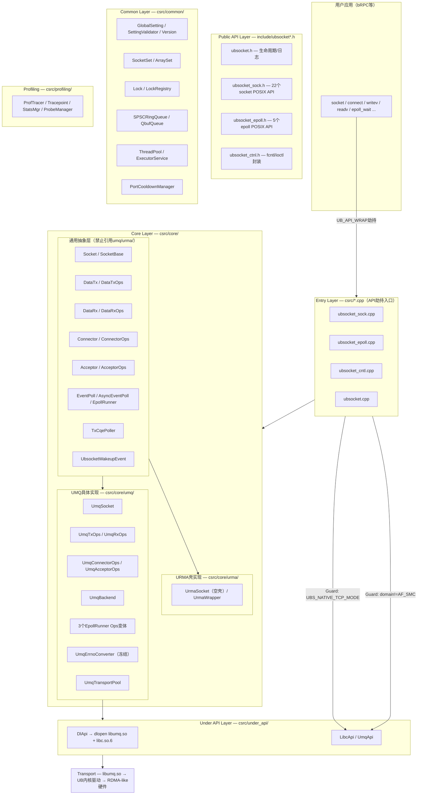
```mermaid
graph TD
    subgraph APP["用户应用（bRPC等）"]
        APP_API["socket / connect / writev / readv / epoll_wait ..."]
    end

    subgraph PUBLIC["Public API Layer — include/ubsocket*.h"]
        PUB_H["ubsocket.h — 生命周期/日志"]
        PUB_SOCK["ubsocket_sock.h — 22个socket POSIX API"]
        PUB_EPOLL["ubsocket_epoll.h — 5个epoll POSIX API"]
        PUB_CTNL["ubsocket_ctnl.h — fcntl/ioctl封装"]
    end

    subgraph ENTRY["Entry Layer — csrc/*.cpp（API劫持入口）"]
        E_SOCK["ubsocket_sock.cpp"]
        E_EPOLL["ubsocket_epoll.cpp"]
        E_CTNL["ubsocket_cntl.cpp"]
        E_INIT["ubsocket.cpp"]
    end

    subgraph CORE["Core Layer — csrc/core/"]
        subgraph ABSTRACT["通用抽象层（禁止引用umq/urma/）"]
            SOCKET_BASE["Socket / SocketBase"]
            DATA_TX["DataTx / DataTxOps"]
            DATA_RX["DataRx / DataRxOps"]
            CONNECTOR["Connector / ConnectorOps"]
            ACCEPTOR["Acceptor / AcceptorOps"]
            EVENT_EPOLL["EventPoll / AsyncEventPoll / EpollRunner"]
            TX_CQE["TxCqePoller"]
            WAKEUP["UbsocketWakeupEvent"]
        end
        subgraph UMQ["UMQ具体实现 — csrc/core/umq/"]
            UMQSOCKET["UmqSocket"]
            UMQ_TX["UmqTxOps / UmqRxOps"]
            UMQ_CONN["UmqConnectorOps / UmqAcceptorOps"]
            UMQ_BACKEND["UmqBackend"]
            UMQ_EPOLL_RUNNER["3个EpollRunner Ops变体"]
            UMQ_ERRNO["UmqErrnoConverter（冻结）"]
            UMQ_TP["UmqTransportPool"]
        end
        subgraph URMA["URMA壳实现 — csrc/core/urma/"]
            URMA_SOCKET["UrmaSocket（空壳）/ UrmaWrapper"]
        end
    end

    subgraph COMMON["Common Layer — csrc/common/"]
        C_SETTING["GlobalSetting / SettingValidator / Version"]
        C_SET["SocketSet / ArraySet"]
        C_LOCK["Lock / LockRegistry"]
        C_RING["SPSCRingQueue / QbufQueue"]
        C_THREAD["ThreadPool / ExecutorService"]
        C_COOLDOWN["PortCooldownManager"]
    end

    subgraph UNDER["Under API Layer — csrc/under_api/"]
        DL["DlApi → dlopen libumq.so + libc.so.6"]
        LIBC["LibcApi / UmqApi"]
    end

    subgraph PROF["Profiling — csrc/profiling/"]
        PROF_TRACER["ProfTracer / Tracepoint / StatsMgr / ProbeManager"]
    end

    subgraph TRANSPORT["Transport — libumq.so → UB内核驱动 → RDMA-like硬件"]
    end

    APP_API -->|UB_API_WRAP劫持| ENTRY
    ENTRY -->|Guard: UBS_NATIVE_TCP_MODE| LIBC
    ENTRY -->|Guard: domain!=AF_SMC| LIBC
    ENTRY --> CORE
    ABSTRACT --> UMQ
    ABSTRACT --> URMA
    UMQ --> UNDER
    UNDER --> TRANSPORT
```

### 1.2 公共API覆盖

| 头文件 | 函数数 | 类别 |
|--------|--------|------|
| `ubsocket.h` | 8 | 库生命周期 + 日志 + IO缓冲区 |
| `ubsocket_sock.h` | 22 | socket / close / shutdown / readv / writev / send / recv 等 |
| `ubsocket_epoll.h` | 5 | epoll_create / epoll_create1 / epoll_ctl / epoll_wait / epoll_pwait |
| `ubsocket_ctnl.h` | 3 | fcntl / fcntl64 / ioctl |

**总计38个公共C API函数**，全部声明为 `extern "C"`。

### 1.3 目录结构速查

```
src/ubsocket/
├── include/                     # 公共C API头文件（5个）
├── UBSOCKET_VERSION             # 全仓统一版本号（当前：1.0.0）
├── csrc/
│   ├── ubsocket.cpp             # 库初始化/uninit/日志/版本
│   ├── ubsocket_sock.cpp        # socket/close/shutdown/readv/writev等劫持
│   ├── ubsocket_epoll.cpp       # epoll_create/ctl/wait劫持
│   ├── ubsocket_cntl.cpp        # fcntl/ioctl劫持
│   ├── common/                  # 基础设施（28个文件）
│   ├── core/                    # 核心层
│   │   ├── ubsocket_*.h/cpp     # 通用抽象层（14个文件）
│   │   ├── umq/                 # UMQ传输实现（32个文件）
│   │   └── urma/                # URMA壳实现（9个文件，条件编译）
│   ├── under_api/               # 动态库加载封装（7个文件）
│   ├── iobuf/                   # 零拷贝Block/BlockCache（3个文件）
│   ├── profiling/               # 维测基础设施（19个文件）
│   └── cli/                     # CLI诊断工具（7个文件）
├── unit_test/                   # 测试（gtest + mockcpp）
└── tools/                       # 辅助工具
```

---

## 2. 对象模型

### 2.1 Socket继承层次

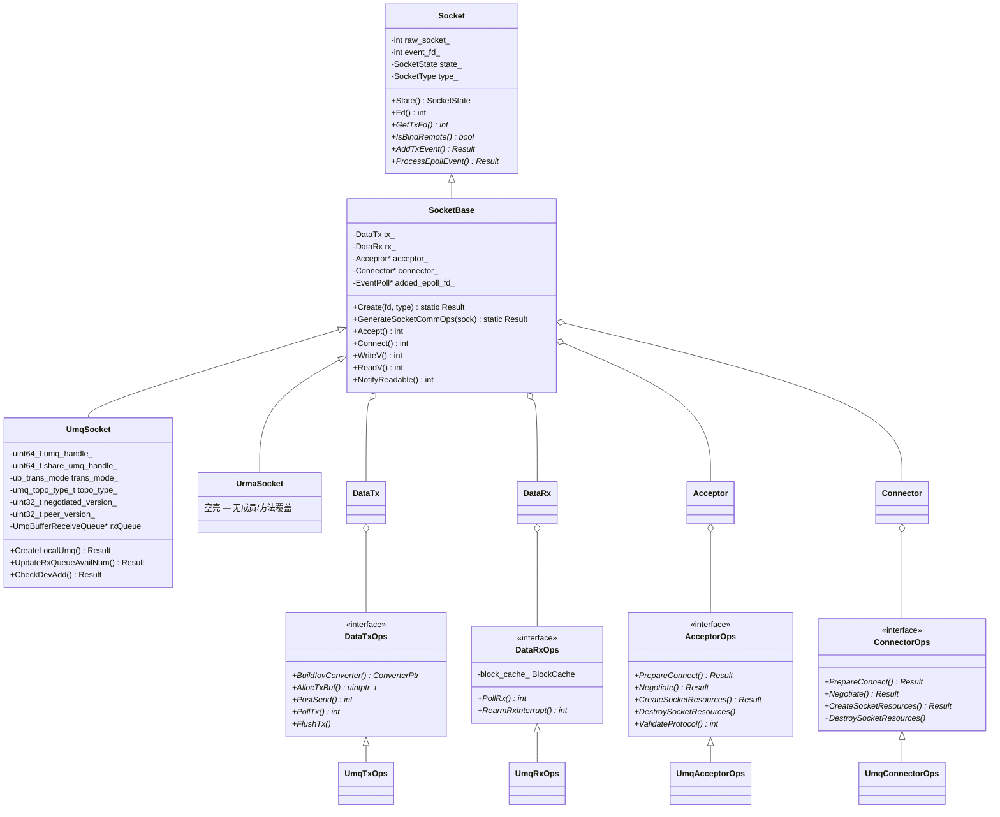
```mermaid
classDiagram
    class Socket {
        -int raw_socket_
        -int event_fd_
        -SocketState state_
        -SocketType type_
        +State() SocketState
        +Fd() int
        +GetTxFd()* int
        +IsBindRemote()* bool
        +AddTxEvent()* Result
        +ProcessEpollEvent()* Result
    }

    class SocketBase {
        -DataTx tx_
        -DataRx rx_
        -Acceptor* acceptor_
        -Connector* connector_
        -EventPoll* added_epoll_fd_
        +Create(fd, type) static Result
        +GenerateSocketCommOps(sock) static Result
        +Accept() int
        +Connect() int
        +WriteV() int
        +ReadV() int
        +NotifyReadable() int
    }

    class UmqSocket {
        -uint64_t umq_handle_
        -uint64_t share_umq_handle_
        -ub_trans_mode trans_mode_
        -umq_topo_type_t topo_type_
        -uint32_t negotiated_version_
        -uint32_t peer_version_
        -UmqBufferReceiveQueue* rxQueue
        +CreateLocalUmq() Result
        +UpdateRxQueueAvailNum() Result
        +CheckDevAdd() Result
    }

    class UrmaSocket {
        空壳 — 无成员/方法覆盖
    }

    class DataTxOps {
        <<interface>>
        +BuildIovConverter()* ConverterPtr
        +AllocTxBuf()* uintptr_t
        +PostSend()* int
        +PollTx()* int
        +FlushTx()*
    }
    class UmqTxOps { }
    class DataRxOps {
        <<interface>>
        +PollRx()* int
        +RearmRxInterrupt()* int
        -block_cache_ BlockCache
    }
    class UmqRxOps { }
    class ConnectorOps {
        <<interface>>
        +PrepareConnect()* Result
        +Negotiate()* Result
        +CreateSocketResources()* Result
        +DestroySocketResources()*
    }
    class UmqConnectorOps { }
    class AcceptorOps {
        <<interface>>
        +PrepareConnect()* Result
        +Negotiate()* Result
        +CreateSocketResources()* Result
        +DestroySocketResources()*
        +ValidateProtocol()* int
    }
    class UmqAcceptorOps { }

    Socket <|-- SocketBase
    SocketBase <|-- UmqSocket
    SocketBase <|-- UrmaSocket
    DataTxOps <|-- UmqTxOps
    DataRxOps <|-- UmqRxOps
    ConnectorOps <|-- UmqConnectorOps
    AcceptorOps <|-- UmqAcceptorOps
    SocketBase o-- DataTx
    SocketBase o-- DataRx
    SocketBase o-- Acceptor
    SocketBase o-- Connector
    DataTx o-- DataTxOps
    DataRx o-- DataRxOps
    Connector o-- ConnectorOps
    Acceptor o-- AcceptorOps
```

### 2.2 Socket 状态机

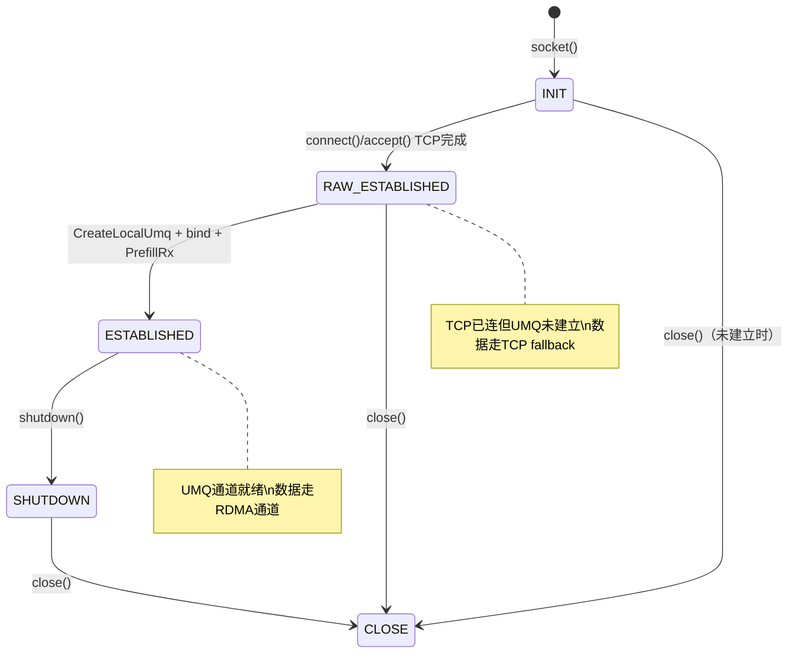
```mermaid
stateDiagram-v2
    [*] --> INIT : socket()
    INIT --> RAW_ESTABLISHED : connect()/accept() TCP完成
    RAW_ESTABLISHED --> ESTABLISHED : CreateLocalUmq + bind + PrefillRx
    ESTABLISHED --> SHUTDOWN : shutdown()
    SHUTDOWN --> CLOSE : close()
    INIT --> CLOSE : close()（未建立时）
    RAW_ESTABLISHED --> CLOSE : close()

    note right of RAW_ESTABLISHED : TCP已连但UMQ未建立\n数据走TCP fallback
    note right of ESTABLISHED : UMQ通道就绪\n数据走RDMA通道
```

---

## 3. 版本协商协议

### 3.1 版本号编码

协议版本号采用32位编码：`[Major(6bit)][Minor(12bit)][Patch(14bit)]`。版本号来源：CMake/Bazel从 `UBSOCKET_VERSION` 文件自动生成，全代码仓统一。

| 宏 | 作用 |
|----|------|
| `UBS_MAKE_PROTOCOL_VERSION(major, minor, patch)` | 编码 |
| `UBS_PROTOCOL_VERSION_MAJOR(v)` | 提取Major (6bit, bit26-31) |
| `UBS_PROTOCOL_VERSION_MINOR(v)` | 提取Minor (12bit, bit14-25) |
| `UBS_PROTOCOL_VERSION_PATCH(v)` | 提取Patch (14bit, bit0-13) |
| `UBS_PROTOCOL_VERSION` | 当前版本 constexpr uint32_t |

### 3.2 协商流程

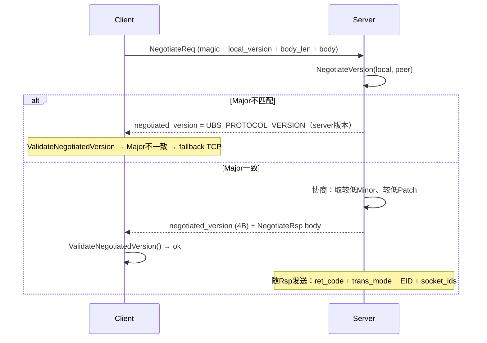
```mermaid
sequenceDiagram
    participant C as Client
    participant S as Server

    C->>S: NegotiateReq (magic + local_version + body_len + body)
    S->>S: NegotiateVersion(local, peer)
    alt Major不匹配
        S-->>C: negotiated_version = UBS_PROTOCOL_VERSION（server版本）
        Note over C: ValidateNegotiatedVersion → Major不一致 → fallback TCP
    else Major一致
        S->>S: 协商：取较低Minor、较低Patch
        S-->>C: negotiated_version (4B) + NegotiateRsp body
        C->>C: ValidateNegotiatedVersion() → ok
        Note over S: 随Rsp发送：ret_code + trans_mode + EID + socket_ids
    end
```

关键函数 (`ubsocket_version.h`):
- `NegotiateVersion(local, peer)` — Acceptor侧；Major一致→取较低值
- `ValidateNegotiatedVersion(local, negotiated)` — Connector侧校验
- Major不一致→降级TCP（不可重试）；Minor/Patch差异→按较低方交互

### 3.3 版本协商跨版本兼容

- `RecvLengthPrefixed` 读body_len后 `min(body_len, sizeof_struct)` 读body，不足零填、超出丢弃
- `NEGOTIATE_REQ_WIRE_SIZE` 自动跟随 `sizeof(NegotiateReq)`，struct变更后不需手动维护常量

---

## 4. 连接建立

### 4.1 握手模式

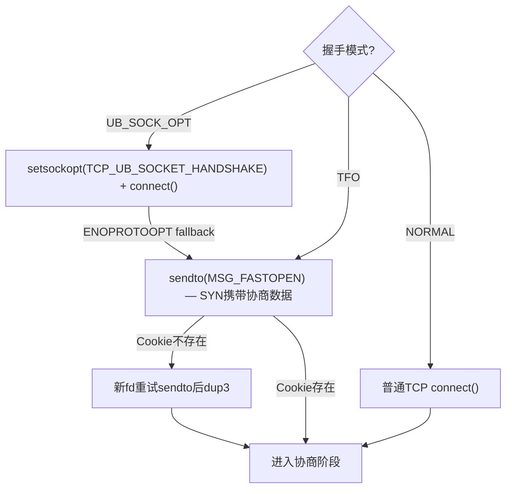
```mermaid
graph TD
    HANDSHAKE{握手模式?} -->|UB_SOCK_OPT| SOCK_OPT["setsockopt(TCP_UB_SOCKET_HANDSHAKE) + connect()"]
    HANDSHAKE -->|TFO| TFO["sendto(MSG_FASTOPEN) — SYN携带协商数据"]
    HANDSHAKE -->|NORMAL| NORMAL["普通TCP connect()"]
    SOCK_OPT -->|ENOPROTOOPT fallback| TFO
    TFO -->|Cookie不存在| RETRY["新fd重试sendto后dup3"]
    TFO -->|Cookie存在| NEGOTIATE["进入协商阶段"]
    NORMAL --> NEGOTIATE
    RETRY --> NEGOTIATE
```

### 4.2 Connector 建链流程

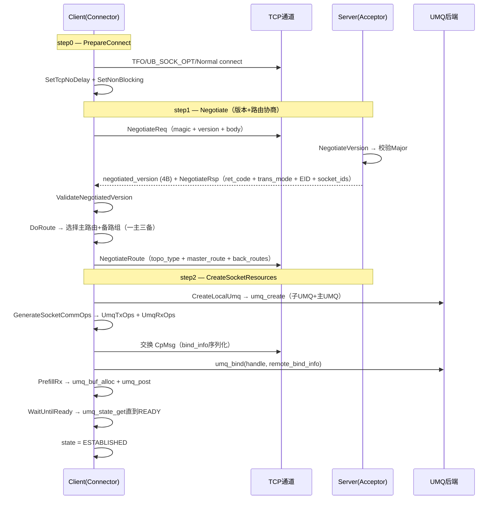
```mermaid
sequenceDiagram
    participant C as Client(Connector)
    participant TCP as TCP通道
    participant S as Server(Acceptor)
    participant UMQ as UMQ后端

    Note over C: step0 — PrepareConnect
    C->>TCP: TFO/UB_SOCK_OPT/Normal connect
    C->>C: SetTcpNoDelay + SetNonBlocking

    Note over C,S: step1 — Negotiate（版本+路由协商）
    C->>TCP: NegotiateReq（magic + version + body）
    S->>S: NegotiateVersion → 校验Major
    S-->>C: negotiated_version (4B) + NegotiateRsp（ret_code + trans_mode + EID + socket_ids）
    C->>C: ValidateNegotiatedVersion
    C->>C: DoRoute → 选择主路由+备路组（一主三备）
    C->>TCP: NegotiateRoute（topo_type + master_route + back_routes）

    Note over C,S: step2 — CreateSocketResources
    C->>UMQ: CreateLocalUmq → umq_create（子UMQ+主UMQ）
    C->>C: GenerateSocketCommOps → UmqTxOps + UmqRxOps
    C->>TCP: 交换 CpMsg（bind_info序列化）
    C->>UMQ: umq_bind(handle, remote_bind_info)
    C->>C: PrefillRx → umq_buf_alloc + umq_post
    C->>C: WaitUntilReady → umq_state_get直到READY
    C->>C: state = ESTABLISHED
```

### 4.3 Acceptor 建链流程

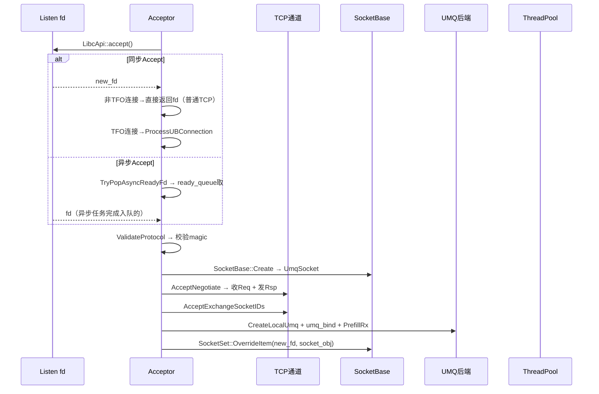
```mermaid
sequenceDiagram
    participant L as Listen fd
    participant A as Acceptor
    participant TCP as TCP通道
    participant SOCK as SocketBase
    participant UMQ as UMQ后端
    participant TP as ThreadPool

    A->>L: LibcApi::accept()
    alt 同步Accept
        L-->>A: new_fd
        A->>A: 非TFO连接→直接返回fd（普通TCP）
        A->>A: TFO连接→ProcessUBConnection
    else 异步Accept
        A->>A: TryPopAsyncReadyFd → ready_queue取
        L-->>A: fd（异步任务完成入队的）
    end

    A->>A: ValidateProtocol → 校验magic
    A->>SOCK: SocketBase::Create → UmqSocket
    A->>TCP: AcceptNegotiate → 收Req + 发Rsp
    A->>TCP: AcceptExchangeSocketIDs
    A->>UMQ: CreateLocalUmq + umq_bind + PrefillRx
    A->>SOCK: SocketSet::OverrideItem(new_fd, socket_obj)
```

### 4.4 异步Accept流程

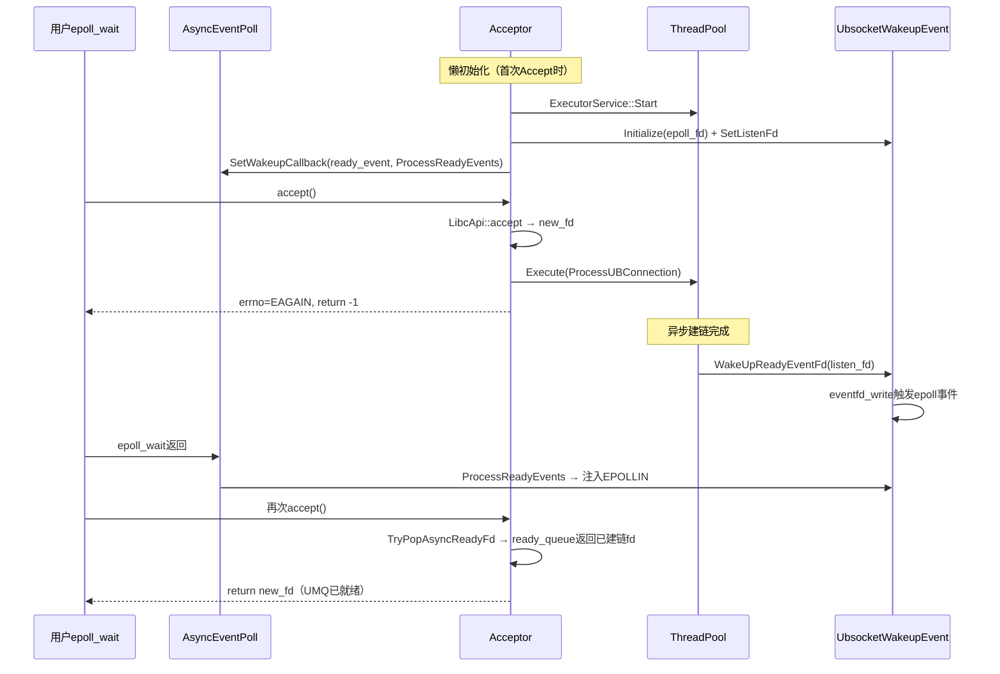
```mermaid
sequenceDiagram
    participant APP as 用户epoll_wait
    participant AEP as AsyncEventPoll
    participant A as Acceptor
    participant TP as ThreadPool
    participant WK as UbsocketWakeupEvent

    Note over A: 懒初始化（首次Accept时）
    A->>TP: ExecutorService::Start
    A->>WK: Initialize(epoll_fd) + SetListenFd
    A->>AEP: SetWakeupCallback(ready_event, ProcessReadyEvents)

    APP->>A: accept()
    A->>A: LibcApi::accept → new_fd
    A->>TP: Execute(ProcessUBConnection)
    A-->>APP: errno=EAGAIN, return -1

    Note over TP: 异步建链完成
    TP->>WK: WakeUpReadyEventFd(listen_fd)
    WK->>WK: eventfd_write触发epoll事件

    APP->>AEP: epoll_wait返回
    AEP->>WK: ProcessReadyEvents → 注入EPOLLIN
    APP->>A: 再次accept()
    A->>A: TryPopAsyncReadyFd → ready_queue返回已建链fd
    A-->>APP: return new_fd（UMQ已就绪）
```

### 4.5 建链重试/降级状态机

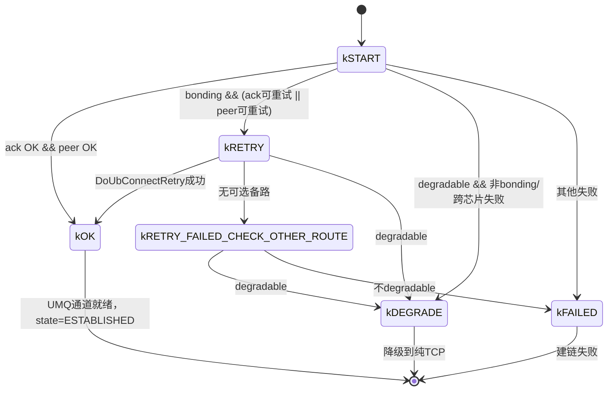
```mermaid
stateDiagram-v2
    [*] --> kSTART
    kSTART --> kOK : ack OK && peer OK
    kSTART --> kRETRY : bonding && (ack可重试 || peer可重试)
    kSTART --> kDEGRADE : degradable && 非bonding/跨芯片失败
    kSTART --> kFAILED : 其他失败

    kRETRY --> kOK : DoUbConnectRetry成功
    kRETRY --> kRETRY_FAILED_CHECK_OTHER_ROUTE : 无可选备路
    kRETRY --> kDEGRADE : degradable

    kRETRY_FAILED_CHECK_OTHER_ROUTE --> kDEGRADE : degradable
    kRETRY_FAILED_CHECK_OTHER_ROUTE --> kFAILED : 不degradable

    kDEGRADE --> [*] : 降级到纯TCP
    kFAILED --> [*] : 建链失败
    kOK --> [*] : UMQ通道就绪，state=ESTABLISHED
```

### 4.6 路由选择（Bonding场景）

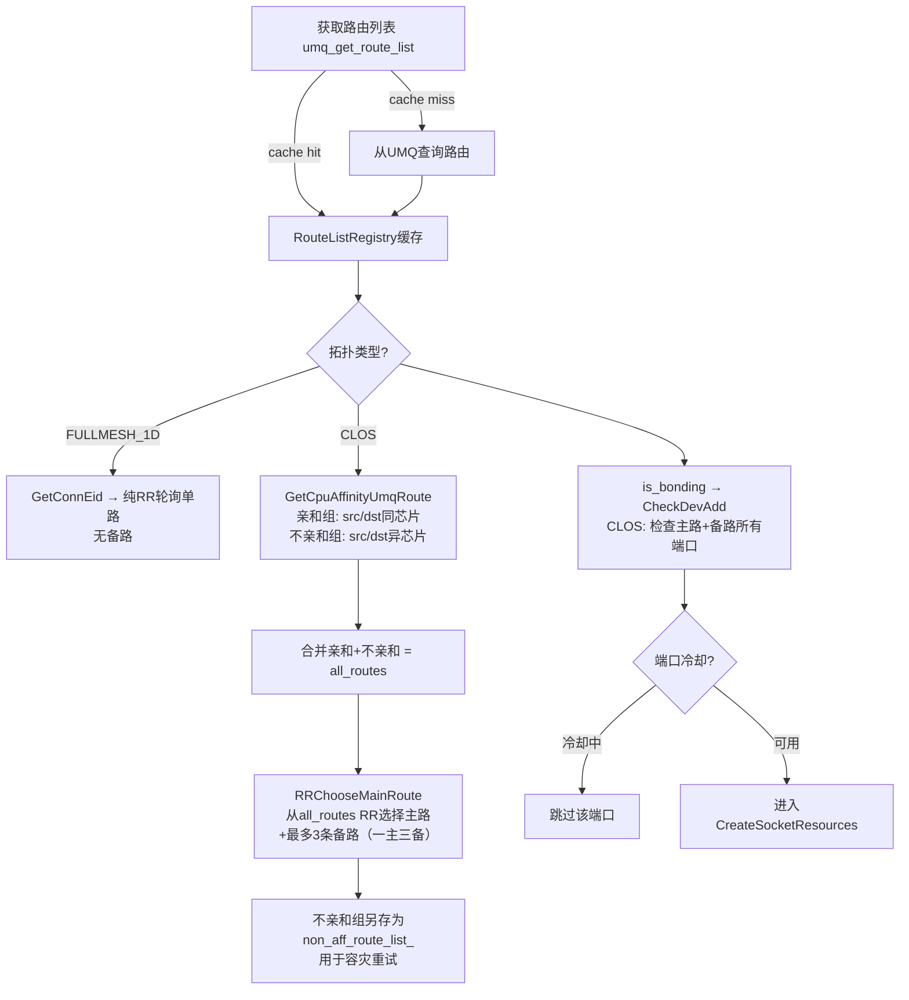
```mermaid
flowchart TD
    START[获取路由列表 umq_get_route_list] -->|cache miss| FETCH[从UMQ查询路由]
    START -->|cache hit| CACHE[RouteListRegistry缓存]
    FETCH --> CACHE
    CACHE --> TOPO{拓扑类型?}

    TOPO -->|FULLMESH_1D| RR["GetConnEid → 纯RR轮询单路<br/>无备路"]
    TOPO -->|CLOS| CPU["GetCpuAffinityUmqRoute<br/>亲和组: src/dst同芯片<br/>不亲和组: src/dst异芯片"]

    CPU --> MERGE["合并亲和+不亲和 = all_routes"]
    MERGE --> PICK["RRChooseMainRoute<br/>从all_routes RR选择主路<br/>+最多3条备路（一主三备）"]
    PICK --> NONAFF["不亲和组另存为non_aff_route_list_<br/>用于容灾重试"]

    TOPO --> CLOS_CONN[is_bonding → CheckDevAdd<br/>CLOS: 检查主路+备路所有端口]
    CLOS_CONN --> COOLDOWN{端口冷却?}
    COOLDOWN -->|冷却中| SKIP[跳过该端口]
    COOLDOWN -->|可用| PROCEED[进入CreateSocketResources]
```

**端口冷却**：`umq_bind()`在CLOS组网下失败时，`PortCooldownManager::MarkPortInCooldown`标记端口冷却，后续建链跳过该端口。

---

## 5. 数据面

### 5.1 发送流程（WriteV）

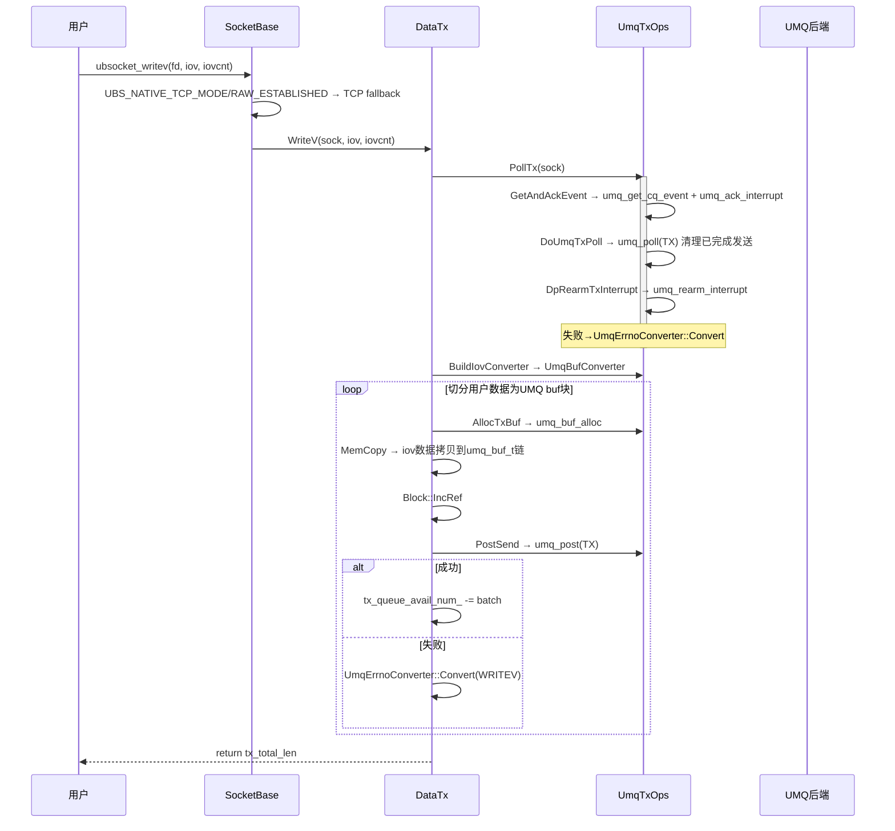
```mermaid
sequenceDiagram
    participant APP as 用户
    participant SOCK as SocketBase
    participant TX as DataTx
    participant TXOPS as UmqTxOps
    participant UMQ as UMQ后端

    APP->>SOCK: ubsocket_writev(fd, iov, iovcnt)
    SOCK->>SOCK: UBS_NATIVE_TCP_MODE/RAW_ESTABLISHED → TCP fallback
    SOCK->>TX: WriteV(sock, iov, iovcnt)

    TX->>TXOPS: PollTx(sock)
    activate TXOPS
    TXOPS->>TXOPS: GetAndAckEvent → umq_get_cq_event + umq_ack_interrupt
    TXOPS->>TXOPS: DoUmqTxPoll → umq_poll(TX) 清理已完成发送
    TXOPS->>TXOPS: DpRearmTxInterrupt → umq_rearm_interrupt
    Note over TXOPS: 失败→UmqErrnoConverter::Convert
    deactivate TXOPS

    TX->>TXOPS: BuildIovConverter → UmqBufConverter
    loop 切分用户数据为UMQ buf块
        TX->>TXOPS: AllocTxBuf → umq_buf_alloc
        TX->>TX: MemCopy → iov数据拷贝到umq_buf_t链
        TX->>TX: Block::IncRef
        TX->>TXOPS: PostSend → umq_post(TX)
        alt 成功
            TX->>TX: tx_queue_avail_num_ -= batch
        else 失败
            TX->>TX: UmqErrnoConverter::Convert(WRITEV)
        end
    end
    TX-->>APP: return tx_total_len
```

### 5.2 接收流程（ReadV + EpollRunner）

#### Share-JFR模式（默认）

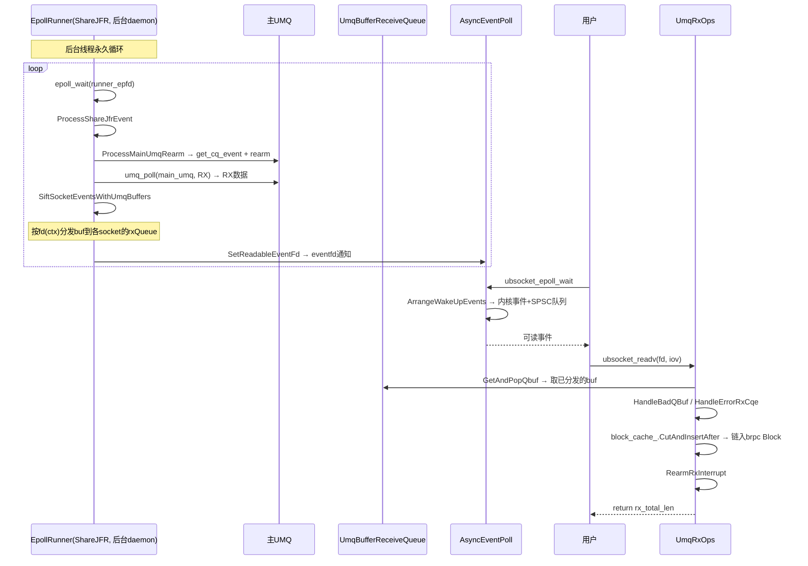
```mermaid
sequenceDiagram
    participant RUNNER as EpollRunner(ShareJFR, 后台daemon)
    participant UMQ as 主UMQ
    participant RXQUEUE as UmqBufferReceiveQueue
    participant ASYNC as AsyncEventPoll
    participant APP as 用户
    participant RX as UmqRxOps

    Note over RUNNER: 后台线程永久循环
    loop
        RUNNER->>RUNNER: epoll_wait(runner_epfd)
        RUNNER->>RUNNER: ProcessShareJfrEvent
        RUNNER->>UMQ: ProcessMainUmqRearm → get_cq_event + rearm
        RUNNER->>UMQ: umq_poll(main_umq, RX) → RX数据
        RUNNER->>RUNNER: SiftSocketEventsWithUmqBuffers
        Note over RUNNER: 按fd(ctx)分发buf到各socket的rxQueue
        RUNNER->>ASYNC: SetReadableEventFd → eventfd通知
    end

    APP->>ASYNC: ubsocket_epoll_wait
    ASYNC->>ASYNC: ArrangeWakeUpEvents → 内核事件+SPSC队列
    ASYNC-->>APP: 可读事件

    APP->>RX: ubsocket_readv(fd, iov)
    RX->>RXQUEUE: GetAndPopQbuf → 取已分发的buf
    RX->>RX: HandleBadQBuf / HandleErrorRxCqe
    RX->>RX: block_cache_.CutAndInsertAfter → 链入brpc Block
    RX->>RX: RearmRxInterrupt
    RX-->>APP: return rx_total_len
```

#### 非Share-JFR模式

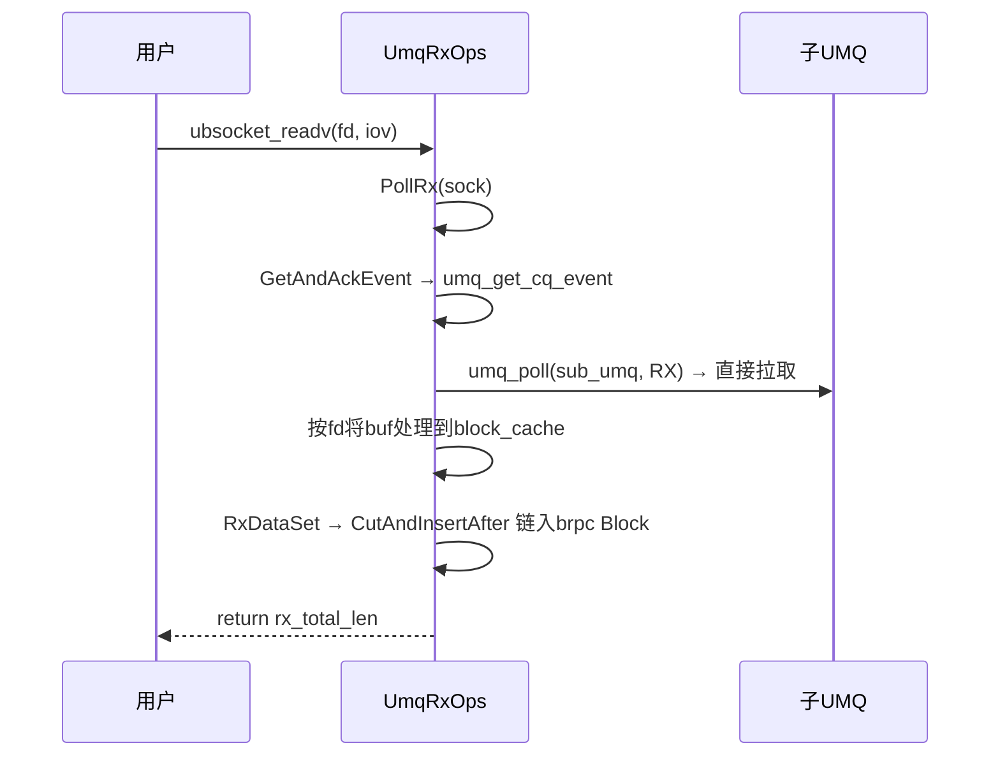
```mermaid
sequenceDiagram
    participant APP as 用户
    participant RX as UmqRxOps
    participant UMQ as 子UMQ

    APP->>RX: ubsocket_readv(fd, iov)
    RX->>RX: PollRx(sock)
    RX->>RX: GetAndAckEvent → umq_get_cq_event
    RX->>UMQ: umq_poll(sub_umq, RX) → 直接拉取
    RX->>RX: 按fd将buf处理到block_cache
    RX->>RX: RxDataSet → CutAndInsertAfter 链入brpc Block
    RX-->>APP: return rx_total_len
```

---

## 6. Epoll 多层架构

### 6.1 总体架构

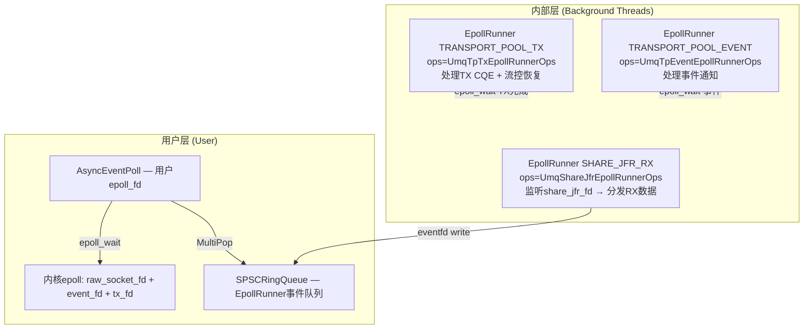
```mermaid
graph TD
    subgraph USER["用户层 (User)"]
        AEP["AsyncEventPoll — 用户epoll_fd"]
        KERNEL["内核epoll: raw_socket_fd + event_fd + tx_fd"]
        RING["SPSCRingQueue — EpollRunner事件队列"]
        AEP -->|epoll_wait| KERNEL
        AEP -->|MultiPop| RING
    end

    subgraph INTERNAL["内部层 (Background Threads)"]
        S_JFR["EpollRunner SHARE_JFR_RX<br/>ops=UmqShareJfrEpollRunnerOps<br/>监听share_jfr_fd → 分发RX数据"]
        TP_TX["EpollRunner TRANSPORT_POOL_TX<br/>ops=UmqTpTxEpollRunnerOps<br/>处理TX CQE + 流控恢复"]
        TP_EV["EpollRunner TRANSPORT_POOL_EVENT<br/>ops=UmqTpEventEpollRunnerOps<br/>处理事件通知"]
    end

    S_JFR -->|eventfd write| RING
    TP_TX -->|epoll_wait TX完成| INTERNAL
    TP_EV -->|epoll_wait 事件| INTERNAL
```

### 6.2 AsyncEventPoll 内部结构

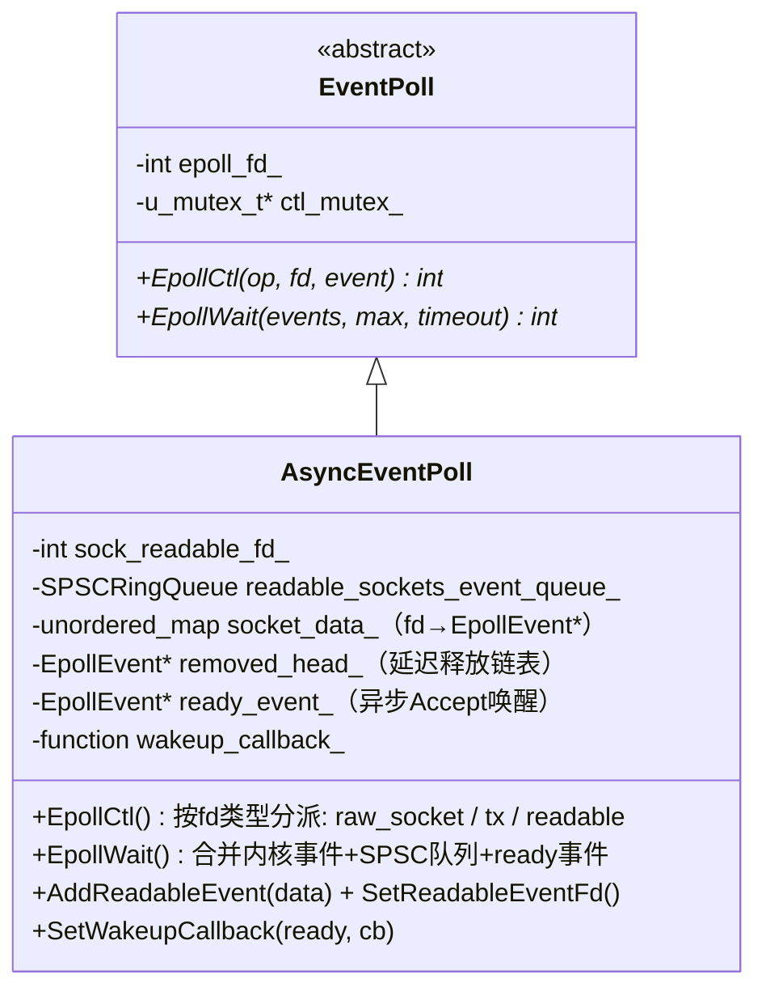
```mermaid
classDiagram
    class EventPoll {
        <<abstract>>
        -int epoll_fd_
        -u_mutex_t* ctl_mutex_
        +EpollCtl(op, fd, event)* int
        +EpollWait(events, max, timeout)* int
    }

    class AsyncEventPoll {
        -int sock_readable_fd_
        -SPSCRingQueue readable_sockets_event_queue_
        -unordered_map socket_data_（fd→EpollEvent*）
        -EpollEvent* removed_head_（延迟释放链表）
        -EpollEvent* ready_event_（异步Accept唤醒）
        -function wakeup_callback_
        +EpollCtl() 按fd类型分派: raw_socket / tx / readable
        +EpollWait() 合并内核事件+SPSC队列+ready事件
        +AddReadableEvent(data) + SetReadableEventFd()
        +SetWakeupCallback(ready, cb)
    }

    EventPoll <|-- AsyncEventPoll
```

**EpollCtl分派逻辑**:
- `raw_socket_fd` → 透传到内核epoll
- `sock_readable_fd` → 内部创建一次（`AddSockReadableEvent`）
- TX fd → `AddProtoTxEvent` + 注册到`EpollRunner`

### 6.3 RunnerEventData 编码

64位union：高4位`type`（`RUNNER_EVENT_TYPE_SHARE_JFR / SUB_UMQ_RX / TP_TX / TP_EVENT / STOP`），低60位`data`（对象指针或umq_handle）。

### 6.4 TransportPool

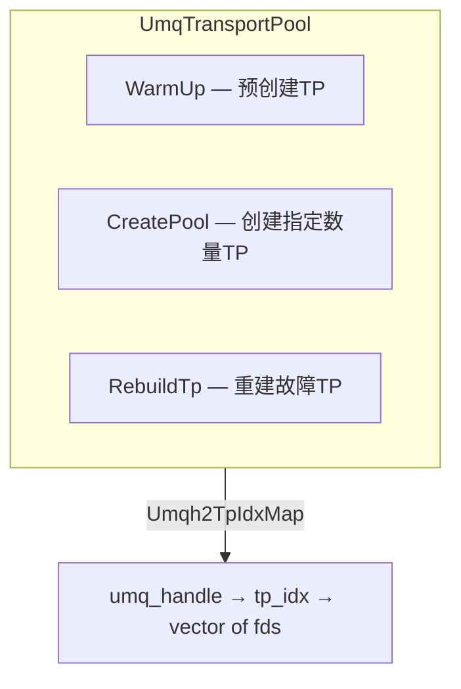
```mermaid
graph TD
    subgraph TP["UmqTransportPool"]
        WARM[WarmUp — 预创建TP]
        CREATE[CreatePool — 创建指定数量TP]
        REBUILD[RebuildTp — 重建故障TP]
    end
    TP -->|Umqh2TpIdxMap| UMQH[umq_handle → tp_idx → vector of fds]
```

TransportPool为每个主UMQ handle维护一组传输资源，支持预热（减少建链延迟）和故障重建。

---

## 7. 零拷贝IOBuf机制

### 7.1 Block结构（8K对齐）

```
 ┌──────────────────────8K对齐边界──────────────────────┐
 │  Block（2×8B + atomic 4B + …）│      buf_data       │
 └──────────────────────────────────────────────────────┘
                                  ▲
                                  │ PtrFloorToBoundary(buf_data)
                                  │ = (char*)buf_data - sizeof(Block)
```

`blockmem_allocate_zero_copy(size)` 分配8K对齐内存，在起始处placement new `Block`。通过8K对齐特性可回溯到`Block`。

### 7.2 Block / BlockCache

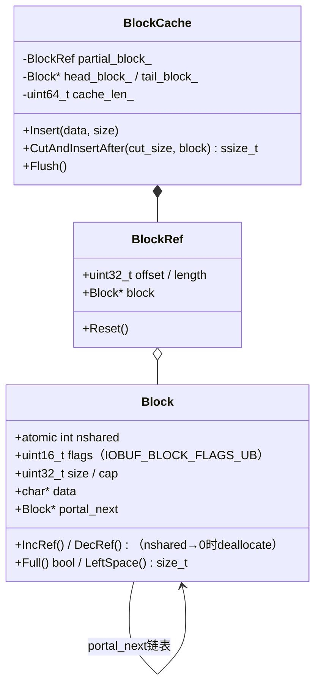
```mermaid
classDiagram
    class Block {
        +atomic int nshared
        +uint16_t flags（IOBUF_BLOCK_FLAGS_UB）
        +uint32_t size / cap
        +char* data
        +Block* portal_next
        +IncRef() / DecRef()（nshared→0时deallocate）
        +Full() bool / LeftSpace() size_t
    }
    class BlockRef {
        +uint32_t offset / length
        +Block* block
        +Reset()
    }
    class BlockCache {
        -BlockRef partial_block_
        -Block* head_block_ / tail_block_
        -uint64_t cache_len_
        +Insert(data, size)
        +CutAndInsertAfter(cut_size, block) ssize_t
        +Flush()
    }
    BlockCache *-- BlockRef
    BlockRef o-- Block
    Block --> Block : portal_next链表
```

### 7.3 数据交付给brpc

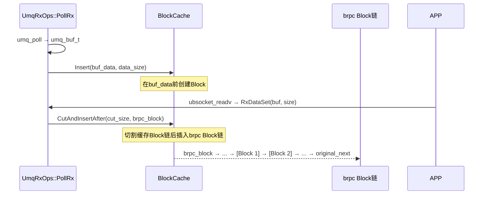
```mermaid
sequenceDiagram
    participant RX as UmqRxOps::PollRx
    participant CACHE as BlockCache
    participant BRPC as brpc Block链

    RX->>RX: umq_poll → umq_buf_t
    RX->>CACHE: Insert(buf_data, data_size)
    Note over CACHE: 在buf_data前创建Block

    APP->>RX: ubsocket_readv → RxDataSet(buf, size)
    RX->>CACHE: CutAndInsertAfter(cut_size, brpc_block)
    Note over CACHE: 切割缓存Block链后插入brpc Block链
    CACHE-->>BRPC: brpc_block → ... → [Block 1] → [Block 2] → ... → original_next
```

---

## 8. 库初始化

### 8.1 初始化流程

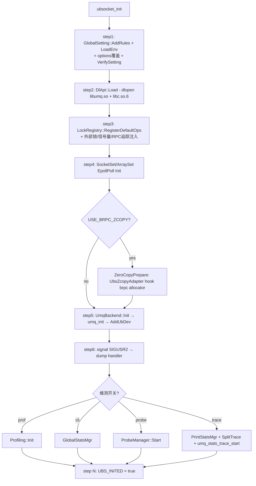
```mermaid
flowchart TD
    START[ubsocket_init] --> STEP1["step1: GlobalSetting::AddRules + LoadEnv<br/>+ options覆盖 + VerifySetting"]
    STEP1 --> STEP2["step2: DlApi::Load - dlopen libumq.so + libc.so.6"]
    STEP2 --> STEP3["step3: LockRegistry::RegisterDefaultOps<br/>+ 外部锁/信号量/RPC追踪注入"]
    STEP3 --> STEP4["step4: SocketSet/ArraySet EpollPoll Init"]
    STEP4 --> STEP5{USE_BRPC_ZCOPY?}
    STEP5 -->|yes| ZCOPY["ZeroCopyPrepare: UbsZcopyAdapter hook brpc allocator"]
    STEP5 -->|no| STEP6
    ZCOPY --> STEP6["step5: UmqBackend::Init → umq_init → AddUbDev"]
    STEP6 --> STEP7["step6: signal SIGUSR2 → dump handler"]
    STEP7 --> STEP8{维测开关?}
    STEP8 -->|prof| PROF["Profiling::Init"]
    STEP8 -->|cli| CLI["GlobalStatsMgr"]
    STEP8 -->|probe| PROBE["ProbeManager::Start"]
    STEP8 -->|trace| TRACE["PrintStatsMgr + SplitTrace + umq_stats_trace_start"]
    PROF --> DONE
    CLI --> DONE
    PROBE --> DONE
    TRACE --> DONE
    DONE["step N: UBS_INITED = true"]
```

### 8.2 初始化选项（`u_init_options_t`）

| 字段 | 默认值 | 说明 |
|------|--------|------|
| `allowed_protocol` | `UBS_PROTOCOL_TCP` | 允许的传输协议 |
| `async_acceptor_thread_count` | 0 | 异步Accept线程数（0=同步） |
| `async_connector_thread_count` | 0 | 异步Connector线程数 |
| `async_epoll_thread_count` | 1 | 后台epoll线程数 |
| `lock_ops` | nullptr | 外部互斥锁注入（brpc butex等） |
| `rw_lock_ops` | nullptr | 外部读写锁注入 |
| `sem_ops` | nullptr | 外部信号量注入 |
| `rpc_id_ops` | nullptr | 外部RPC上下文追踪 |

---

## 9. UmqErrnoConverter

### 9.1 三种映射路径

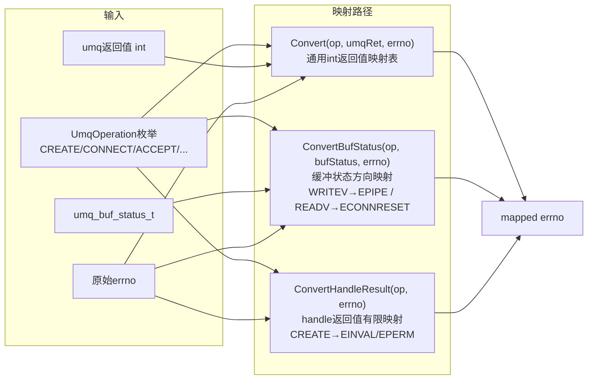
```mermaid
flowchart LR
    subgraph INPUT["输入"]
        OP["UmqOperation枚举<br/>CREATE/CONNECT/ACCEPT/..."]
        RET["umq返回值 int"]
        STATUS["umq_buf_status_t"]
        ERRNO["原始errno"]
    end

    subgraph MAP["映射路径"]
        CONV["Convert(op, umqRet, errno)<br/>通用int返回值映射表"]
        BUF["ConvertBufStatus(op, bufStatus, errno)<br/>缓冲状态方向映射<br/>WRITEV→EPIPE / READV→ECONNRESET"]
        HDL["ConvertHandleResult(op, errno)<br/>handle返回值有限映射<br/>CREATE→EINVAL/EPERM"]
    end

    OP --> CONV
    RET --> CONV
    ERRNO --> CONV
    OP --> BUF
    STATUS --> BUF
    ERRNO --> BUF
    OP --> HDL
    ERRNO --> HDL

    CONV --> OUTPUT[mapped errno]
    BUF --> OUTPUT
    HDL --> OUTPUT
```

覆盖14种UmqOperation，errno在生产代码调用UMQ API后**立即保存**（errno必须在调用被测函数之前设置）。

---

## 10. 核心设计模式

| 模式 | 位置 | 作用 |
|------|------|------|
| **函数劫持** | `UB_API_WRAP()` 宏 | 透明替换POSIX调用 |
| **Strategy(Ops)** | 5组虚接口 | 可插拔传输实现 |
| **Factory** | `SocketBase::Create / GenerateSocketCommOps` | 按SocketType创建ops |
| **Template Method** | `Connector::Connect / Acceptor::Accept` | 固定步骤: Prepare→Negotiate→CreateResources |
| **Singleton** | `SocketSet / ArraySet / UmqEidTable` | 全局注册表 |
| **Leaky Singleton** | `EidRegistry / RouteListRegistry / EpollRunner / TxCqePoller` | 进程生命周期，不析构 |
| **Bridge/Adapter** | `UmqApi / LibcApi / DlApi` | 抽象dlopen vs 直接链接 |
| **Guard/Bypass** | `UBS_NATIVE_TCP_MODE` 检查 | UB不可用时回退TCP |
| **Ref Counting** | `DECLARE_REF_COUNT_VARIABLE` | Socket / EventPoll / Ops生命周期 |
| **SPSC Ring Queue** | `AsyncEventPoll::readable_sockets_event_queue_` | 无锁通知 |
| **State Machine** | `UBHandshakeState` | 建链重试/降级控制 |
| **Scope Exit** | `MakeScopeExit()` | RAII资源恢复 |
| **Port Cooldown** | `PortCooldownManager` | 端口故障冷却 |
| **Route Cache** | `RouteListRegistry` | 缓存路由查询结果 |

---

## 11. UMQ API 使用汇总

| UMQ API | 作用 | 调用方 |
|---------|------|--------|
| `umq_init` | 全局初始化 | `UmqBackend::Init()` |
| `umq_create` | 创建UMQ队列 | `UmqSocket::CreateLocalUmq()` |
| `umq_bind` | 远端绑定 | `UmqConnectorOps/AcceptorOps` |
| `umq_bind_info_get` | 获取序列化绑定信息 | `UmqConnectorOps/AcceptorOps` |
| `umq_post` | 提交发送/接收请求 | `UmqTxOps::PostSend`, `PrefillRx` |
| `umq_poll` | 获取完成缓冲 | `UmqTxOps/UmqRxOps/EpollRunnerOps` |
| `umq_buf_alloc/free` | 缓冲管理 | `UmqTxOps`, `PrefillRx` |
| `umq_rearm_interrupt` | 重触发中断通知 | `UmqTxOps/UmqRxOps/EpollRunnerOps` |
| `umq_interrupt_fd_get` | 获取中断fd | `UmqSocket::AddTxEvent/GetTxFd` |
| `umq_get_cq_event` | 获取CQE | `UmqTxOps/UmqRxOps/EpollRunnerOps` |
| `umq_ack_interrupt` | 确认中断 | 同上 |
| `umq_state_get` | 查询队列状态（IDLE→READY） | `UmqSocket::WaitUntilReady` |
| `umq_dev_add` | 注册UB设备 | `UmqBackend::AddUbDev` |
| `umq_dev_info_list_get` | 发现UB设备 | `UmqBackend::FindDevName` |
| `umq_get_route_list` | 获取路由拓扑 | `UmqConnectorOps::GetDevRouteList` |
| `umq_stats_trace_start/stop` | 维测跟踪 | `ubsocket_init/uninit` |
| `umq_log_config_set` | 日志配置 | `ubsocket_set_log_level/set_logger` |

---

## 12. 关键概念速查

### Share-JFR（共享接收队列）
默认模式。同一EID下多个子UMQ共享主UMQ的接收队列：主UMQ由EpollRunner后台poll，RX数据按fd(ctx)分发到各socket的`rxQueue`；子UMQ只负责TX。

### 双层Epoll
**用户层**（AsyncEventPoll）：合并内核事件 + SPSC队列 + 异步Accept ready事件。**内部层**（3个EpollRunner）：后台线程分别处理Share-JFR RX分发、TX CQE轮询、事件通知。

### TCP Fallback
`UBS_NATIVE_TCP_MODE`守卫 + `RAW_ESTABLISHED`状态时走TCP。建链失败时通过`IsDegradable()`判断是否可降级到纯TCP。

### 外部锁注入
`u_init_options_t`提供mutex/rwlock/semaphore/rpc_id四个函数指针表，brpc可注入自己的butex/semaphore实现。

### 端口冷却（PortCooldownManager）
CLOS组网`umq_bind()`失败后标记端口冷却，后续建链跳过。配合retry→degrade状态机实现容错。

### 一主三备路由
CLOS组网RRChooseMainRoute：从亲和+非亲和合并路由中RR选择1主+最多3备。不亲和组另存为容灾备路池，首次重试失败后从池中选路。

### 依赖方向规则
- 通用层（`core/ubsocket_*`）禁止引用任何具体实现子目录头文件
- 工厂方法（`ubsocket_socket.cpp`）是唯一例外——它根据`SocketType`创建具体对象
- 具体实现层（`core/umq/*`, `core/urma/*`）可引用通用层头文件
