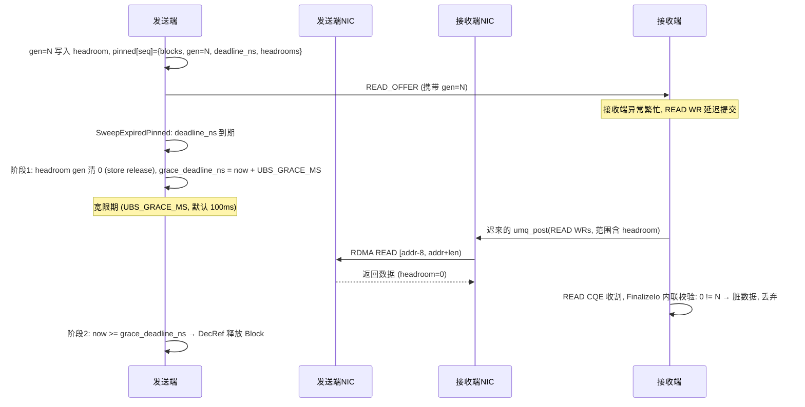

# READ_OFFER RPC 超时释放与脏读防护 (Generation 计数校验) 设计

> 状态: 已实现 (2026-08-08, v2: A1-A7 + B1-B3 落地, 端到端验证通过)
> 问题: 发送端 pinned 源内存无超时释放机制 (接收端不 READ 即泄漏); 超时释放后晚到的 RDMA READ 会读到已复用的脏内存
> 方案: RPC 超时释放 pinned 内存 + 8B headroom generation 计数器校验脏数据
> 关联: UBSOCKET-BRPC-UB-NATIVE-FLOW.ch.md, UBSOCKET-TX-RX-UNIFIED-POLLER-DESIGN.ch.md, ubsocket_bigdata.cpp
> 实现: ubs-comm (`ubsocket_proto.h`/`ubsocket_bigdata.cpp`/`umq_socket.h`/`ubsocket_global_setting`/`ubsocket_socket.cpp`/`ubsocket_tx_cqe_poller.cpp`), brpc (`iobuf_inl.h`/`ubiobuf.cpp`/`socket.cpp`/`channel.cpp`/`socket_map.cpp`/`ubsocket_wrapper.cpp`)

---

## 1. 背景与问题

### 1.1 现状: 发送端 pinned 内存生命周期

READ_OFFER 路径 (seg > 4064B) 的发送端流程:

```
TrySenderPost:
  HandleLargeSegment:
    block->IncRef()                       ← pin 源内存 Block
    state->pinned[seq] = {blocks...}      ← 按 seq 登记
  FlushPendingOffer → umq_post(READ_OFFER 控制帧)

  数据本体留在发送端内存, 等接收端 RDMA READ 拉取
  接收端 READ 完成 → (回程通知) → ReleasePinned(seq) → block->DecRef()
```

### 1.2 两个问题

**问题 1: 无超时释放 → 内存泄漏**

接收端异常 (进程挂死、READ WR 提交失败且重试耗尽、网络分区) 时, 永远不会有释放通知。`state->pinned` 中的 Block 无限期 pin 住:

- 单个 RPC 泄漏 64KB~1MB 级源内存;
- brpc Controller 侧 RPC 已超时返回, 但 ubsocket 层不知情, 内存持续占用;
- 长时间运行后 zcopy 内存池耗尽, 新 RPC `umq_buf_alloc` 失败。

**问题 2: 超时释放引入脏读竞态**

若简单地在超时后 `DecRef` 释放:

```
发送端                          接收端 NIC
──────────────────────────────────────────
t0: umq_post(READ_OFFER)
t1: RPC 超时, DecRef 释放 Block
t2: Block 被新 RPC 复用, 写入新数据
                                t3: 晚到的 RDMA READ 到达
                                    读走的是新 RPC 的数据 (脏!)
接收端把脏数据当作原 RPC 的 response 交付 → 数据错乱
```

RDMA READ 由接收端 NIC 发起、发送端 NIC 直接 DMA 读内存, **发送端 CPU 无感知也无法拦截**。释放与晚到 READ 之间没有任何同步手段, 必须引入端到端的数据有效性校验。

---

## 2. 目标与约束

### 目标

- 发送端 pinned 内存有界生命周期: RPC 超时后可释放, 不泄漏;
- 接收端能识别并丢弃"晚到 READ 读到的脏数据", 不把脏数据交付给上层;
- 校验开销 O(1) 每 seg (一次 8B 比较), 不影响正常路径吞吐;
- 协议向后兼容: 通过版本协商启用, 老版本对端回退现状行为。

### 非目标

- 不解决接收端主动通知发送端"READ 完成"的回程协议 (现状机制保留);
- 不改变 SMALL_DATA (≤4064B) 路径 — 数据 inline 发出, 无 pin 无脏读问题;
- 不追求 100% 消除竞态窗口 (残余窗口用宽限期收敛到工程可忽略, 见 §5.2)。

---

## 3. 方案总览

### 3.1 核心机制: 8B headroom generation 计数器

```
源内存布局 (64KB/1MB 大块, 分配时预留 8B headroom):

  ┌──────────┬──────────────────────────────┐
  │ gen (8B) │        payload (seg 数据)     │
  └──────────┴──────────────────────────────┘
  ^          ^
  addr-8     addr (seg.addr, READ_OFFER 中携带的数据地址)

全进程递增计数器:
  static std::atomic<uint64_t> g_read_gen{1};   // 初始 1, 0 保留为"已失效"标记
```

**gen 粒度: 每次 post 批次一个** — 同一批次 (同一 RPC 的全部 offer/seg) 共用一个 gen, wire 上由 big ctl (`UbsCtrlHdr`) 携带一份, 每个 seg 的 headroom 写入同一值。批次粒度已足够: 脏读判定只需"晚到 READ 读到的值 ≠ 发出时的值", 全进程递增保证跨批次不重复, 批次内无需再细分。

三方协作:

| 角色 | 动作 |
|------|------|
| **发送端 post 时** | `gen = g_read_gen.fetch_add(1)` (每批次一次), 写入本批次每个 seg 的 headroom; READ_OFFER (big ctl) 携带同一 gen |
| **发送端超时时** | 将该 RPC 全部 seg headroom 中的 gen **清 0** → 宽限期后 DecRef 释放 Block |
| **接收端 READ 后** | 每 seg READ 范围扩展为 `[addr-8, addr+len)`, 连 headroom 一起读回; 逐段校验 read buf 头部 8B == big ctl 携带的 gen; 任一不等则判定脏数据, 整笔丢弃 |

### 3.2 正确性直觉

- **正常路径**: 发送端未超时, headroom gen 保持原值, 接收端校验通过, 剥掉 8B 头交付;
- **超时后晚到 READ**: headroom 已清 0 (或 Block 复用后被新 gen 覆盖 — 新 gen 必然 ≠ 旧 gen, 因为全进程递增不重复), 校验失败, 丢弃;
- **gen 全进程唯一递增**: 即使 Block 被复用给新 RPC 并写入了新 gen, 新旧 gen 必不相等, 校验仍然失败 — 这是用"递增计数器"而非"魔数标志位"的原因。

### 3.3 时序 (超时 + 晚到 READ 场景)



---

## 4. 详细设计

### 4.1 发送端: headroom 预留与 gen 打点

**分配约束**: gen headroom 要求 seg 数据前 8B 是本 RPC 独占的可写内存。适用条件:

- seg 来自 ubs zcopy 分配器的**大块 size class (64KB/1MB)**, 分配时数据区起始处预留 8B (`buf_data` 后移 8B); brpc 侧 `create_ub_block` 对非 tiny 块**始终预留** headroom 并置 `IOBUF_BLOCK_FLAGS_GEN_HEADROOM` flag (1<<5) — 8B / 64KB 开销可忽略, 避免特性开关切换时重新分配块;
- seg.addr 必须等于块内数据区起始 (整块 seg)。**切片 seg (addr 位于块中部) 不适用** — 其 addr-8 落在同块前一个切片的数据内, 写 gen 会踩坏相邻数据。

不满足条件的 seg 走**不校验回退** (见 §4.6 兼容性)。

**post 时打点** (`TrySenderPost` 内, 每批次取一次; gen 透传到 `OfferBuilder`, `HandleLargeSegment`/`AllocNewOffer` 中 `Append` 时写入 headroom):

```cpp
/* 每个 post 批次取一次 gen; 同一 RPC 的所有 offer/seg 共用; uint64 回绕跳 0保护 */
uint64_t gen = 0;
if (effective_timeout_ms > 0) {   /* 特性开关 + 连接级超时均满足才取 gen */
    gen = g_read_gen.fetch_add(1, std::memory_order_relaxed);
    if (UNLIKELY(gen == 0)) {
        gen = g_read_gen.fetch_add(1, std::memory_order_relaxed);
    }
}

for each large seg:
    if (gen != 0 && (block->flags & IOBUF_BLOCK_FLAGS_GEN_HEADROOM) &&
        seg.start_pos == nullptr && seg.offset == 0) {
        *reinterpret_cast<volatile uint64_t *>(data - 8) = gen;   // headroom 打点
        headrooms.push_back(data - 8);
    } else if (gen != 0) {
        has_sliced_seg = true;   // 切片 seg → offer 降级 read_gen=0
    }

/* pinned 登记扩展 (PinnedEntry 结构体) */
state->pinned[seq] = {
    .blocks = {...},
    .gen = ctrl_hdr->read_gen,          /* has_sliced_seg ? 0 : gen */
    .headrooms = {seg1.addr-8, ...},    /* 超时清 0 用 */
    .deadline_ns = now + timeout + margin,  /* 0 = 无超时 (read_gen=0 时不设) */
    .grace_deadline_ns = 0,             /* 阶段1时赋值 = now + UBS_GRACE_MS */
    .stage1_done = false,               /* 两阶段标记 */
};
```

### 4.2 协议变更: big ctl 携带 gen, 连接建立时同步 RPC 超时

**big ctl 只携带 gen** — gen 按批次一个, wire 上由 `UbsCtrlHdr` (READ_OFFER) 携带一份即可, **`UbsSeg` (16B) 不变**:

```cpp
struct UbsCtrlHdr {
    /* ... 现有字段 (type, nsegs, seq, ...) ... */
    uint64_t read_gen;      /* 新增: 本 offer 全部 seg 的 generation; 0 = 本 offer 不启用校验 */
};
```

- `UBS_CTRL_HDR_SIZE` 16u → 24u, 相应 static_assert 与 4064B wire 预算计算同步更新 (`UBS_SEG_MAX=32` 时 24+32×64=2072B < 4064B, 协议上限不受影响);
- **无前向兼容需求**: `UbsCtrlHdr` 直接从 16B 扩到 24B — 双端同步升级, 老端解析 24B 头会因 `total_len` 校验失败而拒绝 (ParseReadOffer 内 `ctrl->total_len` 与实际 `data_size` 比对), 不会误读;
- **特性开关门控**: `UBS_READ_GEN_CHECK_ENABLED` (默认 false) 控制是否取 gen / 写 headroom / 设 deadline; 关闭时 `read_gen=0`, 全量现状行为。不依赖版本协商 — 双端需同时开启特性才生效, 由运维部署保证;
- `read_gen == 0` 语义: 本 offer 不校验 (特性关闭 / `effective_timeout==0` / 切片 seg 回退)。

**RPC 超时在 UB 连接建立时同步** — 复用既有版本协商握手 (`NegotiateReq`/`NegotiateRsp`), 不在每个 offer 上重复携带:

```cpp
struct NegotiateReq {
    /* ... 现有字段 (trans_mode, is_bonding, enable_share_jfr, schedule_policy, local_eid) ... */
    uint32_t rpc_timeout_ms;   /* 新增: client 侧 RPC 超时配置 (ms); 0 = 未设置 */
};
```

- client 建连前通过 `setsockopt(SOL_UB, UBS_OPT_RPC_TIMEOUT_MS)` 将 Channel 的 RPC 超时配置 (`ChannelOptions.timeout_ms`) 写入 `UmqSocket::local_rpc_timeout_ms_`, brpc 侧在 `Socket::SetSocketOptions` 中调用 `ubsocket_wrapper_setsockopt` (fd 级, 建连前);
- `BuildNegotiateReq` 将 `local_rpc_timeout_ms_` 填入 `NegotiateReq.rpc_timeout_ms`; server 在 `AcceptNegotiate` 时存入 `UmqSocket::peer_rpc_timeout_ms_` (连接级 state);
- **effective_timeout = local!=0 ? local : peer** — 发送端 pinned deadline 与接收端 ctx deadline 均从 effective_timeout 推导;
- **连接级 vs 每 RPC 级的取舍**: 同一 Channel 上不同 Controller 可覆写超时 (`Controller::set_timeout_ms`), 连接级同步取的是 Channel 配置, 无法逐 RPC 精确 — 接收端 ctx 超时是**资源回收兜底**而非 RPC 语义超时, Channel 级精度足够; 换来的是 offer 热路径零开销 (不加字段、不逐帧计算剩余超时);
- client 未设置超时 (`timeout_ms=-1` → wire 上 0) 时, server 端 ctx 不设 deadline, 依赖 socket 关闭清理路径兜底 (与发送端 pinned 的同款语义, §6);
- **brpc 透传链路**: `Channel::Init` → `SocketMapInsert(ub_rpc_timeout_ms=timeout_ms)` → `SocketMap::Insert` → `SocketOptions.ub_rpc_timeout_ms` → `Socket::_ub_rpc_timeout_ms` → `SetSocketOptions` → `ubsocket_wrapper_setsockopt(SOL_UB, UBS_OPT_RPC_TIMEOUT_MS)`;
- **setsockopt 拦截**: `ubsocket_sock.cpp` 的 `setsockopt` wrapper 在 `level >= SOL_UB` 时路由到 `SocketBase::SetSockOpt`, 后者按 `UbSocketOpt` 枚举分发 — `UBS_OPT_RPC_TIMEOUT_MS=2` 查 fd 对应 `UmqSocket` 并调 `SetLocalRpcTimeoutMs`。

### 4.3 发送端: 超时扫描与两阶段释放

**超时检测挂载点**: 复用 `TxCqePoller` 的 `PollAllSockets` 与 `TxSweepOnce` — 在每 socket 的 `RetryPendingReadsForSocket` 旁追加 `SweepExpiredForSocket(sock)` 调用, 不新增线程/定时器。`SweepExpiredForSocket` 内部调用 `SweepExpiredPinned` (发送端 pinned) 和 `SweepExpiredCtxs` (接收端 ctx, §4.5):

```cpp
void SweepExpiredPinned(UbsBigdataSocketState *state) {
    const uint64_t now_ns = Func::CurrentTimeNs();
    std::vector<std::pair<uint64_t, std::vector<Block *>>> to_release;
    {
        Locker lk(state->mutex);
        for (auto it = state->pinned.begin(); it != state->pinned.end();) {
            PinnedEntry &entry = it->second;
            if (entry.stage1_done) {
                /* 阶段 2: 宽限期到期, 真正释放 */
                if (now_ns >= entry.grace_deadline_ns) {
                    to_release.emplace_back(it->first, std::move(entry.blocks));
                    it = state->pinned.erase(it);
                    continue;
                }
            } else if (entry.deadline_ns != 0 && now_ns >= entry.deadline_ns) {
                /* 阶段 1: 先失效 headroom, 启动宽限期计时 */
                for (void *hr : entry.headrooms) {
                    *reinterpret_cast<volatile uint64_t *>(hr) = 0;
                }
                std::atomic_thread_fence(std::memory_order_release);
                entry.stage1_done = true;
                entry.grace_deadline_ns = now_ns + UBS_GRACE_MS * 1000000ULL;
            }
            ++it;
        }
    }
    /* DecRef 在锁外执行, 缩小临界区 */
    for (auto &kv : to_release) {
        for (Block *b : kv.second) { if (b != nullptr) { b->DecRef(); } }
    }
}
```

**两阶段释放的必要性** (残余竞态收敛):

单次 RDMA READ 传输非原子 — NIC 可能先读走 headroom (gen 还是 N, 校验会通过), 再读 payload。若此刻 CPU 已 DecRef 且 Block 被复用, payload 就是脏的但校验通过。两阶段将该窗口收敛:

- 阶段 1 (清 0, 设 `grace_deadline_ns`) 与阶段 2 (DecRef, `now >= grace_deadline_ns`) 之间隔 **UBS_GRACE_MS (默认 100ms)**;
- 只有"READ 传输横跨 100ms+"的场景才可能踩中 — 1MB READ 硬件传输 < 1ms, 横跨 100ms 意味着链路级异常, 该场景下传输本身通常已报错 (CQE status != 0);
- 正常晚到 READ (在阶段 1 后、阶段 2 前到达): 读到 gen=0, 校验失败丢弃 ✓; 数据虽仍完整但 RPC 已超时, 丢弃无害。

**正常完成路径不变**: 接收端 READ 完成的既有释放通知照旧走 `ReleasePinned(seq)` — 需加一步: 若 entry 已进入超时流程 (`stage1_done == true`), 跳过 DecRef 直接 erase (sweeper 拥有释放权, 避免重复 DecRef):

### 4.4 接收端: READ 范围扩展与校验

**DoReadOffer 改造** (仅当 `ctrl->read_gen != 0`):

```cpp
const uint64_t expect_gen = ctrl->read_gen;
const bool gen_check = (expect_gen != 0);

for each seg:
    /* READ 范围扩展: 连 headroom 一起拉回 */
    uint32_t read_len = gen_check ? sge.length + 8 : sge.length;
    uint64_t read_addr = gen_check ? sge.addr - 8 : sge.addr;

    umq_buf_t *dest = umq_buf_alloc(read_len, 1, umqh, &dest_option);
    pro->opcode = UMQ_OPC_READ;
    pro->remote_sge.addr = read_addr;
    pro->remote_sge.length = read_len;
    /* token_id/mempool_id/token_value 不变 — headroom 与 payload 同块同 mempool */

ctx->expect_gen = expect_gen;   /* 存入 ctx, FinalizeIo 校验用 */
```

**FinalizeIo 校验** (全部 READ CQE 完成后、交付前, 内联在 `FinalizeIo` 函数中):

```cpp
/* FinalizeIo 内, failed 路径之后、SN stamping 之前 */
if (ctx->expect_gen != 0) {
    bool gen_mismatch = false;
    for (uint32_t i = 0; i < ctx->wr_total; ++i) {
        umq_buf_t *b = ctx->wr_slots[i].pending;
        if (b == nullptr || b->data_size < 8) { gen_mismatch = true; break; }
        uint64_t got = *reinterpret_cast<const uint64_t *>(b->buf_data);
        if (got != ctx->expect_gen) {
            UBS_VLOG_WARN("read gen mismatch (stale READ), fd, seq, slot, expect, got\n", ...);
            gen_mismatch = true; break;
        }
    }
    if (gen_mismatch) {
        /* 丢弃: 释放全部 read buf (detach qbuf_next), free offer_rx_buf,
         * 不入 rxQueue, 不发 READ_ABORT (发送端已超时释放, seq 无人认领)。
         * 不 disconnect (非硬件错误)。 */
        for (auto &slot : ctx->wr_slots) {
            slot.pending->qbuf_next = nullptr;
            FreeQbufChain(slot.pending);
            slot.pending = nullptr;
        }
        repost_offer_rx_buf();
        DeleteIoUctx(ctx);
        return;
    }
    /* 校验通过: 剥掉 8B headroom 再交付 */
    for (uint32_t i = 0; i < ctx->wr_total; ++i) {
        umq_buf_t *b = ctx->wr_slots[i].pending;
        if (b != nullptr) {
            b->buf_data += 8;
            b->data_size -= 8;
            b->total_data_size -= 8;
        }
    }
}
/* ... 既有交付流程 (SN stamping, 拼装, 入 rxQueue) ... */
```

**校验时机选择 FinalizeIo 而非逐 CQE**: READ CQE 乱序到达, 逐 CQE 校验需处理"部分 seg 已判脏但其余 WR 仍在途"的中间态; FinalizeIo 是全部 WR 终态后的单一汇聚点, 复用既有 failed 处理骨架, 改动最小。

### 4.5 接收端超时 (对称问题)

接收端 ctx 同样需要有界生命周期 (发送端挂死时 READ CQE 永不到达)。**deadline 取建连时同步的 client RPC 超时** (`UmqSocket::peer_rpc_timeout_ms_`, 连接级 state), 与发送端 pinned 超时天然对齐:

```cpp
/* DoReadOffer 内, ctx 初始化时 */
ctx->expect_gen = ctrl->read_gen;
auto *umq_sock = RefConvert<Socket, UmqSocket>(sock).Get();
uint32_t peer_timeout_ms = (umq_sock != nullptr) ? umq_sock->GetPeerRpcTimeoutMs() : 0;
if (peer_timeout_ms > 0) {
    uint64_t now_ns = Func::CurrentTimeNs();
    ctx->deadline_ns = now_ns + peer_timeout_ms * 1000000ULL
                       + UBS_BIG_PIN_TIMEOUT_MARGIN_MS * 1000000ULL;
} else {
    /* client 未设超时或老对端: 不设 deadline, 依赖 socket 关闭清理路径兜底 */
    ctx->deadline_ns = 0;
}
```

- **对齐意义**: 发送端 pinned 在 `rpc_timeout + margin` 释放, 接收端 ctx 在同一时刻附近放弃 — READ 不会在发送端已释放后仍长期挂着等待, 两端资源回收节奏一致; margin 同款复用, 任何交错由 gen 校验兜底;
- **SweepExpiredCtxs** 由 `SweepExpiredForSocket` 调用 (与 `SweepExpiredPinned` 同一处挂载, §4.3), 扫描 `active_io` 与 `pending_reads` (跳过 `deadline_ns == 0` 的条目);
- `pending_reads` 中的 ctx (READ WR **未提交**): 直接释放全部 buf + offer_rx_buf, `DeleteIoUctx`, 从 deque 移除;
- `active_io` 中有在途 WR 的 ctx: **不能立即释放 buf** (WR 在途, NIC 会写入, 释放即 use-after-free) — 标记 `ctx->failed = true`, 等 WR 以完成或错误 CQE 终结后由既有 FinalizeIo failed 路径回收; socket 关闭时由既有 FlushTx/清理路径兜底。

### 4.6 兼容性与回退矩阵

| 场景 | 发送端行为 | 接收端行为 |
|------|-----------|-----------|
| 双端开关开 + 整块大 seg + effective_timeout>0 | 预留 headroom, 打 gen, ctl 携带 gen, 超时两阶段释放 | 扩展 READ 范围, 校验, 剥头交付 |
| 特性开关关闭 (`UBS_READ_GEN_CHECK_ENABLED=false`) | headroom 仍预留 (brpc 分配层无条件), gen 不取 (read_gen=0), 超时不释放 | `read_gen==0` 不扩展 READ, 不校验 |
| `effective_timeout==0` (未设超时 / 对端未同步) | gen 不取 (read_gen=0), deadline 不设, 超时不释放 | `read_gen==0` 不校验, ctx 不设 deadline |
| 切片 seg (addr 非块首 / 无 headroom flag) | 该 offer `has_sliced_seg=true` → `read_gen=0`, deadline 不设 | `read_gen==0` 不校验 |
| 双端版本不同步 (无前向兼容) | 协议头 24B, 老端 ParseReadOffer 校验失败拒绝 | 同左 |

**关键决策: 无校验保护时超时不释放** — 释放的前提是接收端能识别脏数据; `read_gen=0` 时释放等于把脏读风险转嫁给对端, 宁可保持现状泄漏 (告警可观测) 也不引入数据错乱。因此 `PinnedEntry.deadline_ns` 在 `read_gen==0` 时强制置 0, `SweepExpiredPinned` 跳过 `deadline_ns==0` 的条目。

---

## 5. 竞态分析

| 交错序列 | 处置 |
|----------|------|
| 超时清 0 与晚到 READ 并发 | READ 读到 0 → 校验失败丢弃 ✓ |
| READ 完整发生在清 0 之前 (数据完好) | 校验通过, 交付; RPC 已超时, brpc 按 correlation id 丢弃过期 response, 无害 |
| READ 传输横跨清 0 与 DecRef (headroom 旧值 + payload 脏) | 两阶段 + ≥100ms 宽限期收敛 (§4.3); 残余窗口要求单次 READ 横跨 100ms, 链路级异常场景, CQE 大概率已报错 |
| Block 复用后新 RPC 写入新 gen | 新 gen 全进程唯一递增, ≠ 旧 gen, 校验失败 ✓ |
| 正常完成通知与超时扫描并发 (double free) | `pinned` 条目操作全程持 `state->mutex`; `stage1_done` 标记保证 DecRef 单次执行 (sweeper 拥有释放权, ReleasePinned 见 stage1_done 即跳过 DecRef) |
| 接收端校验读 headroom 与 NIC 写 dest buf | 校验在全部 READ CQE 完成后 (FinalizeIo), NIC 写已终结, 无并发 |
| g_read_gen uint64 回绕 | 每秒 100 万次 post 也需 58 万年回绕; 回绕跳 0 保护已加 (§4.1) |

---

## 6. 配置项

| 配置 | 默认值 | 说明 |
|------|--------|------|
| `UBS_READ_GEN_CHECK_ENABLED` | `false` (灰度) | 总开关 (ENV); 关闭回退现状 (gen 不取, 超时不释放, READ 不扩展) |
| `UBS_BIG_PIN_TIMEOUT_MARGIN_MS` | `1000` | deadline = RPC timeout + margin; margin 保证 brpc 先超时返回、ubsocket 后释放内存的顺序, 两端同款 |
| `UBS_GRACE_MS` | `100` | 两阶段释放宽限期: 阶段 1 (headroom 清 0) 到阶段 2 (DecRef) 的时间间隔 |
| pinned 超时来源 | **连接级 setsockopt** | client 建连前 `setsockopt(SOL_UB, UBS_OPT_RPC_TIMEOUT_MS, timeout_ms)` → `UmqSocket::local_rpc_timeout_ms_`; `effective_timeout = local!=0 ? local : peer`; brpc 侧 `Channel::Init` 透传 `ChannelOptions.timeout_ms` → `SocketOptions.ub_rpc_timeout_ms` → `SetSocketOptions` |
| 接收端 ctx 超时 | **建连时同步** | server `AcceptNegotiate` 存 `UmqSocket::peer_rpc_timeout_ms_`; ctx `deadline_ns = now + peer_timeout + margin`; 未同步到 (老对端/未设超时) 则不设 deadline |

**deadline = RPC timeout + margin 的原因**: 释放动作必须发生在 brpc 已放弃该 RPC 之后 — 若 ubsocket 先释放而 brpc 仍在等 response, 正常完成的晚 READ 会被 gen 校验丢弃, 把"慢 RPC"错杀成"超时 RPC"。margin 吸收 brpc 超时判定与 ubsocket tick 扫描之间的相位差。RPC 未设置超时 (`timeout_ms=-1` → `effective_timeout==0`) 时, pinned 条目 `deadline_ns=0` (保持现状, 仅告警可观测)。

---

## 7. 测试与验收

### UT (mockcpp)

- gen 打点: post 后 headroom == ctl.read_gen, 且全局计数器递增;
- 回绕保护: 强置 `g_read_gen = UINT64_MAX`, 验证跳 0;
- 两阶段释放: tick 1 后 headroom==0 且 Block 未 DecRef, `grace_deadline_ns` 到期后 DecRef; `stage1_done` 幂等 (与正常完成通知并发不 double free);
- 接收端校验: 构造 headroom==gen (交付, buf_data 前移 8B)、headroom==0 (丢弃)、headroom==其他值 (丢弃) 三态;
- `read_gen==0` 回退: 不扩展 READ 范围, 不校验;
- 切片 seg: 验证不打 gen、offer 的 `has_sliced_seg=true` → `read_gen==0`;
- 接收端 ctx 超时: `SweepExpiredCtxs` 对 pending_reads 直接回收; active_io 在途标记 failed 等 CQE; `peer_rpc_timeout_ms==0` 时不设 deadline;
- 建连超时同步: `NegotiateReq` 携带 timeout, server 存入 `UmqSocket::peer_rpc_timeout_ms_`; `setsockopt(UBS_OPT_RPC_TIMEOUT_MS)` 写入 `local_rpc_timeout_ms_`;
- `effective_timeout = local!=0 ? local : peer` 取值逻辑。

### 集成 (已通过 `run_ub_test.sh`)

- **基线 (特性关闭)**: QPS 999, 吞吐 97.6 MB/s, 30004 请求 0 错误, 延迟 avg 96µs / p99 142µs — 与改动前持平, 向后兼容确认;
- **特性开启 (`UBS_READ_GEN_CHECK_ENABLED=true`)**: QPS 999, 吞吐 97.6 MB/s, 30001 请求 0 错误, 延迟 avg 91µs / p99 133µs — gen 打点 + headroom + READ 扩展 + 校验全链路正常, 0 回归;
- **超时同步确认**: Server 日志 `UBS_READ_GEN_CHECK_ENABLED=1, MARGIN=1000, GRACE=100`; Client 日志 `SetSockOpt UBS_OPT_RPC_TIMEOUT_MS fd 46, timeout_ms: 25000` — setsockopt 透传 + 协商同步生效;
- 注入接收端延迟 READ (>timeout): 发送端内存回收 (pinned map 归零), 接收端脏读丢弃计数 +1, 无数据错乱 *(待注入测试)*;
- 注入发送端挂死: 接收端 ctx 超时回收, 无 buf 泄漏 *(待注入测试)*;
- 长稳 24h: `pinned` map 与 `active_io` 无累积增长 *(待长稳测试)*。

---

## 8. 风险与缓解

| 风险 | 缓解 |
|------|------|
| headroom 写点踩坏相邻数据 (切片 seg 误启用) | 打点前强校验 `seg.addr == block_data_start`, 不满足即回退 read_gen=0; UT 覆盖 |
| 超时误杀在途正常 RPC | deadline = RPC timeout + margin (§6), brpc 必然先超时; 丢弃侧无害 (校验通过则交付, brpc 丢过期 response); `read_gen==0` 时 deadline 强制 0, 不释放 |
| READ 横跨宽限期的残余脏读窗口 | 量化: 需单次 READ > `UBS_GRACE_MS`(100ms), 硬件正常时不可达; 必要时调大 `UBS_GRACE_MS` |
| 对端不支持时的泄漏保持现状 | `effective_timeout==0` → `read_gen=0` → `deadline=0` 不释放; 告警 + 监控 pinned 存活时长; 推动双端升级 |
| +8B READ 传输开销 | 64KB seg 增量 0.012%, 可忽略 |
| 协议字段变更兼容 | `UbsCtrlHdr` 24B 无前向兼容, 双端同步升级; 特性开关 `UBS_READ_GEN_CHECK_ENABLED` 灰度控制; ParseReadOffer `total_len` 校验拦截老端 |

---

## 9. 监控指标 (A8 已实现)

| 指标 | 说明 | API |
|------|------|-----|
| `big_pin_timeout_count` | 发送端超时释放次数 (阶段 1 触发计数, 突增 = 对端异常) | `GenCheckStats::pin_timeout` |
| `big_pin_alive_max_ms` | pinned 条目最大存活时长 (正常释放 + 超时释放均更新) | `GenCheckStats::pin_alive_max_ms` |
| `read_gen_mismatch_count` | 接收端脏读丢弃次数 (应与发送端超时数同量级) | `GenCheckStats::gen_mismatch` |
| `read_gen_fallback_count` / `offer_total` | read_gen=0 回退数 / 总 offer 数 (比值 = 回退占比) | `GenCheckStats::gen_fallback` / `offer_total` |
| `big_rx_ctx_timeout_count` | 接收端 ctx 超时回收次数 (pending_reads 释放 + active_io 标记 failed) | `GenCheckStats::rx_ctx_timeout` |

读取方式: `UbsBigdata::GetGenCheckStats()` 返回 `GenCheckStats` 结构体快照。
