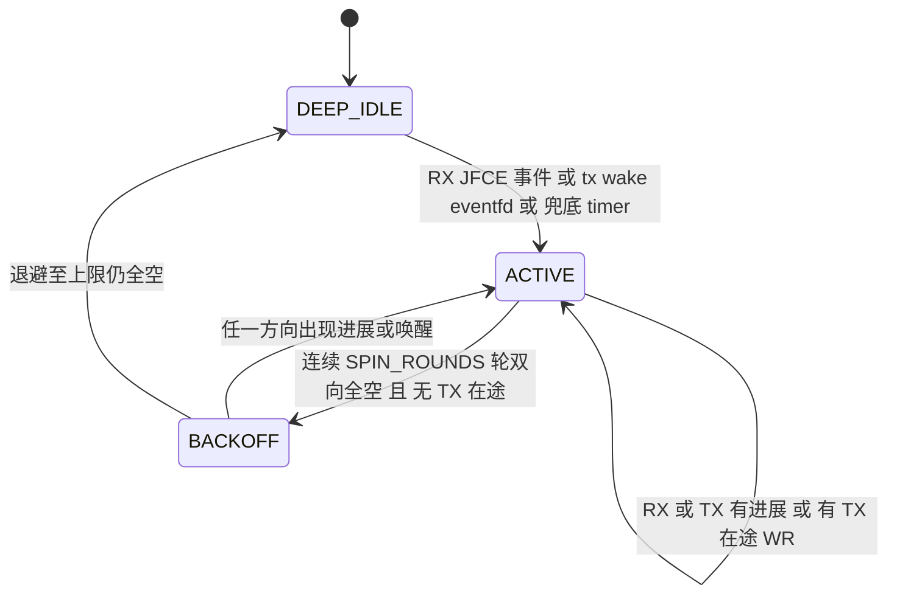
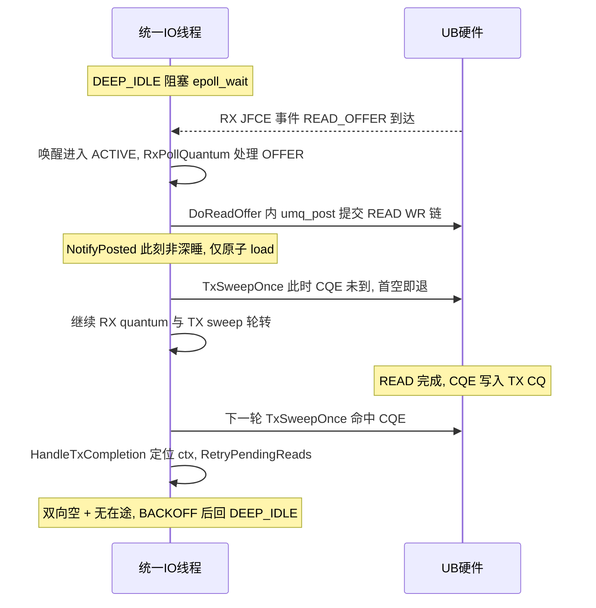

# TX/RX 归一轮询线程设计文档 (TX CQE 无中断收割)

> 状态: 草案 (2026-08-03, v2.4: 二轮审核修订 — 在途计数配平口径下沉公共收割层并按 CQE 数递减, ACTIVE 循环增加就地事件分发/多 main umq 遍历/stop 检查, ExternalPoller 形态禁用, 孤儿清扫 umq 层依赖显式化)
> 背景问题: bigdata READ WR post 之后, 对应 TX CQE 被 poll 到的时延 2ms+
> 本文是 [UBSOCKET-TX-CQE-INTERRUPT-DESIGN.ch.md](UBSOCKET-TX-CQE-INTERRUPT-DESIGN.ch.md) (中断触发方案) 的**替代方案**, 两篇二选一实施。v1 的独立 TX 轮询线程方案因"poll TX 与 RX 必须归一为一个线程"的约束废弃, 本版为归一单线程设计。
> 关联代码: `csrc/core/umq/umq_share_jfr_epoll_runner_ops.cpp`, `csrc/core/ubsocket_tx_cqe_poller.cpp`, `csrc/core/ubsocket_event_epoll.cpp`, `csrc/core/umq/umq_data_tx_ops.cpp`, `csrc/core/ubsocket_bigdata.cpp`

---

## 1. 背景与约束

### 1.1 现状时延构成 (详见中断方案文档 §1)

READ TX CQE 无事件通道, 收割依赖 `TxCqePoller` 的 1ms timerfd, 时延 2ms+ 由三层叠加:

1. **定时器相位底噪**: 0~1ms;
2. **共线程排队**: timerfd 与 RX 处理同在 SHARE_JFR_RX_RUNNER 线程, `ProcessShareJfrEvent` 的 `do-while (UBS_SHARE_JFR_LOOP_POLL_ENABLED)` **无界循环**期间, timer 事件在 epoll 就绪队列里排队无人处理 (详见 §3.2);
3. **全量空转扫描**: `PollAllSockets` 逐 socket 空 poll 50 次 (`POLL_TX_RETRY_MAX_CNT`), O(50 x N)。

### 1.2 设计约束与含义

**硬约束: TX poll 与 RX poll 归一为一个线程** (部署核数预算, 不允许新增专职线程)。

值得指出: 现状 TX timer 本来就挂在 RX 线程上 — 即"已经归一", 但归一得很糟糕。**现状的问题不是归一本身, 而是归一后 TX 收割以"1ms 定时器 + 排队在 RX 无界循环之后"的方式存在**: TX 没有自己的调度配额, 只能捡 RX 的空档。本设计保留归一, 把"排队"改造为"交织": TX 收割成为统一轮询循环里与 RX 平权的一个 quantum, 时延上界从"整个 RX 忙循环 + 定时器相位"收敛到"一个 RX batch 的处理时长"。

### 1.3 与中断方案的关系

同 v1: 用可控的 CPU 开销换掉中断方案的全部复杂度 (无 arm-poll 竞态、无窗口 CAS、无 ack 状态机、无 rearm/solicited 固件语义依赖)。归一后额外的收益: TX 收割与 RX 处理天然同线程串行, 连 v1 的跨线程并发面都不存在。

---

## 2. 目标与非目标

### 目标

- READ TX CQE 收割时延: 空载 P99 < 100us (eventfd 唤醒路径); RX 高负载下有明确上界 (一个 RX batch + 一次 TX sweep, 而非现状的无界排队);
- **不新增任何线程**: SHARE_JFR_RX_RUNNER 线程升级为统一 IO 轮询线程;
- **TX CQE 收割路径全部归一**: POOL 模式 `TP_TX_TIMER` 下线, 其 drain 职责并入统一线程 (§4.4); POOL 且流控关闭形态下 TRANSPORT_POOL_TX_RUNNER 不再启动, 线程数净减一;
- RX 路径行为与性能不回退: rearm 语义不变, RX 吞吐/时延回归持平;
- 空闲时 CPU 为零 (阻塞 epoll_wait), 忙时 CPU 与现状同一线程预算内;
- 不依赖任何 TX 方向硬件事件语义;
- 特性可开关, 关闭时回退现状 (1ms TX_CQE_TIMER)。

### 非目标

- 不改变 READ WR 的 ordered-completion 语义与 `complete_enable` 配置;
- 不接管应用 writev 路径的 `PollTx` (保持现状, 并发面不变);
- 不并入 `FC_TX` (流控超时归还, 含其 TX poll) 与 TRANSPORT_POOL_EVENT_RUNNER 职责 — 非 TX CQE 收割主路径, 归并列二期评估;
- 不为多网卡/多 umq 域做多线程扩展 (单线程约束下无此项)。

---

## 3. 方案总览

### 3.1 结构: SHARE_JFR_RX_RUNNER 升级为统一 IO 轮询线程

```
统一 IO poll 线程 (原 SHARE_JFR_RX_RUNNER, 不新增)
  epoll 集合:
    - JFCE RX fds (RUNNER_EVENT_TYPE_SHARE_JFR / SUB_UMQ_RX)   [既有]
    - tx wake eventfd (RUNNER_EVENT_TYPE_TX_WAKE)              [新增, 替代 1ms TX_CQE_TIMER]
    - tx 兜底 timerfd (复用 RUNNER_EVENT_TYPE_TX_CQE_TIMER)    [周期 1ms -> 100ms]
  主循环 (ACTIVE 态):
    do {
        progress  = RxPollQuantum();   // 至多一个 batch, 既有 sift/repost 流程
        progress |= TxSweepOnce();     // 全 target drain 一轮, 首空即退
    } while (progress || AnyTxInflight());
    ... BACKOFF ... DEEP_IDLE (阻塞 epoll_wait)
```

- **RX 仍是事件驱动**: JFCE 中断 + rearm 流程 (`ProcessMainUmqRearm`) 原样保留, 深睡时由 RX 事件唤醒; **只有 TX 是纯轮询**;
- **TX 轮询目标**: 以 socket 的 `local_umqh_` 为 target, share-JFR 与 POOL 模式均为**每 socket 一个 target** — POOL 模式 logic umq 受 jetty 节点所有权互斥保护, poll 只见自己的 CQE (§4.4 前置事实); POOL 另有按 main umq 登记的兜底孤儿清扫 (§4.4);
- `TxCqePoller` 对外接口 (`AddSocket`/`DelSocket`/`Start`/`Stop`) 保留, 内部实现替换为 target 注册 + wake fd 管理, 调用点 (`ubsocket_socket.cpp:60` `Start`, `ubsocket_event_epoll.cpp:652` `AddSocket`, `ubsocket_event_epoll.cpp:828` `DelSocket`, `ubsocket.cpp:232` `Stop`) 无需改动; `Start()` 内部行为新增 wake eventfd 创建/注册, 在 `RUNNER_EVENT_TYPE_TX_WAKE` 注册到 runner epoll 后生效。

### 3.2 核心机制一: 交织配额 (解决单线程互相饥饿)

现状 `ProcessShareJfrEvent` 的 RX 忙循环是无界的 (`do-while (UBS_SHARE_JFR_LOOP_POLL_ENABLED)`, poll 到空才退出), TX 事件只能等它结束 — 这是 2ms 时延的第 2 层成因。改造为**有界 quantum + 轮转**:

- `RxPollQuantum()`: 现 `ProcessShareJfrEvent` 循环体抽取为单轮 (一次 `umq_poll` 至多 `MAX_EPOLL_WAIT_COUNT`(128) 个 RX CQE + 既有 refill/sift/enqueue 流程), 返回是否有进展; **无界 do-while 循环上移到统一主循环, 循环体内插入 TX sweep**;
- `TxSweepOnce()`: 遍历有在途 WR 的 target 各 drain 一轮 (首空即退, §3.5), 加 `RetryPendingReadsForSocket`; 无在途时为零成本 (一次原子判定);
- 互相饥饿的双向封闭:
  - TX 等待上界 = 一个 RX batch 的处理时长 (典型几十 us 量级, §8 实测确认), 不再是整个 RX 忙循环;
  - RX 等待上界 = 一次有界 TX sweep (首空即退, 有在途 target 数有限), 不存在 TX 侧无界循环。

**`RxPollQuantum` 抽取的状态迁移表** (保证等价性):

`ProcessShareJfrEvent` 循环体 (`umq_share_jfr_epoll_runner_ops.cpp:130-220`) 内有以下状态, 抽取为单轮函数时需明确归属:

| 状态/变量 | 现状生命周期 | 抽取后归属 | 说明 |
|-----------|-------------|-----------|------|
| `event_reach_sockets` / `event_reach_epoll_fds` (`thread_local unique_ptr`) | do-while 外首次初始化, 每轮开头 `ClearAll` | 保持 `thread_local`, `RxPollQuantum` 内每轮 `ClearAll` | 等价, `thread_local` 保证跨轮复用 |
| `traced_socket_fds_` (成员) | **每事件一次** `clear` (do-while **外**, `umq_share_jfr_epoll_runner_ops.cpp:129`) | `RunUnifiedActiveLoop` 入口 `clear` (**不放进** `RxPollQuantum`) | 保持"每事件"的 REARM trace 去重域; 若误改为每轮 clear, 忙循环期间同一 socket 每轮重复打 CORE_EPOLL_REARM 点, trace 量放大且时间戳语义改变 |
| `traced_socket_fd_trace_map_` (成员) | do-while 内每轮 `clear` | `RxPollQuantum` 内每轮 `clear` | 等价 |
| `traceTime_` (成员, 多个时间戳字段) | do-while 外无显式初始化, 循环内每轮覆盖 | `RxPollQuantum` 内每轮覆盖 | 等价, `traceTime_` 为成员变量, 跨轮保持, 每轮覆盖即正确语义 |
| `umq_poll` / `umq_post` refill 流程 | 循环内每轮独立 | `RxPollQuantum` 内单轮 | 等价 |
| `SiftSocketEventsWithUmqBuffers` + `readable_epoll_fds` 派发 | 循环内每轮独立 | `RxPollQuantum` 内单轮 | 等价 |
| do-while 退出条件 (`UBS_SHARE_JFR_LOOP_POLL_ENABLED`) | 循环尾判定 | 上移到 `RunUnifiedActiveLoop` 的循环条件 | 语义升级: 由"RX poll 到空退出"改为"双向空 + 无在途退出", 开关关闭时 `RunUnifiedActiveLoop` 单轮即退 |

**关键不变量**: `RxPollQuantum` 是无状态单轮函数 (所有跨轮状态均为 `thread_local` 或成员变量, 不在函数栈上保持), 可被 `RunUnifiedActiveLoop` 安全重复调用。抽取时需保证 `traceTime_` 的时间戳字段在每轮开始时被覆盖 (而非累加), 这与现状 do-while 内的行为一致。

### 3.3 核心机制二: 自适应节奏状态机 (v1 保留, ACTIVE 判定合并 TX/RX)



| 状态 | 行为 | CPU |
|------|------|-----|
| ACTIVE | RX quantum 与 TX sweep 轮转, 轮间 `sched_yield` (可配) | 高 (仅忙窗口) |
| BACKOFF | 同上扫描, 轮间 sleep 10us 指数增至 200us | 递减 |
| DEEP_IDLE | 阻塞 `epoll_wait` (RX JFCE + tx wake + 兜底 timer) | ~0 |

**三态划分说明**: BACKOFF 行为与 ACTIVE 相同 (都是 RX quantum + TX sweep), 差异仅是轮间 sleep; DEEP_IDLE 与 BACKOFF 的差异是是否阻塞 `epoll_wait`。三态主要为监控可观测性 (busy/backoff/idle 占比统计) 与退避节奏的显式建模, 行为上 BACKOFF 是 ACTIVE 的退避变体; 若实现简化为两态 (ACTIVE spin/backoff 合并 + DEEP_IDLE) 也可接受, 但建议保留三态以支持性能调优时的状态分布分析。

阻塞前置条件: RX JFC 已 rearm (沿用现状 — rearm 在事件处理开头完成, ACTIVE 期间的额外空 poll 不影响 arm 状态, armed CQ 的事件触发与 poll 无冲突); TX 无在途 WR (睡前复查, §3.4)。

### 3.4 核心机制三: post 侧唤醒 (v1 保留)

```cpp
std::atomic<bool> sleeping_{false};

void NotifyPosted()
{
    if (sleeping_.load(std::memory_order_acquire)) {
        eventfd_write(wake_fd_, 1);    // 仅深睡时付一次 syscall
    }
}
```

唤醒点 (**所有 TX 方向 `umq_post` 调用点, 缺一不可**): `PostSend` (writev) / `DoReadOffer` / `RetryPendingReads` / `SendSimpleCtrl` / `DrainDeferredCtrl` / **`TrySenderPost` 批量 SEND (`ubsocket_bigdata.cpp:1417`)** / `ProbeManager` 探测包 (请求与响应两处) — post 成功 (或部分成功, 即本次 `umq_post` 至少提交 1 个 WR) 后。其中 `TrySenderPost` 是 UB-native `ubs_post` 的主数据路径, 不走 writev/PollTx, poller 是其唯一 drain 通道 (`ubsocket_event_epoll.cpp:648-651` 注释) — 遗漏它意味着 UB-native 单向发送流的 SEND CQE 深睡期只能等 100ms 兜底, 相比现状 1ms 定时器是 100 倍回退。

**调用粒度**: `NotifyPosted` 在"本次 `umq_post` 至少提交 1 个 WR"时调用, 覆盖三种结果:
1. 完全成功 (`ret==0`): 调用;
2. 部分成功 (`ret!=0 && submitted_wrs>0`, 如 `DoReadOffer` 的 `bad != head && bad != nullptr` 路径, `ubsocket_bigdata.cpp:1043-1053`): 调用 — 已提交的 WR 的 CQE 需收割才能腾出 SQ slot 给 pending READ 重试;
3. 完全失败且 `nothing_submitted` (`bad==nullptr || bad==head`): **不调用** — 无 CQE 要收割, 入 `pending_reads` 队列等重试; 若统一线程在深睡且本 socket 无其他在途 WR, 不唤醒是正确的。

**`AnyTxInflight` 的实现定义 (在途计数体系, v2.4 重定)**: 现状代码中 `tx_queue_avail_num_` 的 `fetch_sub` 只覆盖 READ 两处 (`ubsocket_bigdata.cpp:1001,1092`) — batch SEND / 控制 SEND / 探测包均不更新它, **不能**作为在途判定依据。本设计的计数体系有三条硬规则:

1. **递增**: `NotifyPosted(target, n_submitted)` 按本次实际提交的 WR 数 `fetch_add`, 同时维护 per-target 计数与**全局聚合计数** `global_inflight_` — `AnyTxInflight()` 只读全局聚合 (一次原子 load, 避免每轮 O(N) 扫全部 target); per-target 计数仅用于 sweep 的 target 跳过;
2. **递减必须下沉到公共收割层** `PollUmqTxInternal` (per-target + 全局同步减), 使**所有消费路径** — 统一线程 sweep、应用 writev 的 `PollTx`、FC 路径 — 的收割都配平。若递减只挂在 poller 的 sweep 上, writev 路径捞走的 CQE 永不递减, 计数虚高会让 ACTIVE 循环**永久驻留忙转**;
3. **递减口径 = 本轮 poll 到的 CQE 数 (`poll_num`), 不是 wr_cnt**: `PollUmqTxInternal` 的 wr_cnt 对探测包 (`HandleProbePacket` 命中即 `continue`, `umq_tx_helper.cpp:96-98`) 和无效 CQE (`:75-93`) **不计数** — 探测包 post 侧 +1 若按 wr_cnt 递减则永远减不掉, 计数卡死在高位 (下限截断救不了高位卡死), 后果同规则 2。按 CQE 数递减的前提: `TX_REPORT_THRESHOLD = 1` (`ubsocket_defines.h:148`) 下每 WR 独立 CQE, post 侧 WR 数 == CQE 数; bigdata READ 亦每 WR 一 CQE (`ConfigureOrderedReadCompletions`)。**若将来该阈值调大, post 侧必须改按 `complete_enable=1` 的 WR 数递增**, 此约束随代码注释固化。

下限截断为 0 容忍极端不配对; 任何计数遗漏由兜底 timer 保证最终收割 (计数偏低只损时延不损正确性, 计数偏高才是致命的 — 规则 2/3 封的就是偏高)。

lost-wakeup 封闭 (与 v1 相同的标准解): poller 睡前 `sleeping_.store(true, release)` 后**复查**全部 target 在途状态, 有则不睡; post 侧先完成 post (在途状态可见) 再 `load(acquire)` 决定写 eventfd。任一交错下, 要么复查看到在途, 要么 eventfd 计数保证 `epoll_wait` 立即返回。归一后还多一层天然冗余: 深睡时 RX 事件同样唤醒线程, 唤醒后必做 TX sweep。兜底 timer (100ms) 为硬上界。

### 3.5 配套 drain 修正 (与中断方案共享, 单独可合入)

- `PollUmqTx(poll_to_empty=true)` 首次空 poll 即退出 (现状连续 50 次空 poll 无意义);
- 无在途 WR 的 target 跳过;
- (v2.3 更正: v2.2 曾列"POOL target 去重只扫一路"的优化, **不成立** — main umq 不带 `FLAG_TP_HANDLE_IDX` 的 TX poll 恒返回 0 (`umq_pro_ub.c:1971-1975`), 且各 socket 的 CQE 本就分居各自独占 jetty 节点的 JFC, 不存在"逐 socket 重复扫描同一 CQ", 见 §4.4 前置事实)。

### 3.6 时序 (READ 场景)



post 到收割的时延 = READ 硬件完成时间 + 至多一个 (RX quantum + yield) 的轮转间隔 — 无定时器相位, 无无界排队。READ 恰在 RX 线程处理 OFFER 时 post, 线程此刻必然处于 ACTIVE, 交织轮转天然覆盖, 连 eventfd 都不用写。

---

## 4. 详细设计

### 4.1 主循环改造 (伪代码)

**嵌入点**: `RunUnifiedActiveLoop` 是 `UmqShareJfrEpollRunnerOps` 的成员方法, 由 `ProcessOneEvent` 的 SHARE_JFR / TX_WAKE / TX_CQE_TIMER 分支在处理完**单次事件** (rearm / 清计数) 后**公共调用**, 不改 `DrainReadyEvents` 模板方法 (避免影响其他 runner 类型)。

**驻留期间的事件分发 (v2.4)**: ACTIVE 驻留的退出条件含 `AnyTxInflight()`, 在途 READ 传输期间循环可驻留 ms 级 — 同批 `epoll_wait` 返回的其余事件 (其他 main umq 的 SHARE_JFR、share-JFR 关闭形态下其他 socket 的 `SUB_UMQ_RX`、STOP) 若只等 `DrainReadyEvents` 的 for 循环, 会被饿死。因此循环内**每 `DISPATCH_INTERVAL`(64) 轮做一次 `epoll_wait(epoll_fd_, timeout=0)` 就地分发**: 非 STOP 事件按 `ProcessOneEvent` 的单事件逻辑处理 (不递归进入 `RunUnifiedActiveLoop`), 遇 STOP 立即置退出标志并 break。同理, **`RxPollQuantum` 遍历 `jfr_main_umq_` 中注册的全部 main umq** 各 poll 一轮 (常见部署单 main umq, 遍历退化为一次; share-JFR 关闭形态 map 为空, quantum 为空操作, RX 全靠就地分发的 `SUB_UMQ_RX`), TX_WAKE / 兜底 timer 分支进入循环时不需要 main umq 上下文。

```cpp
/* ProcessOneEvent 各分支处理完单次事件后公共调用: */
void UmqShareJfrEpollRunnerOps::RunUnifiedActiveLoop()
{
    uint32_t idle_rounds = 0;
    uint32_t backoff_us = BACKOFF_MIN_US;
    uint32_t rounds = 0;
    while (!stop_requested_.load(std::memory_order_relaxed)) {   // v2.4: G6, Stop 的 join 依赖此检查
        bool progress = false;
        progress |= RxPollQuantum();     // 遍历 jfr_main_umq_ 全部 main umq 各一轮 (v2.4: G2)
        progress |= TxSweepOnce();       // 有界: 每 target 首空即退
        if (++rounds % DISPATCH_INTERVAL == 0) {
            if (DispatchPendingEvents()) { break; }   // v2.4: G1, epoll_wait(0) 就地分发; 遇 STOP 返回 true
        }
        if (progress || AnyTxInflight()) {
            idle_rounds = 0;
            backoff_us = BACKOFF_MIN_US;
            if (ACTIVE_YIELD) { sched_yield(); }
            continue;
        }
        if (++idle_rounds <= SPIN_ROUNDS) { sched_yield(); continue; }
        if (backoff_us < BACKOFF_MAX_US) { usleep(backoff_us); backoff_us <<= 1; continue; }
        break;   // 退出回 DrainReadyEvents, 睡前复查见 4.3
    }
}
```

`ProcessOneEvent` 改造后伪代码:

```cpp
int ProcessOneEvent(const epoll_event &event) {
    // ... 既有事件类型判定 ...
    if (type == SHARE_JFR || type == SHARE_JFR_RETRY) {
        // rearm (原 ProcessShareJfrEvent 开头的 rearm 逻辑保留)
        if (should_rearm && ProcessMainUmqRearm(main_umq) < 0) return -1;
        RunUnifiedActiveLoop();          // 替代原 ProcessShareJfrEvent 的 do-while
        return 0;
    }
    if (type == SUB_UMQ_RX) {
        // 原 sub umq poll 单轮逻辑保留
        HandleSubUmqPollBuffers(...);
        if (AnyTxInflight()) { RunUnifiedActiveLoop(); }  // 有 TX 在途则驻留交织
        else                 { TxSweepOnce(); }           // 无在途仅一次原子判定
        return 0;
    }
    if (type == TX_WAKE) {               // 新增
        uint64_t val; read(wake_fd_, &val, sizeof(val));
        RunUnifiedActiveLoop();
        return 0;
    }
    if (type == TX_CQE_TIMER) {          // 兜底
        uint64_t val; read(timer_fd_, &val, sizeof(val));
        RunUnifiedActiveLoop();          // 替代原 PollAllSockets
        return 0;
    }
}
```

事件分发改动对照:

| 事件类型 | 现状 | 改造后 |
|----------|------|--------|
| `SHARE_JFR` / `SHARE_JFR_RETRY` | rearm + 无界 RX 忙循环 (`ProcessShareJfrEvent` do-while) | rearm + `RunUnifiedActiveLoop` (do-while 上移, 内插 TX sweep) |
| `SUB_UMQ_RX` | 单次 sub umq poll | 原逻辑 + 有 TX 在途则进 `RunUnifiedActiveLoop`, 否则单次 `TxSweepOnce` — 必须驻留: `UBS_ENABLE_SHARE_JFR=false` 形态下 RX 事件全走此分支, 线程忙于连续 RX 事件时非深睡 (`NotifyPosted` 不写 eventfd), 若不驻留则 TX 收割退化为每 RX 事件一次 |
| `TX_WAKE` (新增, wake eventfd) | — | 清计数 + `RunUnifiedActiveLoop` |
| `TX_CQE_TIMER` (兜底, 100ms) | 1ms 全量 `PollAllSockets` | 清计数 + `RunUnifiedActiveLoop` |

`UBS_SHARE_JFR_LOOP_POLL_ENABLED` 的语义由"RX 无界忙循环"升级为"统一 ACTIVE 循环", 开关保留 (关闭则 `RunUnifiedActiveLoop` 每次只跑一轮 quantum 即退出, 行为趋近现状)。

### 4.2 改造点清单

| 位置 | 改动 |
|------|------|
| `ubsocket_tx_cqe_poller.cpp` | timerfd 周期 1ms -> `UBS_TX_POLLER_FALLBACK_MS`(100ms); 新增 wake eventfd 创建/注册 (`RUNNER_EVENT_TYPE_TX_WAKE`)、`NotifyPosted(target, n)` 与 per-target `inflight_tx_wrs_` 计数 (§3.4); 新增 `RegisterOrphanSweep` 与兜底孤儿清扫分支 (main umq + tp flag round-robin, umq_ctx callback, §4.4); `PollAllSockets` 重构为 per-socket target 的 `TxSweepOnce` (error callback 维持 `DoUmqTxPoll` 现状) |
| `umq_share_jfr_epoll_runner_ops.cpp` | `ProcessShareJfrEvent` 循环体抽取为 `RxPollQuantum` (遍历 `jfr_main_umq_` 全部 main umq); 新增 `RunUnifiedActiveLoop` (入口 clear `traced_socket_fds_`, stop 检查 + 每 `DISPATCH_INTERVAL` 轮 `DispatchPendingEvents` 就地分发, 退出路径置位 `sleeping_` + 复查, §4.1/4.3); `ProcessOneEvent` 入口清零 `sleeping_`, 增加 `TX_WAKE` 分支, `SUB_UMQ_RX` 分支在途驻留 |
| `umq_tx_helper.cpp` | **在途计数递减下沉至 `PollUmqTxInternal`** (per-target + 全局聚合, 按本轮 CQE 数 `poll_num` 递减, 覆盖探测包/无效/错误 CQE 与 writev/FC 全部消费路径, §3.4 规则 2/3) |
| `umq_data_tx_ops.cpp` | `PollUmqTx` drain 语义修正 (首空即退); `PostSend` 成功后 `NotifyPosted` |
| `ubsocket_bigdata.cpp` | **5 个** post 点追加 `NotifyPosted`: `DoReadOffer` / `RetryPendingReads` / `SendSimpleCtrl` / `DrainDeferredCtrl` / **`TrySenderPost` 批量 SEND (`:1417`)** |
| `profiling/probe/probe_manager.h` | 探测包请求/响应两个 post 点追加 `NotifyPosted` |
| `umq_transport_pool.cpp` | `WarmUp` 移除 `AddTimerEvent` (TP_TX_TIMER 下线); 改为 `RegisterOrphanSweep(main_umqh)` 登记兜底孤儿清扫; `TP_TX_TIMER` 相关 `TxEpollEvent`/timerfd 创建代码删除 |
| `ubsocket_event_epoll.h` | `RunnerEventType` 追加 `RUNNER_EVENT_TYPE_TX_WAKE` — 加在 `RUNNER_EVENT_TYPE_STOP` **之后**、`BUTT` 之前才能保持既有值稳定 (插在 STOP 前会把 STOP 从 9 平移到 10); 硬约束: `RunnerEventData.type` 仅 **4 bit** (`:54`), 现用 0~10, 上限 15 |

### 4.3 睡前复查与 lost-wakeup

为兑现 §4.1 "不改 `DrainReadyEvents` 模板"的承诺, `sleeping_` 的置位**不放在 epoll_wait 前一行** (那是 `EpollRunner` 模板代码), 而放在 `RunUnifiedActiveLoop` 的退出路径上 (仍在 ops 层):

```
/* RunUnifiedActiveLoop 退出前 (双向空 + 无在途 + 退避到上限): */
sleeping_.store(true, release);
if (AnyTxInflight()) { sleeping_.store(false); continue; /* 回 ACTIVE */ }
break;  /* 返回 ProcessOneEvent -> DrainReadyEvents -> 下次 epoll_wait 阻塞 */

/* RunUnifiedActiveLoop 入口: sleeping_.store(false) */
```

正确性论证: 置位点早于真正的 epoll_wait (中间隔着 DrainReadyEvents 处理同批剩余事件), 属于**提前置位** — 提前只会造成多余的 eventfd 写 (post 线程看到 `sleeping_=true` 而统一线程实际还在处理事件时写入, eventfd 计数使下次 epoll_wait 立即返回, 至多一次虚假唤醒), **不会丢唤醒**: 复查 (`AnyTxInflight`) 在 store-release 之后, post 侧 `inflight` 的 `fetch_add` 在 `sleeping_` 的 load-acquire 之前, 交错性质与标准解一致。若实测虚假唤醒频率成为问题, 二期再给 `EpollRunner` 加 `BeforeBlock()` ops 钩子精确置位 (届时改造点清单补 `ubsocket_event_epoll.cpp/.h`)。

**清零点 (v2.4)**: `sleeping_` 在 `ProcessOneEvent` 入口清零 (任意事件唤醒即清), 而非仅 `RunUnifiedActiveLoop` 入口 — 否则纯 `SUB_UMQ_RX` 唤醒周期 (无在途, 不进循环) 会让 stale true 长期存在, `NotifyPosted` 持续写 eventfd (正确性无损, 但徒增 syscall 与虚假唤醒)。

RX 侧无需复查: JFCE 事件是硬件推送, armed 状态下阻塞期间到达的 RX CQE 必产生事件唤醒 epoll_wait (现状语义, 不变)。

### 4.4 POOL 模式 (Jetty 池化): TP_TX_TIMER 下线, 方案 a (per-socket target 沿用)

**前置事实 (v2.3 评估确认, 决定本节方案)**: POOL 模式的 TX JFC 物理上属于共享 jetty 池节点 — logic umq 自身无独立 TX JFC, poll 时 `queue->jfs_jfc` 被指向当前借用节点的 JFC (`umq_pro_ub.c:1704-1723`); 但访问受 `node->umq_ref` **所有权互斥**保护: 只有当前 owner 的 logic umq 能 poll 该节点 JFC, 且节点归还池子的前提是 `tx_outstanding == 0` (在途 WR 全部收割后才 CAS 归还, `:1754-1759`)。因此 **per-socket handle 的 poll 只会捞到自己的 CQE**; 跨 socket 混流只存在于 main umq + `UMQ_IO_OPTION_FLAG_TP_HANDLE_IDX` 的 round-robin poll 路径 (`:2104-2165`, 无 owner 检查)。另一硬约束: **main umq + share transport 不带 tp idx flag 的 TX poll 恒返回 0** (`:1971-1975`) — "对 main umq 一路 drain 不设 tp flag" 的做法一个 CQE 都 poll 不到。

**方案 a: target 不去重, 沿用 per-socket logic handle** (与现状 `PollAllSockets` 的 poll 对象一致):

- 每个 socket 的 target 即其 `local_umqh_`; 所有权互斥保证 poll 只见自己的 CQE, `DoUmqTxPoll` 绑定 `fd_` 的 error callback **正确, 无需改造**; "去重省扫"的收益本就不存在 (各 socket 的 CQE 只在其独占节点的 JFC 里);
- **`TP_TX_TIMER` 一期直接下线**, 其职责拆分为两部分承接:
  1. **活跃 socket 的 CQE (主路径)**: per-socket target 的 `TxSweepOnce`, 由 `NotifyPosted`/交织循环驱动, us 级时延;
  2. **孤儿 CQE 清扫 (兜底路径)**: socket 关闭时若 `FlushTx` 超时仍有在途 WR, logic umq 销毁后无人再 poll 其独占节点, 节点因 `tx_outstanding != 0` 无法归还 — 现状由 TP_TX_TIMER 的 main umq round-robin poll (无 owner 检查) 充当清道夫。下线后该职责由统一线程的 **100ms 兜底 tick** 承接: 兜底分支在常规 sweep 之外, 额外对 main umq 做一次带 `FLAG_TP_HANDLE_IDX` 的 round-robin drain (`umq_ub_poll_tx` 自动分发至 round-robin 全节点轮询, `:2175-2177`), **此路径使用按 `buf_pro->umq_ctx` 解析的 callback** (孤儿 CQE 的 socket 可能已注销, `ArraySet::GetItem` 返回空则跳过 — `PollUmqTxForFcReturn` 样式)。**umq 层依赖待确认 (v2.4)**: (a) logic umq 的 `umq_destroy` 是否释放其持有的 node ownership (`umq_ref` 高位) — 若不释放, drain 完 CQE 节点仍无法归还, 需 umq 层配合; (b) 孤儿 CQE 的 `ProcessTxCqe` 对已关闭 socket 的 qbuf 做 Block DecRef, 安全性依赖 "FlushTx 超时泄漏路径不 free qbuf" 的现状语义。两项在实施前与 umq 层对齐;
- `UmqTransportPool::WarmUp` 不再 `AddTimerEvent`, 改为 `RegisterOrphanSweep(main_umqh)` 向统一 poller 登记兜底清扫对象;
- 非 ubsocket 跟踪的 WR (如 `ProbeManager` 探测包): 探测包经 socket 的 `UmqHandle()` post, 在 per-socket target 覆盖范围内; post 点一期补 `NotifyPosted` (一行改动), 避免深睡期其 CQE 占用 SQ slot 长达 100ms; 即便遗漏, 兜底 tick 仍保证最终收割;
- **`RebuildTp` 与 `umq_poll` 的锁覆盖**: 兜底清扫的 round-robin poll 持 `jetty_node_list->lock`, 与现状 TP_TX_TIMER 分支同路; `RebuildTp` 的 destroy 并发面与现状一致, 安全性等价;
- **线程数净收益**: TP_TX_TIMER 下线后, TRANSPORT_POOL_TX_RUNNER 仅剩 `FC_TX` 职责 — POOL 模式且流控关闭的部署形态下该 runner 不再启动, 线程数净减一; 流控开启时保留 (其 `PollUmqTxForFcReturn` 也会 poll TX CQ, 与统一线程的并发面为现状已有, 见 §5), FC_TX 并入统一线程列二期。

**方案 b (备选, 不采纳)**: target 收敛为 main umq + `FLAG_TP_HANDLE_IDX` round-robin 一路 poll。可行但必须全程配 umq_ctx callback, 且与活跃 socket 自身的 owner 路径 poll 并发扫同一节点 JFC (CQE 原子性由 urma 层保证, 每个 CQE 只被一边取走); 相比方案 a 无收益、并发面更宽, 仅作记录。

**v2.2 表述更正 (F2 现状部分撤回)**: v2.2 曾断言"现状 `PollAllSockets` 在 POOL 模式逐 socket `ForceDrainTx` 同一 main umq, 今天已存在 shutdown 错 socket 隐患" — 经 umq 层核实**不成立**: 现状 poll 的是各 socket 自己的 logic handle, 所有权互斥保证只见自己的 CQE, 无需单列修复。umq_ctx 解析 callback 的要求仅适用于 main umq + tp flag 的 poll 路径, 即本设计的兜底孤儿清扫分支。

### 4.5 生命周期

沿用现 `TxCqePoller` 的 `ubsocket_uninit` 槽位与顺序 (`Stop()` -> `ReleaseAll` -> runner Stop -> `UmqBackend::UnInit`)。`Stop()` 注销 wake fd/timer fd; 统一线程本身即 SHARE_JFR runner 线程, 其 join 由既有 runner `Stop()` 完成 — 满足 "UnInit 前停止所有 poll 线程" 的既有约束 (mempool tseg not exist 陷阱), 且比 v1 少一个需要 join 的线程。

### 4.6 部署形态约束: ExternalPoller backend 下禁用 (v2.4)

`EpollRunner` 有两种 backend: 专职 pthread (`PthreadEpollRunnerBackend`, `ubsocket_event_epoll.cpp:72-94`) 与外部 poller 驱动 (`ExternalPollerEpollRunnerBackend`, `:97+`, 由 `GlobalSetting::UBS_POLLER_OPS` 配置, `DrainReadyEvents` 在外部/brpc poller 的 worker 上下文中被回调)。本设计通篇假设专职线程 — ACTIVE 驻留在 external poller 形态下会**长时间占用外部 poller 的一个 worker**, 语义完全不同。约束: 初始化时检测 `UBS_POLLER_OPS != nullptr` 则**强制关闭本特性** (回退现状 1ms timer) 并打 WARN 日志; external poller 形态的低时延方案 (限界驻留/由外部 poller 承担 pacing) 列二期评估。

### 4.7 RX 侧影响分析 (归一的代价与封闭)

| 影响 | 分析 |
|------|------|
| RX 单事件处理时延 +一次 TxSweepOnce | 无在途时为一次原子判定 (~ns); 有在途时首空即退, 上界 = target 数 x 一次 umq_poll, 远小于现状 TX timer 触发时的 O(50 x N) 全量扫描 |
| ACTIVE 循环内 RX poll 频率被 TX sweep 稀释 | quantum 轮转下 RX 每轮仍处理满 batch (128 CQE), 稀释比例 <= 1 次 sweep / batch; §8 以 RX 吞吐回归把关 |
| 现状 1ms TX timer 每 tick 打断 RX 的开销消失 | 归一后 TX 收割不再经 epoll/timerfd 分发, 反而减少事件分发次数 |

---

## 5. 竞态分析

| 交错序列 | 处置 |
|----------|------|
| lost-wakeup (深睡 vs post) | §3.4 store-release/load-acquire + eventfd 计数 + RX 事件冗余唤醒 + 100ms 兜底 |
| 多线程并发 `NotifyPosted` | eventfd 计数累加, 幂等无锁 |
| 统一线程与应用 writev 线程并发 poll 同一 TX CQ | 与现状 (TxCqePoller vs PollTx) 完全相同, 依据不变 (umq 层 `io_lock_free=false` 加锁, `tx_queue_avail_num_` 原子, qbuf 链归 poll 到者) |
| 统一线程内 TX 与 RX | **同线程串行, 无竞态** — 归一的最大红利 |
| 统一线程与 `FC_TX` (POOL 且流控开启, `PollUmqTxForFcReturn` 也 poll TX CQ) | 现状已存在的双线程并发, 未新增; TP_TX_TIMER 下线后 POOL 无流控形态该线程不再启动, 并发彻底消失 |

对比 v1 独立线程: 消失的项 — TX poller 与 RX runner 跨线程并发扫 POOL main umq、TP_TX_TIMER 与 poller 的并发。对比中断方案: 消失的项 — arm-poll 丢唤醒、窗口 CAS、ack flush 时序。

---

## 6. 配置项

| 环境变量 | 默认值 | 说明 |
|----------|--------|------|
| `UBS_TX_UNIFIED_POLL_ENABLED` | `false` (灰度) | 总开关; 关闭时回退现状 (1ms TX_CQE_TIMER + 无界 RX 忙循环) |
| `UBS_TX_POLLER_ACTIVE_YIELD` | `true` | ACTIVE 轮间 `sched_yield`; `false` 纯 spin (时延最优, 线程近独占一核) |
| `UBS_TX_POLLER_SPIN_ROUNDS` | `64` | 转入 BACKOFF 前空轮宽限 |
| `UBS_TX_POLLER_BACKOFF_MAX_US` | `200` | 退避上限 |
| `UBS_TX_POLLER_FALLBACK_MS` | `100` | 兜底 timer 周期 (开关关闭时该 timer 即现状 1ms timer) |
| `UBS_TX_POLLER_DISPATCH_INTERVAL` | `64` | ACTIVE 驻留期间每 N 轮做一次 `epoll_wait(0)` 就地事件分发 (§4.1) |

配套优化 (不受开关控制, 单独可合入): drain 首空即退; 无在途 target 跳过。

## 7. 三方案对比

| 维度 | 归一单线程轮询 (本方案) | v1 独立线程轮询 (已废弃) | 中断触发 (另篇) |
|------|------------------------|--------------------------|----------------|
| 新增线程 | **0 (POOL 无流控形态净减 1)** | +1 | 0 (复用 runner) |
| 时延 (空载 P99) | eventfd/RX 事件唤醒 ~10us + 硬件 | 同左 | JFCE 事件 ~10-20us + 硬件 |
| 时延 (RX 高负载) | 上界 = 1 个 RX batch + sweep (交织配额) | 最优 (独立线程贴 poll) | handler 批次化 |
| RX 侧影响 | 每 quantum +1 次有界 sweep (量化于 §4.7) | 无 | 无 |
| CPU (空闲/满载) | ~0 / 与现状同线程预算 | ~0 / 独占最多一核 | ~0 / 低 |
| 竞态复杂度 | 1 (lost-wakeup, 标准解) + TX/RX 同线程零竞态 | 1 (lost-wakeup) | 3 类 (arm/窗口/ack) |
| 硬件语义依赖 | 无 | 无 | rearm/solicited/JFCE |
| POOL 改造量 | 小 (per-socket target 沿用 + TP_TX_TIMER 下线 + 兜底孤儿清扫) | 极小 | TP_TX 接线 + handler 补缺口 + `HandleTxCompletion` sock 依赖修正 (前置改动) |

**选择建议**: 在"不新增线程"约束下, 本方案与中断方案的真实权衡是: 本方案实现风险最低、无硬件语义依赖, 代价是 RX 高负载下 TX 时延上界受 RX batch 粒度影响; 中断方案 RX/TX 事件各自独立触发, 但引入 arm/ack 复杂度。若 §8 实测 RX batch 时延上界满足业务目标 (P99 < 100us), 推荐本方案。

## 8. 测试与验收

### 功能 (UT, mockcpp)

- lost-wakeup 封闭: `sleeping_=true` 后翻转在途状态, 验证不进入 epoll_wait;
- `NotifyPosted` 仅深睡时写 eventfd (mock `eventfd_write` 计数);
- `RxPollQuantum`/`TxSweepOnce` 交织: mock 双向 CQE 序列, 验证轮转顺序与有界性 (TX sweep 首空即退, RX 单轮 <= 128);
- target 注册: share-JFR 与 POOL 均为每 socket 一 target; POOL `WarmUp` 的 `RegisterOrphanSweep(main_umqh)` 先于 poller `Start` 的注册容忍 (登记表独立于线程生命周期);
- 在途计数配平 (v2.4 口径): 递减在 `PollUmqTxInternal` 公共层、按 CQE 数 (`poll_num`); 专项用例: 探测包 CQE (post +1, 收割 -1 配平)、无效 CQE 递减、writev 路径 `PollTx` 收割同样递减、`TrySenderPost` 部分接受 (`accepted_bufs`) 按实际提交数计; 全局聚合与 per-target 一致性; 计数永不为负且**不发生高位卡死** (长稳后归零);
- ACTIVE 循环结构: stop 标志置位后循环在一轮内退出 (Stop join 有界); `DISPATCH_INTERVAL` 轮触发就地分发, 构造驻留期间的 `SUB_UMQ_RX`/第二 main umq 事件验证不饿死;
- 兜底孤儿清扫: 构造已注销 socket 的 CQE (`ArraySet::GetItem` 返回空), 验证跳过不崩溃; 构造 socket B 的错误 CQE 经清扫路径, 验证按 `umq_ctx` shutdown 的是 B (§4.4);
- `RUNNER_EVENT_TYPE_TX_WAKE` 分发与 `TX_CQE_TIMER` 兜底分发;
- 开关关闭回退基线; Stop 幂等 (用例 <= 1s, 兜底周期注入缩短)。

### 时延与 CPU (集成)

- 打点: post READ -> `HandleTxCompletion` (SplitTrace tracepoint, 枚举追加在 `UBSOCKET_PROF_COUNT` 之前);
- 验收: 空载 P99 < 100us; **RX 满载下 TX P99 有界且与 RX batch 时长同量级** (交织配额的核心验证, 对比现状 2ms+);
- **UB-native (`ubs_post`) 单向发送流 (无 RX 流量)**: SEND CQE 收割时延 P99 < 100us — 验证 `TrySenderPost` 唤醒点与在途计数生效 (遗漏时表现为 100ms 兜底节奏 + 吞吐坍塌);
- RX batch 时长分布实测 (决定 TX 时延上界的量化数据);
- 空闲 24h 统一线程 CPU ~0。

### 回归 (归一的重点)

- **RX 吞吐/时延回归**: 纯 RX 流量下开关开/关两态持平 (sweep 稀释 <= 判定阈值 3%);
- 纯 SEND 吞吐/时延持平 (writev 路径未动);
- SEND + bigdata READ + RX 三向混跑: 三方向时延分布对比基线;
- POOL: **TP_TX_TIMER 下线后**无 status:12 (SQ full) 回归; 孤儿场景专项: socket 关闭时留在途 WR (`FlushTx` 超时注入), 验证 jetty 节点经兜底清扫最终归还、池子不缩水; 流控关闭形态验证 TRANSPORT_POOL_TX_RUNNER 不启动;
- 探测包 (`ProbeManager`) CQE: 补 `NotifyPosted` 后验证唤醒收割生效 (深睡期 post 探测包, us 级收割); 再人为屏蔽唤醒点验证兜底上界 (<= `UBS_TX_POLLER_FALLBACK_MS`, 无泄漏);
- `ubsocket_uninit` 高负载压测无 "mempool tseg not exist"。

## 9. 风险与回退

| 风险 | 缓解 |
|------|------|
| RX batch 处理时长尾部过大 (如 bigdata OFFER 的大块 buf_alloc 在此线程), 拖高 TX 时延上界 | §8 实测 batch 分布; 必要时二期把 OFFER 的大分配移出热路径 (预分配池); 上界仍远优于现状无界排队 |
| ACTIVE 纯 spin 配置下统一线程近独占一核 | 默认 `ACTIVE_YIELD=true`; 该线程本就是现有线程, 无新增核占用 |
| 交织改造触碰 RX 主路径, 回归风险高于 v1 | `RxPollQuantum` 严格为现循环体的等价抽取 (行为不变), 交织逻辑全部在外层; RX 回归测试把关; 开关回退保底 |
| 唤醒点遗漏 | 100ms 兜底 + RX 事件冗余唤醒双保险; 评审 checklist 绑定 `umq_post(TX)` 调用点 (v2.2 评审已补 `TrySenderPost` 批量 SEND 与探测包三处遗漏, §3.4 列出全量清单) |
| 计数虚高导致 ACTIVE 永驻忙转 + Stop 挂死 (v2.4 识别的最高风险) | §3.4 三条硬规则封闭 (公共层递减/按 CQE 数/全局聚合) + 循环 stop 检查 (§4.1) + §8 长稳归零用例; 监控项: `global_inflight_` 长期不归零告警 |
| ACTIVE 驻留饿死同批事件 (多 main umq / SUB_UMQ_RX / STOP) | `DISPATCH_INTERVAL` 就地分发 (§4.1); §8 专项用例把关 |
| ExternalPoller backend 形态误开启 | 初始化检测 `UBS_POLLER_OPS` 强制关闭 + WARN (§4.6) |
| 孤儿清扫依赖 umq 层语义未确认 (umq_destroy 释放 node ownership / 孤儿 qbuf DecRef 安全) | §4.4 显式列为实施前 umq 层对齐项; 未确认前 POOL 形态可保留 TP_TX_TIMER 作为过渡 |
| TP_TX_TIMER 下线后, 不经 ubsocket 跟踪的 TX WR (探测包等) 在深睡期 CQE 收割延迟升至 100ms | 一期在探测包 post 点补 `NotifyPosted` (一行改动), 消除 SQ slot 占用风险 (§4.4); 100ms 兜底 timer 仍作为最终保险 |
| POOL `WarmUp` 的兜底清扫登记与 poller 生命周期顺序 | 登记表独立于线程启停 (先登记后 Start 合法), UT 覆盖 |
| 孤儿节点在兜底周期内 (<= 100ms) 暂不可归还 | 孤儿是 `FlushTx` 超时的异常路径, 100ms 上界远优于现状之外的永久泄漏; 清扫随兜底 tick 免费获得, 无额外线程/timer |
| `UBS_SHARE_JFR_LOOP_POLL_ENABLED=false` 部署形态下 ACTIVE 循环退化 | 该开关语义升级已在 §4.1 定义 (每事件单轮 quantum), 行为趋近现状, 时延回退到事件驱动节奏而非劣化 |
