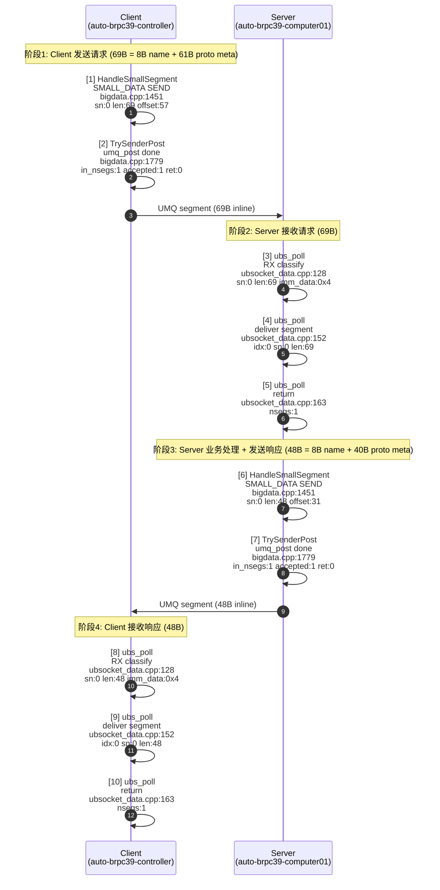
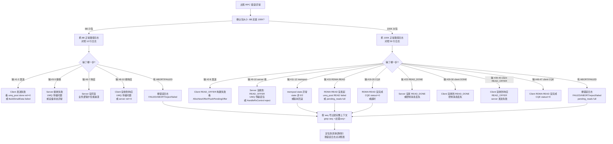
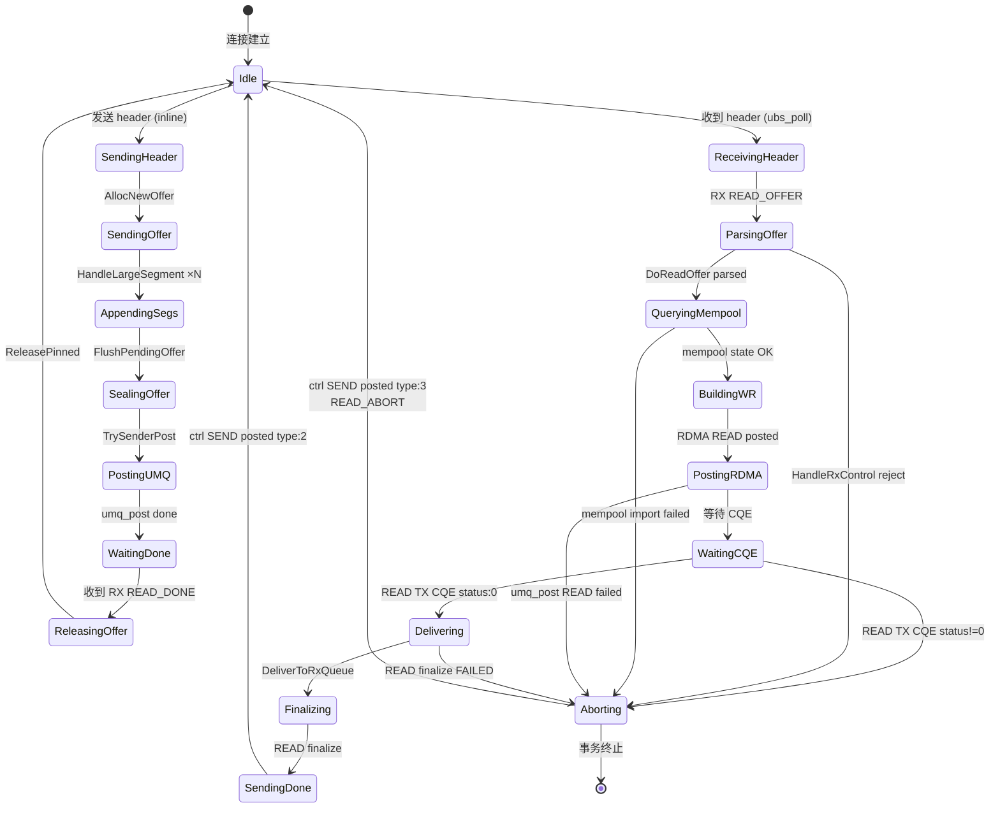

# UB Socket RPC 大小包正常路径 DEBUG 日志流程图（Mermaid）

> 编译开关：`--copt=-DUBS_DATAPATH_DEBUG=1`
> 日志标签格式：`[UBSOCKET <函数名>] [datapath] <标签>, fd: <fd>, <字段>`
> 源码位置：`ubsocket_bigdata.cpp`（发送/接收大数据）、`ubsocket_data.cpp`（ubs_poll 投递）

---

## 一、8B 小包正常路径（inline SMALL_DATA）

### 适用条件
- 请求/响应序列化后 <= ~64B（proto meta + 小字段）
- 不触发 READ_OFFER / RDMA READ 零拷贝
- 数据直接塞进 UMQ segment 的 inline 区域

### Mermaid 时序图



### 8B 正常路径要点
- **10 行 datapath 日志**（client 5 + server 5）
- **2 个函数路径**：`HandleSmallSegment`（发送）+ `ubs_poll`（接收）
- **无 READ_OFFER、无 RDMA READ、无零拷贝**
- **ret=0** 是正常标志，ret!=0 表示 UMQ 提交失败

---

## 二、100K 大包正常路径（READ_OFFER + RDMA READ 零拷贝）

### 适用条件
- 请求/响应序列化后 > ~64B
- header（proto meta）走 inline SMALL_DATA，body 走 READ_OFFER 零拷贝
- body 拆成多个分片（本例 100K = 65504B + 36902B / 36907B）

### 涉及两个 seq
- **请求方向 seq**：`seq:17234056677080979850`（client 发 READ_OFFER，server RDMA READ）
- **响应方向 seq**：`seq:5902249033498799971`（server 发 READ_OFFER，client RDMA READ）

### Mermaid 时序图



```mermaid
sequenceDiagram
    autonumber
    participant C as Client<br/>(auto-brpc39-controller)
    participant S as Server<br/>(auto-brpc39-computer01)

    Note over C: 阶段1: Client 发送请求<br/>header 57B inline + body 100K READ_OFFER
    C->>C: [1] HandleSmallSegment<br/>SMALL_DATA SEND<br/>bigdata.cpp:1451<br/>sn:0 len:57 (请求头)
    C->>C: [2] AllocNewOffer<br/>new READ_OFFER allocated<br/>bigdata.cpp:1417<br/>seq:...850 offer_sn:1
    C->>C: [3] Append<br/>offer UbsSeg filled<br/>bigdata.cpp:393<br/>slot:0 addr:0xffff13390020 len:65504
    C->>C: [4] HandleLargeSegment<br/>READ_OFFER append<br/>bigdata.cpp:1498<br/>input_idx:1 len:65504 (分片1)
    C->>C: [5] Append<br/>offer UbsSeg filled<br/>bigdata.cpp:393<br/>slot:1 addr:0xffff13380020 len:36902
    C->>C: [6] HandleLargeSegment<br/>READ_OFFER append<br/>bigdata.cpp:1498<br/>input_idx:2 len:36902 (分片2)
    C->>C: [7] FlushPendingOffer<br/>READ_OFFER sealed<br/>bigdata.cpp:1401<br/>nsegs:2 seq:...850 first_sn:1
    C->>C: [8] TrySenderPost<br/>umq_post done<br/>bigdata.cpp:1779<br/>in_nsegs:3 accepted:2 ret:0
    C->>S: header 57B inline + READ_OFFER (2 slots)

    Note over S: 阶段2: Server 接收请求<br/>RX READ_OFFER → RDMA READ → 投递
    S->>S: [9] HandleRxControl<br/>RX READ_OFFER<br/>bigdata.cpp:1869<br/>seq:...850 nsegs:2
    S->>S: [10] DoReadOffer<br/>DoReadOffer parsed<br/>bigdata.cpp:1021<br/>first_sn:1 nsegs:2
    S->>S: [11] DoReadOffer<br/>mempool state<br/>bigdata.cpp:1034<br/>slot:0 state:2 (就绪)
    S->>S: [12] DoReadOffer<br/>mempool state<br/>bigdata.cpp:1034<br/>slot:1 state:0
    S->>S: [13] DoReadOffer<br/>READ WR built<br/>bigdata.cpp:1130<br/>slot:0 remote_addr:0xffff13390020 len:65504
    S->>S: [14] DoReadOffer<br/>READ WR built<br/>bigdata.cpp:1130<br/>slot:1 remote_addr:0xffff13380020 len:36902
    S->>S: [15] DoReadOffer<br/>RDMA READ posted<br/>bigdata.cpp:1195<br/>read_wrs:2
    S->>S: [16] ubs_poll<br/>RX classify<br/>ubsocket_data.cpp:128<br/>sn:0 len:57 (请求头)
    S->>S: [17] ubs_poll<br/>deliver segment<br/>ubsocket_data.cpp:152<br/>idx:0 sn:0 len:57
    S->>S: [18] ubs_poll<br/>return<br/>ubsocket_data.cpp:163<br/>nsegs:1
    S->>S: [19] HandleTxCompletion<br/>READ TX CQE<br/>bigdata.cpp:1954<br/>status:0 finalize:0 (分片1完成)
    S->>S: [20] HandleTxCompletion<br/>READ TX CQE<br/>bigdata.cpp:1954<br/>status:0 finalize:1 (分片2完成)
    S->>S: [21] DeliverToRxQueue<br/>DeliverToRxQueue enqueued<br/>bigdata.cpp:739<br/>first_sn:1
    S->>S: [22] FinalizeIo<br/>READ finalize<br/>bigdata.cpp:951<br/>wr_total:2 delivered:1
    S->>S: [23] SendSimpleCtrl<br/>ctrl SEND posted<br/>bigdata.cpp:672<br/>type:2 (READ_DONE)
    S->>C: READ_DONE 控制消息 (type:2)
    S->>S: [24] ubs_poll<br/>RX classify<br/>ubsocket_data.cpp:128<br/>sn:1 len:65504 (body分片1)
    S->>S: [25] ubs_poll<br/>deliver segment<br/>ubsocket_data.cpp:152<br/>idx:0 sn:1 len:65504
    S->>S: [26] ubs_poll<br/>RX classify<br/>ubsocket_data.cpp:128<br/>sn:1 len:36902 (body分片2)
    S->>S: [27] ubs_poll<br/>deliver segment<br/>ubsocket_data.cpp:152<br/>idx:1 sn:1 len:36902
    S->>S: [28] ubs_poll<br/>return<br/>ubsocket_data.cpp:163<br/>nsegs:2

    Note over C: 阶段3: Client 收到 READ_DONE<br/>(server 已 RDMA READ 请求体)
    C->>C: [29] HandleRxControl<br/>RX READ_DONE<br/>bigdata.cpp:1878<br/>seq:...850
    C->>C: [30] ReleasePinned<br/>ReleasePinned unpin source Blocks<br/>bigdata.cpp:245<br/>blocks:2 (释放offer内存)

    Note over S: 阶段4: Server 发送响应<br/>header 31B inline + body 100K READ_OFFER
    S->>S: [31] HandleSmallSegment<br/>SMALL_DATA SEND<br/>bigdata.cpp:1451<br/>sn:0 len:31 (响应头)
    S->>S: [32] AllocNewOffer<br/>new READ_OFFER allocated<br/>bigdata.cpp:1417<br/>seq:...971 offer_sn:1
    S->>S: [33] Append<br/>offer UbsSeg filled<br/>bigdata.cpp:393<br/>slot:0 addr:0xfffdca790020 len:65504
    S->>S: [34] HandleLargeSegment<br/>READ_OFFER append<br/>bigdata.cpp:1498<br/>input_idx:1 len:65504
    S->>S: [35] Append<br/>offer UbsSeg filled<br/>bigdata.cpp:393<br/>slot:1 addr:0xfffdca780020 len:36907
    S->>S: [36] HandleLargeSegment<br/>READ_OFFER append<br/>bigdata.cpp:1498<br/>input_idx:2 len:36907
    S->>S: [37] FlushPendingOffer<br/>READ_OFFER sealed<br/>bigdata.cpp:1401<br/>nsegs:2 seq:...971 first_sn:1
    S->>S: [38] TrySenderPost<br/>umq_post done<br/>bigdata.cpp:1779<br/>in_nsegs:3 accepted:2 ret:0
    S->>C: header 31B inline + READ_OFFER (2 slots)

    Note over C: 阶段5: Client 接收响应<br/>RX READ_OFFER → RDMA READ → 投递
    C->>C: [39] HandleRxControl<br/>RX READ_OFFER<br/>bigdata.cpp:1869<br/>seq:...971 nsegs:2
    C->>C: [40] DoReadOffer<br/>DoReadOffer parsed<br/>bigdata.cpp:1021<br/>first_sn:1 nsegs:2
    C->>C: [41] DoReadOffer<br/>mempool state<br/>bigdata.cpp:1034<br/>slot:0 state:2
    C->>C: [42] DoReadOffer<br/>mempool state<br/>bigdata.cpp:1034<br/>slot:1 state:0
    C->>C: [43] DoReadOffer<br/>READ WR built<br/>bigdata.cpp:1130<br/>slot:0 remote_addr:0xfffdca790020 len:65504
    C->>C: [44] DoReadOffer<br/>READ WR built<br/>bigdata.cpp:1130<br/>slot:1 remote_addr:0xfffdca780020 len:36907
    C->>C: [45] DoReadOffer<br/>RDMA READ posted<br/>bigdata.cpp:1195<br/>read_wrs:2
    C->>C: [46] HandleTxCompletion<br/>READ TX CQE<br/>bigdata.cpp:1954<br/>status:0 finalize:0
    C->>C: [47] HandleTxCompletion<br/>READ TX CQE<br/>bigdata.cpp:1954<br/>status:0 finalize:1
    C->>C: [48] DeliverToRxQueue<br/>DeliverToRxQueue enqueued<br/>bigdata.cpp:739<br/>first_sn:1
    C->>C: [49] FinalizeIo<br/>READ finalize<br/>bigdata.cpp:951<br/>wr_total:2 delivered:1
    C->>C: [50] SendSimpleCtrl<br/>ctrl SEND posted<br/>bigdata.cpp:672<br/>type:2 (READ_DONE)
    C->>S: READ_DONE 控制消息 (type:2)
    C->>C: [51] ubs_poll<br/>RX classify<br/>ubsocket_data.cpp:128<br/>sn:0 len:31 (响应头)
    C->>C: [52] ubs_poll<br/>deliver segment<br/>ubsocket_data.cpp:152<br/>idx:0 sn:0 len:31
    C->>C: [53] ubs_poll<br/>RX classify<br/>ubsocket_data.cpp:128<br/>sn:1 len:65504 (body分片1)
    C->>C: [54] ubs_poll<br/>deliver segment<br/>ubsocket_data.cpp:152<br/>idx:1 sn:1 len:65504
    C->>C: [55] ubs_poll<br/>RX classify<br/>ubsocket_data.cpp:128<br/>sn:1 len:36907 (body分片2)
    C->>C: [56] ubs_poll<br/>deliver segment<br/>ubsocket_data.cpp:152<br/>idx:2 sn:1 len:36907
    C->>C: [57] ubs_poll<br/>return<br/>ubsocket_data.cpp:163<br/>nsegs:3

    Note over S: 阶段6: Server 收到 READ_DONE<br/>(client 已 RDMA READ 响应体)
    S->>S: [58] HandleRxControl<br/>RX READ_DONE<br/>bigdata.cpp:1878<br/>seq:...971
    S->>S: [59] ReleasePinned<br/>ReleasePinned unpin source Blocks<br/>bigdata.cpp:245<br/>blocks:2 (释放offer内存)
```

### 100K 正常路径要点
- **59 行 datapath 日志**（client 29 + server 30）
- **6 个阶段**：发请求 → server 收请求 → client 收 DONE → 发响应 → client 收响应 → server 收 DONE
- **零拷贝机制**：发送方建 offer（含远端地址），接收方 RDMA READ 直接读远端内存
- **status=0, finalize=0/1** 是正常标志，status!=0 表示 RDMA READ 失败
- **type=2** (READ_DONE) 是正常标志，type=3 (READ_ABORT) 表示对端 abort

---

## 三、8B vs 100K 路径对比

### Mermaid 流程图对比

```mermaid
flowchart LR
    subgraph SmallPath["8B 小包路径 (inline)"]
        direction LR
        S1[HandleSmallSegment<br/>SMALL_DATA SEND] --> S2[TrySenderPost<br/>umq_post done]
        S2 --> S3[UMQ segment<br/>69B/48B inline]
        S3 --> S4[ubs_poll<br/>RX classify + deliver]
        S4 --> S5[ubs_poll return<br/>nsegs:1]
    end

    subgraph BigPath["100K 大包路径 (zero-copy)"]
        direction LR
        B1[HandleSmallSegment<br/>SMALL_DATA SEND<br/>header 57B/31B] --> B2[AllocNewOffer<br/>new READ_OFFER]
        B2 --> B3[Append + HandleLargeSegment<br/>offer UbsSeg filled ×2]
        B3 --> B4[FlushPendingOffer<br/>READ_OFFER sealed]
        B4 --> B5[TrySenderPost<br/>umq_post done]
        B5 --> B6[UMQ<br/>header + READ_OFFER]
        B6 --> B7[HandleRxControl<br/>RX READ_OFFER]
        B7 --> B8[DoReadOffer<br/>parsed + mempool state]
        B8 --> B9[READ WR built<br/>×2 slots]
        B9 --> B10[RDMA READ posted<br/>read_wrs:2]
        B10 --> B11[HandleTxCompletion<br/>READ TX CQE ×2<br/>status:0]
        B11 --> B12[DeliverToRxQueue<br/>+ READ finalize]
        B12 --> B13[SendSimpleCtrl<br/>ctrl SEND posted<br/>type:2 READ_DONE]
        B13 --> B14[ubs_poll<br/>deliver body ×2]
        B14 --> B15[HandleRxControl<br/>RX READ_DONE]
        B15 --> B16[ReleasePinned<br/>unpin source Blocks]
    end

    SmallPath -->|数据 > 64B<br/>触发零拷贝| BigPath
```



### 关键差异表

| 维度 | 8B 小包 | 100K 大包 |
|---|---|---|
| **datapath 日志行数** | 10 行（client 5 + server 5） | 59 行（client 29 + server 30） |
| **数据传输方式** | 全 inline SMALL_DATA | header inline + body 走 READ_OFFER zero-copy |
| **READ_OFFER 次数** | 0 | 2（请求1次 + 响应1次） |
| **RDMA READ 次数** | 0 | 4（请求2 WR + 响应2 WR，每次2个分片） |
| **READ TX CQE** | 0 | 4（请求2 + 响应2） |
| **READ_DONE 控制消息** | 0 | 2（双向各1） |
| **ReleasePinned** | 0 | 2（释放 offer 内存） |
| **DeliverToRxQueue** | 0 | 2（大数据投递通知） |
| **数据分片** | 1段（69B / 48B） | 3段（1 header + 2 body，65504+36902/36907） |
| **端到端延迟** | ~654us | ~1173us |
| **核心机制** | UMQ segment 直接携带数据 | READ_OFFER + RDMA READ 零拷贝 |

---

## 四、错误定位决策图

### Mermaid 流程图



### 错误搜索命令

```bash
# 在 client 日志中搜错误
grep -E "FAILED|ABORT|reject|failed|pending_reads full|miss" /home/jl/ub_test_client.log

# 在 server 日志中搜错误
grep -E "FAILED|ABORT|reject|failed|pending_reads full|miss" /home/jl/ub_test_server.log

# 按出错的 seq 过滤完整上下文（大包）
grep "seq: <出错seq>" /home/jl/ub_test_client.log
grep "seq: <出错seq>" /home/jl/ub_test_server.log

# 按时间窗口过滤（小包）
grep "\[datapath\]" /home/jl/ub_test_client.log | head -20
grep "\[datapath\]" /home/jl/ub_test_server.log | head -20
```

---

## 五、零拷贝机制详解

### Mermaid 状态图



### 关键状态说明

| 状态 | 含义 | 正常出口 |
|---|---|---|
| `SendingHeader` | 发送 inline header | → AllocNewOffer（大包）/ 直接 umq_post（小包） |
| `AppendingSegs` | 追加大数据分片到 offer | → FlushPendingOffer |
| `SealingOffer` | 封装 READ_OFFER | → TrySenderPost |
| `WaitingDone` | 等待对端 READ_DONE | → RX READ_DONE → ReleasePinned |
| `ParsingOffer` | 接收方解析 READ_OFFER | → DoReadOffer parsed |
| `QueryingMempool` | 查询内存池状态 | → mempool state=2（就绪） |
| `BuildingWR` | 构建 RDMA READ WR | → RDMA READ posted |
| `WaitingCQE` | 等待 RDMA READ CQE | → READ TX CQE status=0 |
| `Delivering` | 投递到 RX 队列 | → DeliverToRxQueue |
| `SendingDone` | 发 READ_DONE 给对端 | → ctrl SEND posted type=2 |
| `Aborting` | 事务 abort | → READ_ABORT type=3 |

---

## 六、datapath 日志点速查表

### 发送侧

| 日志标签 | 源码:行 | 阶段 | 正常值 |
|---|---|---|---|
| `SMALL_DATA SEND` | `bigdata.cpp:1451` | 发送 inline header | sn, len, offset, block |
| `new READ_OFFER allocated` | `bigdata.cpp:1417` | 分配 offer 容器 | seq, offer_sn |
| `offer UbsSeg filled` | `bigdata.cpp:393` | 填入大分片 | slot, addr, len, mempool_id |
| `READ_OFFER append` | `bigdata.cpp:1498` | 追加到 offer | input_idx, len, offer_nsegs |
| `READ_OFFER sealed` | `bigdata.cpp:1401` | 封装 offer | nsegs, seq, first_sn |
| `umq_post done` | `bigdata.cpp:1779` | UMQ 提交 | **ret:0**, accepted_bufs |

### 接收侧

| 日志标签 | 源码:行 | 阶段 | 正常值 |
|---|---|---|---|
| `RX classify` | `ubsocket_data.cpp:128` | ubs_poll 收 segment | sn, len, **big_ctrl:0** |
| `RX big_ctrl dispatch` | `ubsocket_data.cpp:133` | 控制消息分发 | consumed:1 |
| `ubs_poll deliver segment` | `ubsocket_data.cpp:152` | 投递到调用方 | idx, sn, len |
| `ubs_poll return` | `ubsocket_data.cpp:163` | ubs_poll 返回 | nsegs > 0 |
| `RX READ_OFFER` | `bigdata.cpp:1869` | 收到 READ_OFFER | seq, nsegs |
| `RX READ_DONE` | `bigdata.cpp:1878` | 收到 READ_DONE | seq |
| `RX READ_ABORT` | `bigdata.cpp:1886` | 收到 ABORT | **错误路径** |
| `DoReadOffer parsed` | `bigdata.cpp:1021` | offer 解析 | first_sn, nsegs |
| `mempool state` | `bigdata.cpp:1034` | 内存池状态 | **state:0 或 2** |
| `READ WR built` | `bigdata.cpp:1130` | RDMA READ WR 构建 | slot, remote_addr, len |
| `RDMA READ posted` | `bigdata.cpp:1195` | RDMA READ 发起 | read_wrs |
| `READ TX CQE` | `bigdata.cpp:1954` | RDMA READ 完成 | **status:0**, finalize |
| `DeliverToRxQueue enqueued` | `bigdata.cpp:739` | 投递到 RX 队列 | first_sn |
| `READ finalize` | `bigdata.cpp:951` | READ 收尾 | wr_total, delivered |
| `READ finalize FAILED` | `bigdata.cpp:903` | READ 收尾失败 | **错误路径** |
| `ctrl SEND posted` | `bigdata.cpp:672` | 控制消息发送 | **type:2** (DONE) |
| `ReleasePinned unpin source Blocks` | `bigdata.cpp:245` | 释放 offer 内存 | blocks |
| `ReleasePinned miss` | `bigdata.cpp:238` | 幂等释放 | **无害** |
