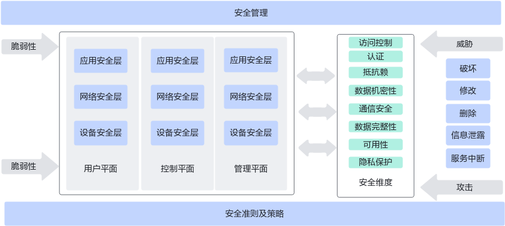
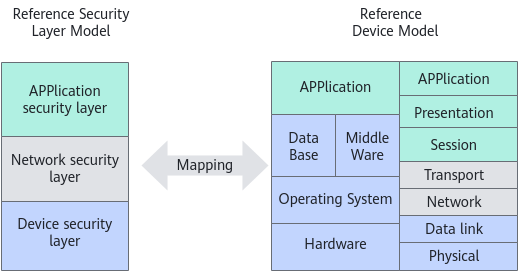

# 安全技术白皮书

## 简介

### 业务介绍

UBS Comm（UB service communication）是一个适用于高带宽和低延迟网络C/S（Client/Server）架构应用程序的高性能通信框架。

UBS Comm提供一组支持各种协议的高级API（Application Programming Interface），并屏蔽了包括RDMA（Remote Direct Memory Access）、TCP（Transmission Control Protocol）、UDS（Unix Domain Socket）、SHM（Shared Memory）等低级API的复杂性与差异性，同时尽可能发挥硬件能力，以保证其拥有高性能。

UBS Comm主要分为服务层和传输层。其中，服务层提供了更易用的API，包含Net Service（服务层对象）、Net Channel（消息收发通道）、同步/异步模型、链路重连和限流、IO超时检测、传输加密等功能。传输层（[**图 1** 安全层映射](#安全层映射) 的Net Driver所展示的内容）也有单独的API，同时提供多个协议（RDMA/TCP/UDS/SHM）的同步异步通信、心跳、传输加密等功能。

**图 1** 软件架构

UBS Comm的组网规划如[**图 2** 组网规划](#组网规划)所示。

**图 2** 组网规划

### 安全问题和挑战

UBS Comm作为底层通信库，是客户系统进行网络数据交互的关键组件，可能直接面对外部恶意攻击者，面临如DDoS（Distributed Denial-of-Service）、盗窃、窃听、干扰等攻击风险。

在实际应用中，安全风险主要在于用户应用场景本身的安全风险，本版本需确保不因UBS Comm的使能而引入新的安全风险，应用场景原有的安全风险由应用场景本身的安全解决方案解决。

### 本安全白皮书主要内容

本安全白皮书内容主要包括：基于UBS Comm的应用使能方案的安全。

## 产品安全解决方案

### 安全架构

通常端到端安全架构模型包括三层三面，三面是用户平面、控制平面和管理平面，每个平面包括设备安全层、网络安全层和应用安全层，解决方案安全架构如[**图 1** 安全层映射](#安全层映射)所示。

**图 1** 安全架构

后续章节详细介绍了各平面、各层的安全威胁和相应的技术措施。

### 安全攻击及威胁

产品可能遭受到网络安全攻击及安全威胁：

- 漏洞是系统弱点，攻击者可以利用该弱点进行攻击，降低系统的安全能力。
- 攻击是针对目标采取的动作，意图达到破坏系统或窃取信息等目的。
- 威胁是有害事件（如攻击）发生的潜在可能性。

根据ITU-T X.800建议，存在五类威胁：

- 拒绝服务（Interruption）
- 信息泄露（Disclosure）
- 删除（Removal）
- 修改（Modification）
- 破坏（Destruction）

#### 拒绝服务

设备在常见的DoS攻击下，可以通过防火墙、ACL、SYN Cookie等机制确保设备还能给客户提供正常的服务，有效的降低DoS攻击对客户体验的影响。对于设备和设备所在的解决方案必须有完备的抗DoS攻击的机制。

UBS Comm仅作为通信组件，非解决方案，不涉及。

#### 信息泄露

攻击者攻击成功后，可能获取设备的参数配置信息、固件信息、日志信息，甚至获取传输的数据信息。

UBS Comm作为底层通信库，本身只提供一个信息通信传输通道，不对信息内容本身进行分析和处理，对信息内容本身无感知。传递的信息本身的机密性由使用该信息的业务决定，并由业务提供机密性保护。

#### 删除

攻击者攻击成功后，可能删除系统配置文件、关键数据、日志文件等，导致系统无法正常工作。

UBS Comm作为底层通信库，没有配置文件、日志文件，关键数据存储等，不涉及被删除风险。

#### 修改

攻击者攻击成功后，可能篡改系统固件、配置文件、日志文件等。

UBS Comm作为底层通信库，没有配置文件、日志文件，关键数据存储等，不涉及被修改风险。

#### 破坏

攻击者攻击成功后，可能破坏系统固件、配置文件、日志文件等。

UBS Comm作为底层通信库，没有配置文件、日志文件，关键数据存储等，不涉及被破坏风险。

### 安全维度

#### 访问控制

访问控制安全维度可防止未经授权访问或使用网络资源，确保只有授权的人员或设备才能访问网络元素、存储的信息、信息流、服务和应用程序。

UBS Comm为底层通信库，不涉及授权人员或者设备。

#### 认证

身份验证安全维度利用PKI（Public Key Infrastructure）、数字证书等技术确认通信实体的身份，确保参与业务的实体声称的身份有效性，保证实体没有被仿冒或未经授权。

UBS Comm支持TLS安全通信能力，当用户使用TLS通信时，需使用证书、私钥来进行C/S两端进行认证。

#### 抗抵赖

抗抵赖，即不可否认性，该安全维度用于防止个人或实体否认执行了与数据相关的特定操作，它确保了证据的可用性。数字签名技术被广泛用于不可否认的场景。

UBS Comm主要提供了如下抗抵赖方式：

通过签名校验来防止软件包版本发布过程中被植入恶意软件或被篡改。

#### 数据机密性

数据机密性安全维度保护数据免受未经授权的披露，确保数据内容无法被未经授权的实体解析。

UBS Comm为底层通信库，不涉及数据管理。

#### 通信安全

通信安全维度确保信息授权端点之间安全流动，TLS和IPSec（Internet Protocol Security）通常用于提供通信安全。

UBS Comm支持TLS安全通信能力，需用户根据业务需要按需使能。

#### 数据完整性

数据完整性安全维度确保数据的正确性或准确性，防止未经授权的修改、删除、创建和复制。

UBS Comm主要提供了如下数据完整性相关特性：

- 通过签名校验来防止软件包版本发布过程中被植入恶意软件或被篡改，确保发布件的完整性。
- 通过CRC校验来确保通信过程中数据完整性。

#### 可用性

可用性安全维度确保不会因影响网络的事件而拒绝对网络元素、存储的信息、信息流、服务和应用程序的授权访问。容灾方案和冗余技术可用于可用性目的。

UBS Comm作为底层通信库，不涉及。

#### 隐私保护

隐私安全维度对可能从网络活动中获得的信息提供隐私保护，防止隐私信息被未授权访问。一般采用加密和ACL（Access Control List）方式用于隐私保护目的。

UBS Comm作为底层通信库，不涉及客户敏感数据收集。

### 安全层

通常产品会进行网络安全层次划分，安全层代表了一些特定类型的独特安全弱点或漏洞。网络安全分层可以分为三层：设备安全层、网络安全层和应用安全层。每个安全层的安全弱点或漏洞，需要将对策集成到设备中驻留的组件或协议中来对各安全层进行保护。

安全层模型可以映射到设备参考模型。TCP/IP OSI（Open Systems Interconnection）参考模型是设备参考模型的一部分，安全层映射如[**图 1** 安全层映射](#安全层映射)所示。

**图 1** 安全层映射

#### 设备安全层

设备安全层包括各种单独的设备和连接它们的传输设施。作为网络的基础，支持服务和应用程序的交付。设备安全层关注的是设备自身的安全性和设备间底层通信的安全性。

- 设备的安全性可以通过提高设备中包含的组件的安全性来实现，如硬件组件、操作系统、数据库、中间件等。
- 设备间底层通信的安全性映射到数据链路层和物理层链路的安全性，如物理连接的安全性，以及TCP/IP OSI参考模型中定义的IEEE802.2、PPTP（Point to Point Tunneling Protocol）和L2TP（Layer Two Tunneling Protocol）的安全性。

UBS Comm作为底层通信库，并非设备，不涉及。

#### 网络安全层

网络安全层包括网络协议和基于协议的逻辑网络。在网络安全层，我们主要关注网络的安全和网络协议的安全。

- 网络的安全可以通过应用“域划分”、“深度防御”、“主动协同防御”、“安全平面分离”等安全原则和策略来实现。
- 网络协议的安全是指TCP/IP OSI参考模型中定义的TCP、IP等网络层和传输层协议的安全。

UBS Comm不涉及网络的安全，但在网络协议的安全提供了如下特性：

支持TLS安全协议，网络层可以基于TLS安全协议建立安全的通信通道。

#### 应用安全层

应用安全层由应用和服务以及应用相关协议组成。在应用安全层，我们主要关注服务和应用的安全以及相关协议的安全。

- 应用和服务有很多种类型，如Web应用、运维服务和应用、计费服务或应用等。
- 应用相关协议的安全是指位于会话层、表示层、应用层的协议的安全，如HTTP、DNS（Domain Name System）、SSH（Secure Shell）、FTP（File Transfer Protocol）相关协议等。

基于UBS Comm的应用层安全基于相关应用的安全机制，由相关应用提供，由客户在应用部署时进行配置和部署。

### 安全准则及策略

源自华为自身经验和业界最佳实践，UBS Comm主要的安全原则和策略如下。

#### 独立平面隔离

UBS Comm不涉及管理面和用户业务面。

#### 最小权限

权限控制是安全的重要手段，UBS Comm作为底层通信库，不涉及权限赋予。

### 默认安全

UBS Comm不涉及默认安全。

### 安全管理

通常在设备和系统中存在许多未知漏洞，导致在业务和应用运行过程中存在许多潜在的安全威胁。实现良好的网络安全变得非常复杂和困难，安全管理是绝对必要的。

UBS Comm作为底层通信库，不涉及安全管理。

## 推广

### 客户价值

UBS Comm结合认证、通信安全、数据完整性的安全设计，为用户提供了通信的安全能力_。_

### 应用案例

本解决方案当前正在拓展客户典型的安全应用场景，将在后续版本补充在安全方面的成功案例。

## 结论

基于UBS Comm系列解决方案场景，用户可以使用认证功能，实现数据的完整性和通信安全保护，满足业务对网络安全方面的需求。

## 术语

|缩略语|英文全称|中文名称|
|--|--|--|
|RDMA|Remote Direct Memory Access|远端内存直接访问。|
|TCP|Transmission Control Protocol|传输控制协议。|
|UDS|Unix Domain Socket|Unix域套接字。|
|SHM|Shared Memory|共享内存。|
|TLS|Transport Layer Security|传输层安全协议。|
