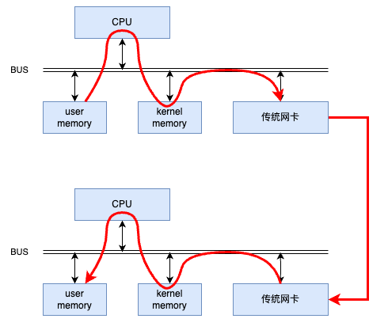
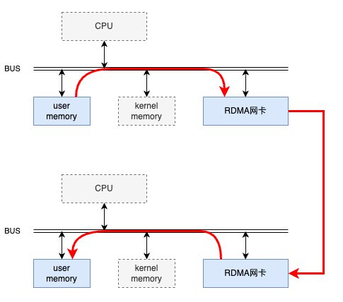
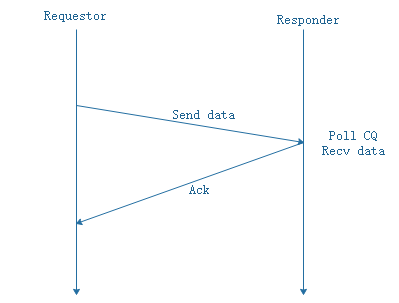
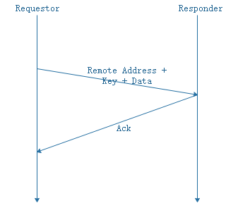
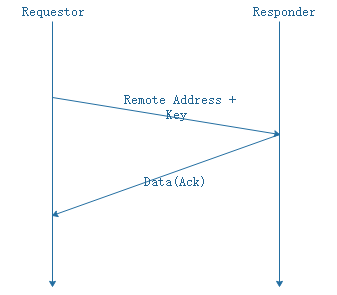
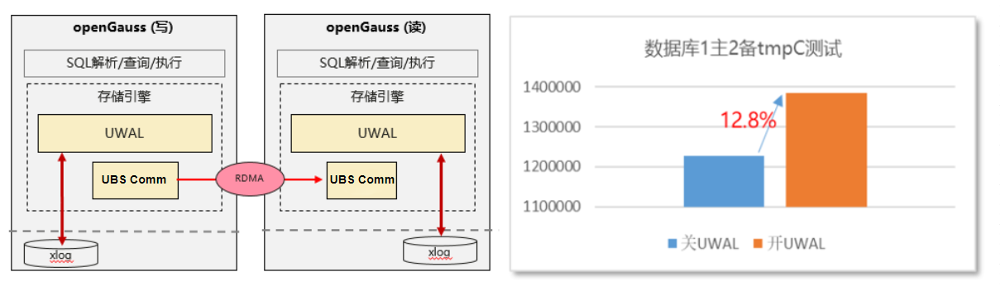
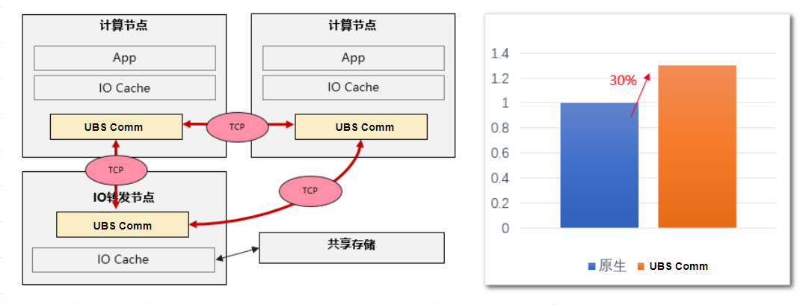
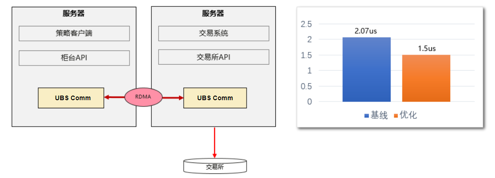

# 产品描述

## 产品定位和亮点

### 产品定位

UBS Comm（UB service communication）是一个适用于高带宽和低延迟网络C/S（Client/Server）架构应用程序的高性能通信框架。

### 产品亮点

#### 说明

UBS Comm旨在提供一组支持各种协议的高级API（Application Programming Interface），并屏蔽了包括RDMA（Remote Direct Memory Access）、TCP（Transmission Control Protocol）、UDS（Unix Domain Socket）、SHM（Shared Memory）等低级API的复杂性与差异性，同时尽可能发挥硬件能力，以保证其拥有高性能。

#### 高性能

UBS Comm提供点对点消息Send/Receive、Read/Write的单双边通信接口，基于MLX5 RDMA网卡，可使用RDMA协议进行高性能通信。具体场景参见[典型应用场景](#ZH-CN_TOPIC_0000002596757689)。

#### 易集成

- 支持多语言（C/C++、Java、Go）API。
- 支持多种协议通信（RDMA/TCP/UDS/SHM）。

#### 可靠性

提供高可靠的通信传输能力，支持故障检测消息重传，包括超时检测、等待、重传。

## 方案架构

UBS Comm架构如[**图 1** X交易所对接](#X交易所对接)所示。

**图 1** 软件架构

UBS Comm主要分为服务层和传输层。其中，服务层提供了更易用的API，包含Net Service（服务层对象）、Net Channel（消息收发通道）、同步/异步模型、链路重连和限流、IO超时检测、传输加密等功能。传输层（[**图 1** X交易所对接](#X交易所对接)的Transport Layer）也有单独的API，同时提供多个协议（RDMA/TCP/UDS/SHM）的同步通信、异步通信、心跳、传输加密等功能。

**RDMA技术**

传统网络中，“节点A给节点B发消息”实际上做的是“把节点A内存中的一段数据，通过网络链路搬移到节点B的内存中”，而这一过程无论是发送端还是接收端，都需要CPU的指挥和控制，包括网卡的控制，中断的处理，报文的封装和解析等等。

[**图 2** 传统网络收发](#传统网络收发)中上面的节点在内存用户空间中的数据，需要经过CPU拷贝到内核空间的缓冲区中，然后才可以被网卡访问，这期间数据会经过软件实现的TCP/IP协议栈，加上各层头部和校验码，比如TCP头，IP头等。网卡通过DMA拷贝内核中的数据到网卡内部的缓冲区中，进行处理后通过物理链路发送给对端。

对端收到数据后，会进行相反的过程：从网卡内部存储空间，将数据通过DMA拷贝到内存内核空间的缓冲区中，然后CPU会通过TCP/IP协议栈对其进行解析，将数据取出来拷贝到用户空间中。

**图 2** 传统网络收发

使用了RDMA技术后，该过程可以简单的表示如下示意图。

**图 3** RDMA技术

同样是将本端内存中的一段数据，复制到对端内存中，在使用了RDMA技术时，两端的CPU几乎不用参与数据传输过程（只参与控制面）。本端的网卡直接从内存的用户空间DMA拷贝数据到内部存储空间，然后硬件进行各层报文的组装后，通过物理链路发送到对端网卡。对端的RDMA网卡收到数据后，剥离各层报文头和校验码，通过DMA将数据直接拷贝到用户空间内存中。

**RDMA操作类型**

RDMA分为三种操作类型：Send/Recv双边操作、Write单边操作、Read单边操作。

- SEND/RECV双边操作

    SEND和RECV是两种不同的操作类型，如果一端进行SEND操作，对端必须进行RECV操作，因此称之为“双端操作”。即一端SEND发送数据，另一端RECV接收数据。

    实际上SEND-RECV其实并不能被称作“RDMA”操作，因为完成一次通信的过程中还需要两端CPU的参与，只是一种加入了0拷贝和协议栈卸载的传统收发模型的“升级版”，这种操作类型并未完全发挥RDMA技术全部实力，常用于两端交换控制信息等场景。当涉及大量数据的收发时，更多使用的是两种RDMA独有的操作：WRITE和READ。

    **图 4** SEND/RECV双边操作

    

- Write单边操作

    WRITE全称是RDMA WRITE操作，是本端主动写入远端内存的行为。除了在准备阶段，远端CPU不需要参与，也无需感知何时有数据写入以及数据在何时接收完毕，属于一种单端操作。

    本端在准备阶段通过数据交互，获取对端某一片可用的内存的地址和“钥匙”，相当于获得了这片远端内存的读写权限。拿到权限之后，本端就可以像访问自己的内存一样直接对这一远端内存区域进行读写，这也是RDMA——远程直接地址访问的意义所在。

    **图 5** WRITE单边操作

    

- Read单边操作

    READ跟WRITE是相反的过程，是本端主动读取远端内存的行为。同WRITE一样，远端CPU不需要参与，也不感知数据在内存中被读取的过程。

    需要注意的是“READ”这个动作所请求的数据，是在对端回复的报文中携带的。

    **图 6** READ单边操作

    

    >[!NOTICE]说明
    >WRITE/READ操作中的目的地址和钥匙可以通过SEND-RECV操作来完成，该获取过程是由远端内存的控制者CPU允许的。

## 典型应用场景

### 数据库场景

UWAL的Client和Server对接了UBS Comm使用service层接口完成RDMA和TCP协议通信。场景应用如[**图 1** X交易所对接](#X交易所对接)所示。

**图 1** 数据库场景典型应用

在数据库场景中，openGauss中UWAL模块借助UBS Comm极致数据传输能力，TPC-C tmpC性能提升12.8%。

### HPC场景

SDK和Daemon进程的Cache组件使用了UBS Comm的SHM协议，MF组件节点内通信使用的UDS协议，MF节点间通信使用的TCP协议。场景应用如[**图 1** X交易所对接](#X交易所对接)所示。

**图 1** HPC场景应用

HPC场景中，IO缓存采用UBS Comm读写效率提升30%。

### 对接X交易所场景

X交易系统中，使用UBS Comm的Transport层C++接口层进行RDMA通信。

**图 1** X交易所对接

X交易所对接场景中，基于MLX5网卡，使用RDMA协议通信，实现256B小包单向时延不高于1.5us。

## 特性和功能

### 传输层特性

**客户价值**

提供多种协议（RDMA/TCP/UDS/SHM）点对点消息Send/Receive双边通信接口、Read/Write单边通信接口。

**场景举例**

对接X交易所场景。

**功能举例**

传输层特性功能说明如下：

- 支持多种协议（RDMA/TCP/UDS/SHM/UBC）。
- 点对点消息Send/Receive双边通信，Read/Write单边通信。
- 支持多种算法的加密通信。
- 支持保活功能。

### 服务层特性

**客户价值**

提供双向服务层API接口，提供流量控制、多语言（C/C++、Java、Go）API、MULTIRAIL（多端口）、RNDV等高级功能。

**场景举例**

数据库场景。

**功能举例**

- 支持多种协议（RDMA/TCP/UDS/SHM/UBC）。
- 支持点对点消息Send/Receive双边通信，Read/Write单边通信。
- 支持多种加密算法的认证和加密通信。
- 支持保活功能。
- 支持流量控制功能。
- 支持多语言（C/C++、Java、Go）API。
- 支持MULTIRAIL功能。
- 支持RNDV功能。

## 周边软硬件兼容性

**硬件要求**

**表 1** 硬件要求

<table style="undefined;table-layout: fixed; width: 751px"><colgroup>
<col style="width: 261px">
<col style="width: 490px">
</colgroup>
<thead>
  <tr>
    <th>硬件环境</th>
    <th>通信节点</th>
  </tr></thead>
<tbody>
  <tr>
    <td>服务器名称</td>
    <td>TaiShan服务器</td>
  </tr>
  <tr>
    <td>网卡</td>
    <td>Mellanox CX5 (仅使用RDMA通信协议时必须，使用其他通信协议不需要)</td>
  </tr>
  <tr>
    <td>CPU</td>
    <td>通过系统文件“/sys/devices/system/cpu/cpu0/regs/identification/midr_el1”中获取CPU厂商信息判断，当前配套机型鲲鹏处理器型号为0x48。</td>
  </tr>
</tbody>
</table>

**操作系统和软件要求**

**表 2** 操作系统和软件要求

<table style="undefined;table-layout: fixed; width: 1084px"><colgroup>
<col style="width: 272px">
<col style="width: 274px">
<col style="width: 538px">
</colgroup>
<thead>
  <tr>
    <th>项目</th>
    <th>版本</th>
    <th>说明</th>
  </tr></thead>
<tbody>
  <tr>
    <td>操作系统</td>
    <td>openEuler 20.03LTS openEuler 22.03LTS CentOS 7.6</td>
    <td>非openEuler系统：通过系统文件“/sys/devices/system/cpu/cpu0/regs/identification/midr_el1”中获取CPU厂商信息判断，当前配套机型KP型号为0x48。 openEuler系统：通过系统文件“/sys/devices/system/cpu/cpu0/regs/identification/midr_el1”中获取CPU厂商信息判断，当前配套机型KP型号为0x48，并且通过lscpu回显中Model name为包含字段“Kunpeng”。</td>
  </tr>
  <tr>
    <td rowspan="3">协议类型</td>
    <td>RDMA</td>
    <td>CX5的RDMA网络。操作系统支持TCP和UDS协议。</td>
  </tr>
  <tr>
    <td>TCP/UDS</td>
    <td>操作系统支持TCP和UDS协议。</td>
  </tr>
  <tr>
    <td>SHM</td>
    <td>Linux内核版本大于2.4（使用uname -a命令查询）。代码运行用户需要具备创建文件的权限。操作系统支持UDS协议。</td>
  </tr>
</tbody>
</table>

## 特性规格清单

**表 1** 特性规格清单

<table style="undefined;table-layout: fixed; width: 1118px"><colgroup>
<col style="width: 286px">
<col style="width: 342px">
<col style="width: 490px">
</colgroup>
<thead>
  <tr>
    <th>特性</th>
    <th>子特性/规格</th>
    <th>特性/规格描述</th>
  </tr></thead>
<tbody>
  <tr>
    <td rowspan="8">传输层</td>
    <td>RDMA</td>
    <td>支持配置RDMA通信功能，使用RDMA协议通信。</td>
  </tr>
  <tr>
    <td>TCP</td>
    <td>支持配置TCP通信功能，使用TCP协议通信。</td>
  </tr>
  <tr>
    <td>UDS</td>
    <td>支持配置UDS通信功能，使用UDS协议通信。</td>
  </tr>
  <tr>
    <td>SHM</td>
    <td>支持配置SHM通信功能，使用SHM通信。</td>
  </tr>
  <tr>
    <td>双边通信</td>
    <td>支持使用双边通信接口，进行双边通信。</td>
  </tr>
  <tr>
    <td>单边通信</td>
    <td>支持使用单边通信接口，进行单边通信。</td>
  </tr>
  <tr>
    <td>加密认证和通信</td>
    <td>支持使能加密功能，进行加密认证和通信。</td>
  </tr>
  <tr>
    <td>保活</td>
    <td>默认开启保活功能。</td>
  </tr>
  <tr>
    <td rowspan="10">服务层</td>
    <td>RDMA</td>
    <td>支持配置RDMA通信功能，使用RDMA协议通信。</td>
  </tr>
  <tr>
    <td>TCP</td>
    <td>支持配置TCP通信功能，使用TCP协议通信。</td>
  </tr>
  <tr>
    <td>UDS</td>
    <td>支持配置UDS通信功能，使用UDS协议通信。</td>
  </tr>
  <tr>
    <td>SHM</td>
    <td>支持配置SHM通信功能，使用SHM通信。</td>
  </tr>
  <tr>
    <td>双边通信</td>
    <td>支持使用双边通信接口，进行双边通信。</td>
  </tr>
  <tr>
    <td>单边通信</td>
    <td>支持使用单边通信接口，进行单边通信。</td>
  </tr>
  <tr>
    <td>加密认证和通信</td>
    <td>支持使能加密功能，进行加密认证和通信。</td>
  </tr>
  <tr>
    <td>保活</td>
    <td>默认开启保活功能。</td>
  </tr>
  <tr>
    <td>RNDV</td>
    <td>支持使能RNDV协议，进行单边+双边结合的方式通信。</td>
  </tr>
  <tr>
    <td>MULTIRAIL</td>
    <td>支持使能MULTIRAIL功能，RDMA多网口带宽聚合通信。</td>
  </tr>
</tbody></table>

## 术语

|缩略语|英文全称|中文名称|
|--|--|--|
|RDMA|Remote Direct Memory Access|远端内存直接访问。|
|TCP|Transmission Control Protocol|传输控制协议。|
|UDS|Unix Domain Socket|Unix域套接字。|
|SHM|Shared Memory|共享内存。|
|RNDV|Rendezvous|Rendezvous协议。|
|MULTIRAIL|multi rail|多网口。|
