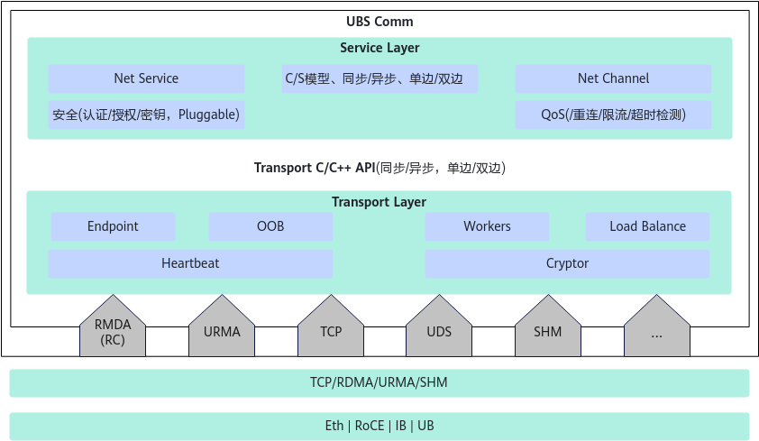
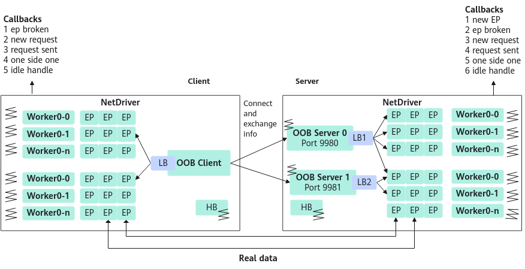
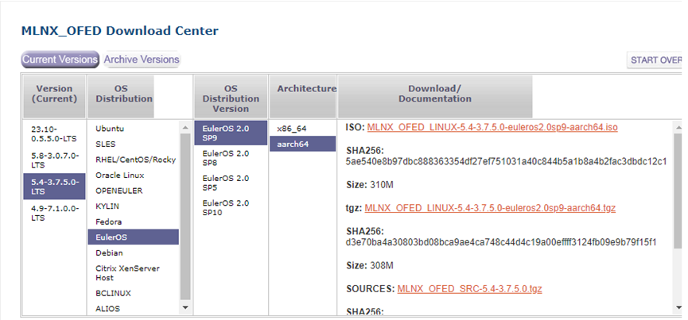

# 用户指南

## 介绍<a name="ZH-CN_TOPIC_0000002565998362"></a>

**概述<a name="section1824010174163"></a>**

UBS Comm（UB Service communication）是一个适用于高带宽和低延迟网络C/S（Client/Server）架构应用程序的高性能通信框架。

UBS Comm提供一组支持各种协议的高级API（Application Programming Interface），并屏蔽了包括RDMA（Remote Direct Memory Access）、TCP（Transmission Control Protocol）、UDS（Unix Domain Socket）、SHM（Shared Memory）等低级API的复杂性与差异性，同时尽可能发挥硬件能力，以保证其拥有高性能。

**整体方案<a name="section862813211619"></a>**

UBS Comm主要分为服务层和传输层。其中，服务层（**图 1** [软件架构](#软件架构)中的Service所展示的内容）提供了更易用的API，包含Net Service（服务层对象）、Net Channel（消息收发通道）、同步/异步模型、链路重连和限流、IO超时检测、传输加密等功能。传输层（**图 1** [软件架构](#软件架构)的Net Driver所展示的内容）也有单独的API，同时提供多个协议（RDMA/TCP/UDS/SHM）的同步异步通信、心跳、传输加密等功能。

**图 1** 软件架构<a id="软件架构"></a>



**特性介绍<a name="section19800165812211"></a>**

- 线程模型

    UBS Comm会创建3种类型的线程：主线程、Worker线程和心跳线程。

    - 主线程：每个Client或Server会创建一个主线程进行侦听、建链、收发消息等操作。
    - Worker线程：同时可以配置多个Worker线程，每条链路EP（End Point）会在建链时选择某个Worker线程，每个Worker线程可能对应多个EP（多条链路）。链路的异步收发回调、断链回调等都会由Worker线程进行处理。

        用户能够使用参数workerGroups配置线程组以及每个组线程的个数，并通过参数workerGroupsCpuSet配置线程绑核。

    - 心跳线程：心跳线程会定时监测对端状态，以保证能感知对端服务是否还存在。用户可以通过参数heartBeatIdleTime、heartBeatProbeTime、heartBeatProbeInterval来配置心跳检查时长。
        - RDMA模式下，启动心跳线程，对所有链路发送单边写来判断链路状态。
        - TCP模式下，使用TCP协议的keepalive特性，配置TCP\_KEEPIDLE/TCP\_KEEPINTVL等字段，保证链路状态正常。

    **图 2** 线程模型<a id="线程模型"></a>

    

- 双向RPC

    UBS Comm提供双向的RPC通信，每个Client和Server都是对等的，都可以启动监听线程等待对方建链，可以由建立Instance时的第三个bool参数startOobSvr来决定是否启动监听线程。Client和Server彼此之间可以相互建链也可以相互收发消息。

- RNDV特性

    RNDV协议（Rendezvous协议）是MPI通信协议中的一类，会在接收端协调缓存来接收信息，通常适用于发送比较大的消息。为了增加易用性，UBS Comm引入Rendezvous协议提供给用户使用。

    RNDV协议主要采用单边+双边结合的方式完成。使用双边协议传递控制消息以及回复响应，如单边的MR信息、用户控制头、用户处理结果等；使用单边协议进行数据拉取，并通过回调通知业务处理。

- 超时机制

    UBS Comm可以对每个IO进行超时检测，通过获取每个IO的时间戳标记，然后加入到定时器中，检测标记时间和当前时间，判断该IO是否发生超时，从而及时进行业务回调处理。

    用户可以通过NetServiceOpInfo结构的timeout字段来配置每个IO的超时时间。

- 认证加密

    UBS Comm提供了加密认证的能力，可以选择AES\_128\_GCM\_SHA256、AES\_256\_GCM\_SHA384、AES\_128\_CCM\_SHA256、TLS\_CHACHA20\_POLY1305\_SHA256四种加密算法进行加密，同时可以选择设置TLS版本，当前默认且仅支持TLS 1.3版本。用户只需要把“enableTls”参数设置为“true”，然后配置“cipherSuite”参数，注册三个TLS相关的回调函数，详情请参见[API参考](../zh/ubscomm_api_reference.md)，提供CA证书、公钥、私钥信息，即可开启加密的流程。

    - 传输口令，密钥，银行账号等敏感数据、敏感个人数据和批量个人数据时，建议开启TLS能力。
    - 当用户使用UBS Comm时，应该自己做好三面隔离，如果将UBS Comm使用在登录认证场景时，用户需要自己做好管理接口提供接入认证机制。
    - 当用户使用TLS加密能力时，建议用户做好证书安全管理，参见[证书安全管理](#section1911412125313)。

- RDMA协议加速特性Device Memory

    在发送数据量很小的情况下，RDMA协议提供DM（Device Memory）特性来加速传输效率，DM是存在于硬件网卡上的内存，直接使用该内存可以免去将消息拷贝到网卡的时间从而提升性能。在UBS Comm中可以通过配置选项的dmSegCount和dmSegSize来配置，其中dmSegSize决定使用DM特性的消息最大长度，在小于或等于1024bytes时有明显提升，dmSegCount决定预申请多少个dmSegSize长度的内存。在配置过大时由于硬件内存有限会申请失败，但依旧可以正常运行UBS Comm，只是无法使用DM特性。

- RDMA协议加速特性inline

    普通的情况下，消息请求中存放的是需要发送消息的地址，网卡需要去地址处拷贝内容。而当发送数据大小在128bytes及以下时，RDMA提供一种比DM更高效的特性inline，inline可以把需要发送的消息直接存放在消息请求中，可以明显节省拷贝用时。

- 兼容性检查

    UBS Comm版本号区分主次版本，如HCOM1.0，HCOM1.1。其中小数点前数字为主版本，小数点后数字为次版本。客户端服务端主版本要相同，但服务端的次版本一定要大于等于客户端的次版本。

- 限制客户端的连接数消减DOS攻击风险

    UBS Comm服务端支持开启建链TLS认证，但认证过程比较耗时；DOS攻击可以通过伪造大量的客户端发送建链报文对UBS Comm服务端进行攻击，迫使UBS Comm服务端忙于执行TLS认证校验，无法响应合法建链请求。

    支持通过配置项限定某个客户端IP地址最大允许EP建链数，默认值为250，异常IP发来的请求达到阈值后直接报错，不再执行TLS认证校验，并通过日志告警；通过提高恶意建链成本，提升服务端服务韧性。

## 环境配置<a name="ZH-CN_TOPIC_0000002596637755"></a>

### 组网规划<a name="ZH-CN_TOPIC_0000002565998382"></a>

UBS Comm组网可由2台服务器组成，其中：

- Server用于等待其他节点建链，也可以主动向其他节点建链，并可以使用链路来向对端发送消息。
- Client用于主动向其他节点建链，并可以使用链路来向对端发送消息。

**图 1** 组网规划<a id="组网规划"></a>


### 环境要求<a name="ZH-CN_TOPIC_0000002565998390"></a>

**硬件要求<a name="section69005151510"></a>**

**表 1** 硬件要求<a id="硬件要求"></a>

<a name="zh-cn_topic_0000001614371366___d0e1171"></a>
<table><tbody><tr id="zh-cn_topic_0000002555962033_row310mcpsimp"><th class="firstcol" valign="top" width="27%" id="mcps1.2.3.1.1"><p id="zh-cn_topic_0000002555962033_p312mcpsimp"><a name="zh-cn_topic_0000002555962033_p312mcpsimp"></a><a name="zh-cn_topic_0000002555962033_p312mcpsimp"></a>服务器名称</p>
</th>
<td class="cellrowborder" valign="top" width="73%" headers="mcps1.2.3.1.1 "><p id="zh-cn_topic_0000002555962033_p314mcpsimp"><a name="zh-cn_topic_0000002555962033_p314mcpsimp"></a><a name="zh-cn_topic_0000002555962033_p314mcpsimp"></a>TaiShan服务器</p>
</td>
</tr>
<tr id="zh-cn_topic_0000002555962033_row315mcpsimp"><th class="firstcol" valign="top" width="27%" id="mcps1.2.3.2.1"><p id="zh-cn_topic_0000002555962033_p317mcpsimp"><a name="zh-cn_topic_0000002555962033_p317mcpsimp"></a><a name="zh-cn_topic_0000002555962033_p317mcpsimp"></a>处理器</p>
</th>
<td class="cellrowborder" valign="top" width="73%" headers="mcps1.2.3.2.1 "><p id="zh-cn_topic_0000002555962033_p319mcpsimp"><a name="zh-cn_topic_0000002555962033_p319mcpsimp"></a><a name="zh-cn_topic_0000002555962033_p319mcpsimp"></a>鲲鹏处理器</p>
</td>
</tr>
<tr id="zh-cn_topic_0000002555962033_row187781906534"><th class="firstcol" valign="top" width="27%" id="mcps1.2.3.3.1"><p id="zh-cn_topic_0000002555962033_zh-cn_topic_0000001614371366_p769mcpsimp"><a name="zh-cn_topic_0000002555962033_zh-cn_topic_0000001614371366_p769mcpsimp"></a><a name="zh-cn_topic_0000002555962033_zh-cn_topic_0000001614371366_p769mcpsimp"></a>网卡</p>
</th>
<td class="cellrowborder" valign="top" width="73%" headers="mcps1.2.3.3.1 "><p id="zh-cn_topic_0000002555962033_p1426061222412"><a name="zh-cn_topic_0000002555962033_p1426061222412"></a><a name="zh-cn_topic_0000002555962033_p1426061222412"></a>Mellanox CX5 (仅使用RDMA通信协议时必须，使用其他通信协议不需要)</p>
</td>
</tr>
<tr id="zh-cn_topic_0000002555962033_row97552279531"><th class="firstcol" valign="top" width="27%" id="mcps1.2.3.4.1"><p id="zh-cn_topic_0000002555962033_p22811117141412"><a name="zh-cn_topic_0000002555962033_p22811117141412"></a><a name="zh-cn_topic_0000002555962033_p22811117141412"></a>CPU</p>
</th>
<td class="cellrowborder" valign="top" width="73%" headers="mcps1.2.3.4.1 "><p id="zh-cn_topic_0000002555962033_p1928119174141"><a name="zh-cn_topic_0000002555962033_p1928119174141"></a><a name="zh-cn_topic_0000002555962033_p1928119174141"></a>通过系统文件<span class="filepath" id="zh-cn_topic_0000002555962033_filepath1937013192419"><a name="zh-cn_topic_0000002555962033_filepath1937013192419"></a><a name="zh-cn_topic_0000002555962033_filepath1937013192419"></a>“/sys/devices/system/cpu/cpu0/regs/identification/midr_el1”</span>中获取CPU厂商信息判断，当前配套机型鲲鹏处理器型号为0x48。</p>
</td>
</tr>
</tbody>
</table>

**软件版本<a name="section15923759174210"></a>**

**表 2** 软件要求<a id="软件要求"></a>

|软件名称|软件版本|
|--|--|
|OS|openEuler 22.03 LTS<br>openEuler 24.03 LTS|
|RDMA-Core|42.7|
|GCC|7.3.0|
|CCA|VPP V300R024C10SPC001|

**获取软件安装包<a name="section3489574613"></a>**

**表 3** UBS Comm软件获取列表<a id="UBS Comm软件获取列表"></a>

|名称|包名|发布类型|说明|获取地址|
|--|--|--|--|--|
|UBS Comm|ubs-comm-lib-*{version}*.oe2403sp3.aarch64.rpm<br>ubs-comm-devel-1.0.0-15.oe2403sp3.aarch64.rpm|闭源|UBS Comm软件安装包。|BeiMing对应CMC版本库中获取|

**校验软件包完整性<a name="section11491417131511"></a>**

为了防止软件包在传递过程或存储期间被恶意篡改，获取软件包时需下载对应的数字签名文件用于完整性验证。

1. 参见[获取软件安装包](#section3489574613)获取软件包。
2. 获取《OpenPGP签名验证指南》。
    - 运营商客户：请访问[http://support.huawei.com/carrier/digitalSignatureAction](http://support.huawei.com/carrier/digitalSignatureAction)
    - 企业客户：请访问[https://support.huawei.com/enterprise/zh/tool/pgp-verify-TL1000000054](https://support.huawei.com/enterprise/zh/tool/pgp-verify-TL1000000054)

3. 根据《OpenPGP签名验证指南》进行软件安装包完整性检查。

    - 如果校验失败，请不要使用该软件包，先联系华为技术支持工程师解决。
    - 使用软件包安装或升级之前，也需要按上述过程先验证软件包的数字签名，确保软件包未被篡改。

**UBS Comm软件版本可查询<a name="section589224416153"></a>**

UBS Comm支持查询软件版本。

1. 参考[获取软件安装包](#section3489574613)获取软件包。
2. 查询UBS Comm软件版本。

    ```cmd
    cat {hcom_package_name}/version.property
    ```

## 安装使用<a name="ZH-CN_TOPIC_0000002596637711"></a>

RDMA无损配置可以提高网络传输的性能和效率，确保数据传输的可靠性和一致性，同时减少CPU的负担。

### 安装MLNX\_OFED驱动<a name="ZH-CN_TOPIC_0000002566158050"></a>

使用RDMA通信协议时，请在UBS Comm所有通信节点执行本章节操作。未使用RDMA通信协议，则可跳过本章节。

**安装步骤<a name="section925845918215"></a>**

1. 执行以下命令，查询服务器操作系统。

    ```cmd
    uname -a
    ```

    返回信息如下所示。

    ```cmd
    Linux 4826-node62 5.10.0-182.0.0.95.oe2203sp3.aarch64
    ```

2. 执行以下命令，查看Mellanox网卡信息。

    ```cmd
    lspci |grep Mellanox
    ```

    返回信息如下所示。

    ```cmd
    81:00.0 Ethernet controller: Mellanox Technologies MT28800 Family [ConnectX-5 Ex]
    81:00.1 Ethernet controller: Mellanox Technologies MT28800 Family [ConnectX-5 Ex]
    ```

3. 获取与操作系统匹配的MLNX\_OFED驱动包至本地。

    地址为[https://network.nvidia.com/products/infiniband-drivers/linux/mlnx_ofed/](https://network.nvidia.com/products/infiniband-drivers/linux/mlnx_ofed/)。

    **图 1** 下载页面<a id="下载页面"></a>

    

4. 执行以下命令，新建目录并将操作系统镜像文件挂载至新建目录。

    ```cmd
    mkdir -p /mnt/iso
    mount openEuler-20.03-LTS-aarch64-dvd.iso /mnt/iso
    ```

    操作系统镜像名称请根据实际情况进行修改。

5. 配置操作系统镜像源，此处以配置本地镜像源为例，配置前请做好镜像源配置文件备份。
    1. 执行以下命令打开镜像源配置文件。

        ```cmd
        vi /etc/yum.repos.d/openEuler.repo
        ```

    2. 按“i”进入编辑模式，只保留以下内容。

        ```cmd
        [OS]
        name=OS
        baseurl=file:///mnt/iso
        enabled=1
        gpgcheck=0
        ```

    3. 按“Esc”键，输入**:wq!**，按“Enter”保存并退出编辑。

6. 执行以下命令刷新软件包缓存信息。

    ```cmd
    yum makecache
    ```

7. 上传驱动包至服务器并解压。

    ```cmd
    tar -zxvf MLNX_OFED_LINUX-5.4-3.7.5.0-openeuler22.03-x86_64.tgz
    ```

8. 进入压缩包解压文件夹目录下，执行以下命令安装驱动。

    ```cmd
    ./mlnxofedinstall –force
    ```

    - 若提示内核不匹配，则执行以下命令。

        ```cmd
        ./mlnxofedinstall --add-kernel-support
        ```

    - 若不想进行固件更新，则执行以下命令。

        ```cmd
        ./mlnxofedinstall  --without-fw-update
        ```

        - 安装程序将删除所有之前安装的OFED驱动，并重新安装，系统会提示您确认删除旧包。
        - ./mlnxofedinstall -h可查询参数配置，请根据实际情况选择参数。

9. 安装完成后，执行以下命令重启服务器。

    ```cmd
    reboot
    ```

10. 执行以下命令，配置MLNX\_OFED驱动安装完成后自启动。

    ```cmd
    chkconfig --add openibd
    /etc/init.d/openibd start
    chkconfig openibd on
    ```

11. 执行以下命令验证MLNX\_OFED驱动是否安装成功。

    - Server节点请执行以下命令：

        ```cmd
        ib_send_bw -d mlx5_1 -a
        ```

    - Client节点请执行以下命令：

        ```cmd
        ib_send_bw -d mlx5_1 -a <Server节点IP地址>
        ```

    返回信息如下所示，即为安装成功。

    ```cmd
    Send BW Test
    Dual-port       : OFF          Device         : mlx5_1
    Number of qps   : 1            Transport type : IB
    Connection type : RC           Using SRQ      : OFF
    PCIe relax order: ON
    ibv_wr* API     : ON
    TX depth        : 128
    CQ Moderation   : 100
    Mtu             : 4096[B]
    Link type       : Ethernet
    GID index       : 3
    Max inline data : 0[B]
    rdma_cm QPs     : OFF
    Data ex. method : Ethernet
    --------------------------------------------------------------------------
    local address: LID 0000 QPN 0x19b8 PSN 0xa3aa02
    GID: 00:00:00:00:00:00:00:00:00:00:255:255:10:10:01:62
    remote address: LID 0000 QPN 0x19b9 PSN 0xf3ab0
    GID: 00:00:00:00:00:00:00:00:00:00:255:255:10:10:01:62
    --------------------------------------------------------------------------
    #bytes     #iterations    BW peak[MB/sec]    BW average[MB/sec]   MsgRate[Mpps]
    2          1000             10.60              10.11              5.298300
    ```

    当对RDMA通信协议有性能调优需求时，请参见[Performance Tuning for Mellanox Adapters](https://enterprise-support.nvidia.com/s/article/performance-tuning-for-mellanox-adapters)。

**卸载<a name="section15780193142318"></a>**

1. 进入解压包。
2. 执行以下命令，卸载MLNX\_OFED驱动。

    ```cmd
    ./uninstall.sh
    ```

### 配置服务器侧RDMA网卡无损特性<a name="ZH-CN_TOPIC_0000002596757661"></a>

RDMA无损配置可以提高网络传输的性能和效率，确保数据传输的可靠性和一致性，同时减少CPU的负担。

未使用RDMA通信协议时，以下操作步骤可以不执行；否则需要在使用UBS Comm的所有通信节点上执行。

1. <a name="li1919910204286"></a>登录服务器，执行以下命令查询CX5网卡设备net\_card信息，以CX5网卡为例。

    ```cmd
    net_card=$(ibdev2netdev | grep mlx5_1 | awk '{print $5}')
    ```

2. 使用[1](#li1919910204286)查询出的net\_card作为参数，执行以下命令进行CX5网卡配置。

    ```cmd
    cma_roce_tos -d mlx5_1 -t 106
    mlnx_qos -i ${net_card} --pfc 0,0,0,1,0,0,0,0 --trust dscp
    ifconfig ${net_card} mtu 4500
    ```

    服务器每次重启后都需要重新执行当前步骤进行配置。

3. 执行以下命令配置网卡的CNP中的DSCP字段。

    ```cmd
    echo 48 >/sys/class/net/${net_card}/ecn/roce_np/cnp_dscp
    ```

4. 执行以下命令配置网卡的RoCEv2中的DCQCN拥塞控制机制。

    ```cmd
    echo 1 >/sys/class/net/${net_card}/ecn/roce_np/enable/3
    echo 1 >/sys/class/net/${net_card}/ecn/roce_rp/enable/3
    ```

### 安装UBS Comm<a name="ZH-CN_TOPIC_0000002596637747"></a>

**前提条件<a name="section1340093619408"></a>**

前置依赖libboundscheck（华为开源的安全函数库），可通过以下方式安装。

- 有欧拉yum镜像源时，可以直接yum install安装。

    ```cmd
    yum install libboundscheck
    ```

- 源码编译安装。

    [https://gitee.com/openeuler/libboundscheck](https://gitee.com/openeuler/libboundscheck)

    1. 下载发行版本。最新的release版本是v1.1.16。

        [https://gitee.com/openeuler/libboundscheck/releases/tag/v1.1.16](https://gitee.com/openeuler/libboundscheck/releases/tag/v1.1.16)

    2. 编译。

        ```cmd
        make CC=gcc
        ```

    3. 编译后根目录下lib目录中，存在libboundscheck.so。

        ```cmd
        cp lib/libboundscheck.so /usr/lib64
        ```

**操作步骤<a name="section078195334012"></a>**

若环境上已安装UBS Comm，则先卸载再安装，否则直接安装即可。

1. 执行以下命令，卸载rpm。

    ```cmd
    rpm -e ubs-comm-lib-1.0.0
    rpm -e ubs-comm-devel-1.0.0
    ```

2. 执行以下命令，安装rpm。

    ```cmd
    rpm -ivh ubs-comm-lib-1.0.0-*rpm --force
    rpm -ivh ubs-comm-devel-1.0.0-*rpm --force (开发包，运行时可选)
    ```

### UBC仿真环境<a name="ZH-CN_TOPIC_0000002596757653"></a>

**前提条件<a name="section5969740414"></a>**

已启动并配置好urma驱动。urma\_admin show回显正常，打流正常。

**规格限制<a name="section16992257880"></a>**

- 双边发送数据长度小于等于64KB。
- 单边读写数据小于等于16MB。
- 单边带宽为0.12MB/s。

**操作步骤<a name="section176485318017"></a>**

请参见[安装UBS Comm](#ZH-CN_TOPIC_0000002596637747)。

## 使用指导<a name="ZH-CN_TOPIC_0000002596757683"></a>

### 服务层<a name="ZH-CN_TOPIC_0000002596637723"></a>

#### 说明<a name="ZH-CN_TOPIC_0000002596637739"></a>

本章节将通过基础示例来演示如何使用UBS Comm，开发者可以通过学习此指导来快速上手UBS Comm。UBS Comm向开发者提供了传输层和服务层，因此使用指导也将分别提供一个示例代码来演示如何使用传输层和服务层。

#### 服务端<a name="ZH-CN_TOPIC_0000002596757649"></a>

1. 使用NetService::Instance创建一个service的对象。

    ```cmd
    NetService *service = NetService::Instance(NetDriverProtocol::RDMA, "server1", true);
    ```

    此处创建了一个使用RDMA协议的名为server1的服务端Driver，true代表启动监听线程，可以接收其他Driver对象的建链请求。

2. 设置NetServiceOptions选项，使用service对象注册回调函数，并用service的SetOobIpAndPort方法设置需要侦听的IP地址和端口。

    ```cmd
    NetServiceOptions options {};
    
    service->RegisterNewChannelHandler(NewChannel);
    service->RegisterChannelBrokenHandler(BrokenChannel, ock::hcom::RECONNECT);
    service->RegisterOpReceiveHandler(0, ReceivedRequest);
    service->RegisterOpSentHandler(0, PostSendRequest);
    service->RegisterOpOneSideHandler(0, OneSideDownRequest);
    
    service->SetOobIpAndPort(oobIp, oobPort);
    ```

    - NetServiceOptions的参数，详情请参见[API参考](../zh/ubscomm_api_reference.md)的“NetService::Start”章节。
    - 注册回调函数，详情请参见[API参考](../zh/ubscomm_api_reference.md)的“NetServiceContext::ReplySendRawSgl”章节。
    - SetOobIpAndPort用来设置需要侦听的IP地址和端口。

3. 使用设置好的NetServiceOptions选项作为参数来调用service的Start方法，完成服务端的启动。

    ```cmd
    service->Start(options);
    ```

#### 客户端<a name="ZH-CN_TOPIC_0000002596637733"></a>

1. 使用NetService::Instance创建一个Service的对象。

    ```cmd
    NetService *service = NetService::Instance(NetDriverProtocol::RDMA, "client1", false);
    ```

2. 设置NetServiceOptions选项，用Service对象注册回调函数。

    ```cmd
    NetServiceOptions options {};
    
    service->RegisterNewChannelHandler(NewChannel);
    service->RegisterChannelBrokenHandler(BrokenChannel, ock::hcom::RECONNECT);
    service->RegisterOpReceiveHandler(0, ReceivedRequest);
    service->RegisterOpSentHandler(0, PostSendRequest);
    service->RegisterOpOneSideHandler(0, OneSideDownRequest);
    
    service->SetOobIpAndPort(oobIp, oobPort);
    ```

3. 使用设置好的选项NetServiceOptions作为参数来调用Service的Start方法，完成客户端的启动。

    ```cmd
    service->Start(options);
    ```

#### 服务端与客户端启动后<a name="ZH-CN_TOPIC_0000002596757675"></a>

1. 当服务端与客户端都完成启动后，客户端的Service可以调用Connect方法来连接服务端。

    ```cmd
    NetServiceConnectOptions options {};
    service->Connect(oobIp, oobPort, "hello service", channel, options);
    ```

    参数说明如下所示。
    <table style="undefined;table-layout: fixed; width: 789px"><colgroup>
    <col style="width: 274px">
    <col style="width: 515px">
    </colgroup>
    <thead>
    <tr>
        <th>参数</th>
        <th>说明</th>
    </tr></thead>
    <tbody>
    <tr>
        <td>oobIp</td>
        <td>需要建链的IP地址。</td>
    </tr>
    <tr>
        <td>oobPort</td>
        <td>需要建链的Port。</td>
    </tr>
    <tr>
        <td>"hello service"</td>
        <td>需要发送给对端的消息，对端在NewChannel回调函数的第三个参数中获得。</td>
    </tr>
    <tr>
        <td>channel</td>
        <td>Connect函数的返回值，即为得到的链路的本端，对端的NetChannel在NewChannel回调函数的第二个参数中获得。</td>
    </tr>
    <tr>
        <td>options</td>
        <td>设置这条链路的选项。详情请参见<a href="../zh/ubscomm_api_reference.md">API参考</a>的“connect”章节。</td>
    </tr>
    </tbody>
    </table>

2. 连接成功后，服务端与客户端都会获得一个NetChannel对象，服务端与客户端都可以使用该对象来调用各种消息发送接口向对端发送消息。

    ```cmd
    NetServiceMessage message(data, dataSize);
    NetServiceOpInfo opInfo {};
    channel->Send(opInfo, message, nullptr);
    ```

    详情请参见[API参考](../zh/ubscomm_api_reference.md)的“send”章节。

#### 服务层编程<a name="ZH-CN_TOPIC_0000002566158004"></a>

此示例仅限帮助开发者具象化理解如何使用UBS Comm，作为实际使用场景的参考，请勿直接复制使用。

**Sever端完整示例代码<a name="section121510352017"></a>**

1. 以下为服务层Server端的完整示例代码，当Server端收到Client端的消息时，会调用初始化时注册的回调函数RequestReceived，可以在回调函数中给Client端回复消息。

    ```cmd
    #include <unistd.h>
    #include <getopt.h>
    #include "hcom_service.h"
    
    using namespace ock::hcom;
    
    NetService *service = nullptr;
    int32_t pingCount = 1000000;
    int32_t pingCount1 = 1000000;
    std::string oobIp = "";
    uint16_t oobPort = 9980;
    std::string dumpStr = "";
    std::string ipSeg = "192.168.100.0/24";
    std::string udsName = "SHM_UDS";
    uint64_t startTime = 0;
    uint64_t finishTime = 0;
    int32_t dataSize = 1024;
    uint32_t workerNum = 1;
    int16_t asyncWorkerCpuId = -1;
    NetDriverProtocol driverType = RDMA;
    
    int NewChannel(const std::string &ipPort, const NetChannelPtr &ch, const std::string &payload)
    {
        NN_LOG_INFO("new channel " << ch->Id() << " call from " << ipPort << " payload: " << payload);
        return 0;
    }
    
    void BrokenChannel(const NetChannelPtr &ch)
    {
        NN_LOG_INFO("ep broken");
    }
    
    int ReceivedRequest(NetServiceContext &context)
    {
        NetServiceMessage message(context.MessageData(), context.MessageDataLen());
        if (context.OpCode() == 0) {
            NN_LOG_TRACE_INFO("receive msg, channel id " << context.Channel()->Id() << ", info " <<
                reinterpret_cast<char *>(context.MessageData()));
        } else {
            NetServiceMessage req = message;
            // send the same message back to verify
            NetCallback *newCallback = NewCallback([](NetServiceContext &context) {}, std::placeholders::_1);
            // post send callback
            if ((context.Channel()->Send(context.OpInfo(), req, newCallback, context.RspCtx())) != 0) {
                NN_LOG_ERROR("failed to post message to data to server");
                return -1;
            }
        }
        return 0;
    }
    
    int PostSendRequest(NetServiceContext context)
    {
        return 0;
    }
    
    int OneSideDownRequest(NetServiceContext context)
    {
        return 0;
    }
    
    bool CreateService()
    {
        if (service != nullptr) {
            NN_LOG_ERROR("service already created");
            return false;
        }
        // step1: new service object
        service = NetService::Instance(driverType, "server1", true);
        if (service == nullptr) {
            NN_LOG_ERROR("failed to create service already created");
            return false;
        }
        // step2: set service options for start
        NetServiceOptions options {};
        options.mode = NetDriverWorkingMode::NET_EVENT_POLLING;
        options.mrSendReceiveSegSize = 1024 + dataSize;
        options.mrSendReceiveSegCount = 128;
        options.prePostReceiveSizePerQP = 32;
        options.heartBeatIdleTime = 1;
        options.heartBeatProbeInterval = 1;
        options.heartBeatProbeTimes = 1;
        if (driverType == SHM) {
            options.oobType = NET_OOB_UDS;
            NetOobUDSListenerOptions listenOpt;
            listenOpt.Name(udsName);
            listenOpt.perm = 0;
            service->AddOobUdsOptions(listenOpt);
            options.mode = NetDriverWorkingMode::NET_EVENT_POLLING;
        }
        if (asyncWorkerCpuId != -1) {
            std::string str = std::to_string(asyncWorkerCpuId) + "-" + std::to_string(asyncWorkerCpuId);
            options.SetWorkerGroupsCpuSet(str);
            NN_LOG_INFO(" set cpuId " << str);
        }
        options.SetNetDeviceIpMask(ipSeg);
        NN_LOG_INFO("set ip mask " << options.netDeviceIpMask);
        options.SetWorkerGroups(std::to_string(workerNum));
        // step3: register callback for service
        service->SetOobIpAndPort(oobIp, oobPort);
        service->RegisterNewChannelHandler(NewChannel);
        service->RegisterChannelBrokenHandler(BrokenChannel, ock::hcom::BROKEN_ALL);
        service->RegisterOpReceiveHandler(0, ReceivedRequest);
        service->RegisterOpSentHandler(0, PostSendRequest);
        service->RegisterOpOneSideHandler(0, OneSideDownRequest);
        // step4: start service
        int result = 0;
        if ((result = service->Start(options)) != 0) {
            NN_LOG_ERROR("failed to initialize service " << result);
            return false;
        }
        NN_LOG_INFO("service initialized");
        return true;
    }
    
    void Quit()
    {
        NN_LOG_INFO("input q means quit");
        while (true) {
            auto tmpChar = getchar();
            switch (tmpChar) {
                case 'q':
                    return;
                default:
                    NN_LOG_INFO("input q means quit");
                    continue;
            }
        }
    }
    
    void Run()
    {
        if (!CreateService()) {
            return;
        }
        Quit();
    }
    
    int main(int argc, char *argv[])
    {
        // step1: parameters parse
        struct option options[] = {
            {"driver", required_argument, NULL, 'd'},
            {"ip", required_argument, NULL, 'i'},
            {"port", required_argument, NULL, 'p'},
            {"size", required_argument, NULL, 's'},
            {"cpuId", required_argument, NULL, 'c'},
            {NULL, 0, NULL, 0},
        };
        const char *usage = "usage\n"
            "        -d, --driver,                 driver type, 0 means rdma, 1 means tcp\n"
            "        -i, --ip,                     server ip mask, e.g. 10.175.118.1\n"
            "        -p, --port,                   server port, by default 9980\n"
            "        -s, --io size ,               max data size\n"
            "        -w, --worker num ,            worker num\n"
            "        -c, --cpuId,                  async worker\n";
        int ret = 0;
        int index = 0;
        if (argc != 13) {
            printf("invalid param, %s, for example %s -d 0 -i rdma_nic_ip -p 9980 -s 1024 -w 1 -c 5\n", usage, argv[0]);
            return -1;
        }
        std::string str = "d:i:p:s:w:c:";
        while ((ret = getopt_long(argc, argv, str.c_str(), options, &index)) != -1) {
            switch (ret) {
                case 'd':
                    driverType = static_cast<NetDriverProtocol>((uint16_t)strtoul(optarg, NULL, 0));
                    if (driverType > SHM) {
                        printf("invalid driver type %d", driverType);
                        return -1;
                    }
                    break;
                case 'i':
                    oobIp = optarg;
                    ipSeg = oobIp + "/24";
                    break;
                case 'p':
                    oobPort = (uint16_t)strtoul(optarg, NULL, 0);
                    break;
                case 's':
                    dataSize = (int32_t)strtoul(optarg, NULL, 0);
                    break;
                case 'w':
                    workerNum = (int32_t)strtoul(optarg, NULL, 0);
                    break;
                case 'c':
                    asyncWorkerCpuId = strtoul(optarg, nullptr, 0);
                    break;
            }
        }
        // step2: run server example
        Run();
        return 0;
    }
    ```

2. 执行以下命令运行代码，启动Server端。

    ```cmd
    ./pp_service_server_simple -d 1 -i 127.0.0.1 -p 9980 -s 1024 -w 1 -c 5
    ```

    - _pp\_service\_server\_simple_：编译后可执行文件名，请根据实际情况进行修改。
    - -d：配置Driver类型。
        - 0：RDMA
        - 1：TCP
        - 2：UDS
        - 3：SHM

    - -i：Server IP地址。
    - -p：Server端口号。
    - -s：数据大小。
    - -w：Worker mode。
        - 0：表示busy polling
        - 1：表示event polling

    - -c：Worker绑定CPU，-1表示不绑核。

**Client端完整示例代码<a name="section149475014116"></a>**

1. 以下为服务层一个完整的Client端示例，入口为main函数，经过参数解析后，进入Run函数。

    ```cmd
    #include <unistd.h>
    #include <getopt.h>
    #include "hcom_service.h"
    #include "net_monotonic.h"
    #include <semaphore.h>
    #include <thread>
    
    using namespace ock::hcom;
    
    NetService *service = nullptr;
    NetChannelPtr channel = nullptr;
    
    uint64_t startTime = 0;
    uint64_t finishTime = 0;
    uint64_t asyncTime = 0;
    uint64_t mode = 0;
    uint64_t threadCnt = 0;
    int32_t pingCount = 1000000;
    int32_t dataSize = 1024;
    int32_t epSize = 1;
    std::string oobIp = "";
    uint16_t oobPort = 9980;
    std::string ipSeg = "192.168.100.0/24";
    std::string dumpStr = "";
    std::string udsName = "SHM_UDS";
    NetDriverProtocol driverType = RDMA;
    char *data = nullptr;
    bool start = false;
    int16_t asyncWorkerCpuId = -1;
    
    int NewChannel(const std::string &ipPort, const NetChannelPtr &, const std::string &payload)
    {
        NN_LOG_INFO("new channel call");
        return 0;
    }
    void BrokenChannel(const NetChannelPtr &ch)
    {
        channel.Set(nullptr);
    }
    int ReceivedRequest(NetServiceContext context)
    {
        return 0;
    }
    int PostSendRequest(NetServiceContext context)
    {
        return 0;
    }
    int OneSideDownRequest(NetServiceContext context)
    {
        return 0;
    }
    
    bool CreateService()
    {
        if (service != nullptr) {
            NN_LOG_ERROR("service already created");
            return false;
        }
    
        // step1: new service object
        service = NetService::Instance(driverType, "client1", false);
        if (service == nullptr) {
            NN_LOG_ERROR("failed to create service already created");
            return false;
        }
    
        // step2: set service options for start
        NetServiceOptions options {};
        options.mode = NetDriverWorkingMode::NET_EVENT_POLLING;
        options.periodicThreadNum = threadCnt;
        options.mrSendReceiveSegSize = 1024 + dataSize;
        options.mrSendReceiveSegCount = epSize * 4;
        options.heartBeatIdleTime = 1;
        options.heartBeatProbeInterval = 1;
        options.heartBeatProbeTimes = 1;
    
        if (driverType == SHM) {
            options.oobType = NET_OOB_UDS;
            options.mode = NetDriverWorkingMode::NET_EVENT_POLLING;
        }
    
        if (asyncWorkerCpuId != -1) {
            std::string str = std::to_string(asyncWorkerCpuId) + "-" + std::to_string(asyncWorkerCpuId);
            options.SetWorkerGroupsCpuSet(str);
            NN_LOG_INFO(" set cpuId " << str);
        }
        options.SetNetDeviceIpMask(ipSeg);
        NN_LOG_INFO("set ip mask " << options.netDeviceIpMask);
        options.SetWorkerGroups("1");
    
        // step3: register callback for service
        service->SetOobIpAndPort(oobIp, oobPort);
        service->RegisterChannelBrokenHandler(BrokenChannel, ock::hcom::RECONNECT);
        service->RegisterOpReceiveHandler(0, ReceivedRequest);
        service->RegisterOpSentHandler(0, PostSendRequest);
        service->RegisterOpOneSideHandler(0, OneSideDownRequest);
    
        // step4: start service
        int result = 0;
        if ((result = service->Start(options)) != 0) {
            NN_LOG_ERROR("failed to start service " << result);
            return false;
        }
        NN_LOG_ERROR("service started");
    
        return true;
    }
    
    bool Connect()
    {
        if (service == nullptr) {
            NN_LOG_ERROR("service is null");
            return false;
        }
    
        int result = 0;
        NetServiceConnectOptions options {};
        options.epSize = epSize;
        if (mode == 1) {
            options.flags = NET_EP_SELF_POLLING;
        }
    
        if (driverType == SHM) {
            result = service->Connect(udsName, 0, "hello service", channel, options);
        } else {
            result = service->Connect(oobIp, oobPort, "hello service", channel, options);
        }
    
        if (result != 0) {
            NN_LOG_ERROR("failed to connect to server, result " << result);
            return false;
        }
    
        NN_LOG_ERROR("success to connect to server, channel id " << channel->Id());
        data = static_cast<char *>(malloc(dataSize));
        return true;
    }
    
    void SendRequest()
    {
        NetServiceMessage message(data, dataSize);
        NetServiceOpInfo opInfo {};
        opInfo.opCode = 0;
    
        if ((channel->Send(opInfo, message, nullptr)) != 0) {
            NN_LOG_ERROR("failed to send message to data to server");
            return;
        }
    }
    
    bool CallRequest()
    {
        NetServiceMessage req(data, dataSize);
        NetServiceMessage rsp(data, dataSize);
        NetServiceOpInfo reqInfo {};
        NetServiceOpInfo rspInfo {};
        reqInfo.opCode = 1;
        reqInfo.timeout = 60;
    
        if ((channel->SyncCall(reqInfo, req, rspInfo, rsp)) != 0) {
            NN_LOG_ERROR("failed to call message to data to server");
            return false;
        }
    
        if (memcmp(&reqInfo, &rspInfo, sizeof(NetServiceOpInfo)) != 0) {
            NN_LOG_ERROR("failed to verify op info");
            return false;
        }
        return true;
    }
    
    void CallAsyncRequest()
    {
        char data1[dataSize];
        char data2[dataSize];
    
        int ret = 0;
        sem_t sem;
        sem_init(&sem, 0, 0);
        NetServiceMessage rsp(data2, dataSize);
        NetCallback *newCallback = NewCallback(
            [&sem, &ret, &rsp](NetServiceContext &context) {
                if (context.Result() != 0 || context.MessageDataLen() != rsp.size) {
                    NN_LOG_ERROR("Async call result failed or get unwanted message");
                    ret = -1;
                    sem_post(&sem);
                    return;
                }
    
                memcpy(rsp.data, context.MessageData(), context.MessageDataLen());
                sem_post(&sem);
            },
            std::placeholders::_1);
        if (newCallback == nullptr) {
            NN_LOG_ERROR("Async call malloc callback failed");
            return;
        }
    
        uint64_t asyncStart = NetMonotonic::TimeNs();
        NetServiceOpInfo opInfo;
        opInfo.opCode = 1;
        opInfo.timeout = 2;
        ret = channel->AsyncCall(opInfo, NetServiceMessage(data1, dataSize), newCallback);
        asyncTime += NetMonotonic::TimeNs() - asyncStart;
        if (ret != 0) {
            NN_LOG_ERROR("failed to async call message to data to server");
            return;
        }
    
        sem_wait(&sem);
        sem_destroy(&sem);
        if (ret != 0) {
            NN_LOG_ERROR("failed to async call with check ret");
            return;
        }
    
        if (memcmp(data1, data2, dataSize) != 0) {
            NN_LOG_ERROR("failed to verify data");
            return;
        }
    }
    
    int userChar = 0;
    
    void RunInThread()
    {
        while (!start) {
            usleep(1);
        }
        bool ret;
        switch (userChar) {
            case '0':
                for (int32_t i = 0; i < pingCount; i++) {
                    SendRequest();
                }
                break;
            case '1':
                for (int32_t i = 0; i < pingCount; i++) {
                    ret = CallRequest();
                    if (!ret) {
                        return;
                    }
                }
                break;
            case '2':
                for (int32_t i = 0; i < pingCount; i++) {
                    CallAsyncRequest();
                }
                break;
            default:
                return;
        }
    }
    
    void Test()
    {
        NN_LOG_INFO("input 0:send, 1:sync call, 2:async call with verify, q mean quit");
    
        while (true) {
            userChar = getchar();
            startTime = MONOTONIC_TIME_NS();
            std::thread threads[epSize];
            start = false;
            for (int i = 0; i < epSize; i++) {
                threads[i] = std::thread(RunInThread);
            }
            NN_LOG_INFO("Wait for finish");
            start = true;
            for (auto &t : threads) {
                t.join();
            }
    
            switch (userChar) {
                case '0':
                    printf("\tType sync send\n");
                    break;
                case '1':
                    printf("\tType sync call\n");
                    break;
                case '2':
                    printf("\tType async call\n");
                    break;
                case 'q':
                    return;
                default:
                    NN_LOG_INFO("input 0:send, 1:sync call, 2:async call with verify, q mean quit");
                    continue;
            }
    
            finishTime = MONOTONIC_TIME_NS();
            printf("\tPerf summary\n");
            printf("\tPingpong times:\t\t%d\n", pingCount);
            printf("\tData size:\t\t%d\n", dataSize);
            printf("\tEp size:\t\t%d\n", epSize);
            printf("\tThread count:\t\t%d\n", epSize);
            printf("\tTotal time(us):\t\t%f\n", (finishTime - startTime) / 1000.0);
            printf("\tTotal time(ms):\t\t%f\n", (finishTime - startTime) / 1000000.0);
            printf("\tTotal time(s):\t\t%f\n", (finishTime - startTime) / 1000000000.0);
            printf("\tLatency(us):\t\t%f\n", (finishTime - startTime) / pingCount / 1000.0);
            printf("\tAvg ops:\t\t%f pp/s\n", (pingCount * 1000000000.0) / (finishTime - startTime));
            printf("\tTotal ops:\t\t%f pp/s\n", (pingCount * 1000000000.0) / (finishTime - startTime) * epSize);
            printf("\tAvg bw:\t\t\t%f MB/s\n",
                (pingCount * 1000000000.0) / (finishTime - startTime) * dataSize / 1024 / 1024);
            printf("\tTotal bw:\t\t%f MB/s\n",
                (pingCount * 1000000000.0) / (finishTime - startTime) * dataSize / 1024 / 1024 * epSize);
    
            if (userChar == '2') {
                printf("\tAsync call latency(us):\t%f\n", asyncTime / pingCount / 1000.0 / epSize);
                asyncTime = 0;
            }
        }
    }
    
    void Run()
    {
        // step1: create and start service
        if (!CreateService()) {
            return;
        }
        // step2: connect to server
        if (!Connect()) {
            return;
        }
        // step3: send request in test using different api
        Test();
    }
    
    int main(int argc, char *argv[])
    {
        // step1: parameters parse
        struct option options[] = {
            {"driver", required_argument, NULL, 'd'},
            {"ip", required_argument, NULL, 'i'},
            {"port", required_argument, NULL, 'p'},
            {"pingpongtimes", required_argument, NULL, 't'},
            {"size", required_argument, NULL, 's'},
            {"epSize", required_argument, NULL, 'e'},
            {"epMode", required_argument, NULL, 'm'},
            {"timeout thread", required_argument, NULL, 'o'},
            {"cpuId", required_argument, NULL, 'c'},
            {NULL, 0, NULL, 0},
        };
    
        const char *usage = "usage\n"
            "        -d, --driver,                 driver type, 0 means rdma, 1 means tcp\n"
            "        -i, --ip,                     coord server ip mask, e.g. 10.175.118.1\n"
            "        -p, --port,                   coord server port, by default 9980\n"
            "        -t, --pingpongtimes,          ping pong times\n"
            "        -s, --size,                   max data size\n"
            "        -e, --ep size,                connect and run ep size\n"
            "        -m, --ep mode,                0 means worker polling, 1 means self polling\n"
            "        -o, --timeout thread,         range [1, 4]\n"
            "        -c, --cpuId,                  async worker\n";
    
        int ret = 0;
        int index = 0;
    
        if (argc != 21) {
            printf("invalid param, %s, for example %s -d 0 -i rdma_nic_ip -p 9980 -t 1000000 -s 1024 -e 1 -m 0 -o 1 -c 5\n",
                usage, argv[0]);
            return -1;
        }
    
        std::string str = "d:i:p:t:s:e:m:o:c:";
        while ((ret = getopt_long(argc, argv, str.c_str(), options, &index)) != -1) {
            switch (ret) {
                case 'd':
                    driverType = static_cast<NetDriverProtocol>((uint16_t)strtoul(optarg, NULL, 0));
                    if (driverType > SHM) {
                        printf("invalid driver type %d", driverType);
                        return -1;
                    }
                    break;
                case 'i':
                    oobIp = optarg;
                    ipSeg = oobIp + "/24";
                    break;
                case 'p':
                    oobPort = (uint16_t)strtoul(optarg, NULL, 0);
                    break;
                case 't':
                    pingCount = (int32_t)strtoul(optarg, NULL, 0);
                    break;
                case 's':
                    dataSize = (int32_t)strtoul(optarg, NULL, 0);
                    break;
                case 'e':
                    epSize = (int32_t)strtoul(optarg, NULL, 0);
                    break;
                case 'm':
                    mode = (uint64_t)strtoul(optarg, NULL, 0);
                    break;
                case 'o':
                    threadCnt = (uint64_t)strtoul(optarg, NULL, 0);
                    break;
                case 'c':
                    asyncWorkerCpuId = strtoul(optarg, nullptr, 0);
                    break;
            }
        }
    
        // step2: run client example
        Run();
        return 0;
    }
    ```

2. 使用以下命令运行代码，启动Client端。

    ```cmd
    ./pp_service_client_simple -d 1 -i 127.0.0.1 -p 9980 -t 10000 -s 1024 -e 1 -m 0 -o 1 -c -1
    ```

    _pp\_service\_client\_simple_：编译后可执行文件名，请根据实际情况进行修改。

    - -d：配置Driver类型。
        - 0：RDMA
        - 1：TCP
        - 2：UDS
        - 3：SHM

    - -i：Server IP地址。
    - -p：Server端口号。
    - -t：Pingpong次数。
    - -s：数据大小。
    - -e：connect时EP的数量，1 \~ 16。
    - -m：EP模式。
        - 0表示worker polling
        - 1表示self polling

    - -o：超时处理线程数量，1 \~ 4。
    - -c：Worker绑定CPU，-1表示不绑核。

### 传输层<a name="ZH-CN_TOPIC_0000002566158028"></a>

#### 说明<a name="ZH-CN_TOPIC_0000002565998398"></a>

本章节将通过基础示例来演示如何使用UBS Comm，开发者可以通过学习此指导来快速上手UBS Comm。UBS Comm向开发者提供了传输层和服务层，因此使用指导也将分别提供一个示例代码来演示如何使用传输层和服务层。

#### 服务端<a name="ZH-CN_TOPIC_0000002596757641"></a>

1. 使用NetDriver::Instance创建一个Driver的对象。

    ```cmd
    NetDriver *driver = NetDriver::Instance(NetDriverProtocol::RDMA, "server1", true);
    ```
 
    此处创建了一个使用RDMA协议的名为server1的服务端Driver。true代表启动监听线程，可以接收其他Driver对象的建链请求。

2. 设置NetDriverOptions选项，使用Driver对象注册回调函数，并用Driver的OobIpAndPort方法设置需要侦听的IP地址和端口。

    ```cmd
    NetDriverOptions options {};
    
    driver->RegisterNewEPHandler(std::bind(&NewEndPoint, std::placeholders::_1, std::placeholders::_2, std::placeholders::_3));
    driver->RegisterEPBrokenHandler(std::bind(&EndPointBroken, std::placeholders::_1));
    driver->RegisterNewReqHandler(std::bind(&RequestReceived, std::placeholders::_1));
    driver->RegisterReqPostedHandler(std::bind(&RequestPosted, std::placeholders::_1));
    driver->RegisterOneSideDoneHandler(std::bind(&OneSideDone, std::placeholders::_1));
    
    driver->OobIpAndPort(oobIp, oobPort);
    ```

    - NetDriverOptions的参数，详情请参见[API参考](../zh/ubscomm_api_reference.md)的“NetDriver::Initialize”章节。
    - 注册回调函数，详情请参见[API参考](../zh/ubscomm_api_reference.md)的“NetDriver::RegisterTLSCaCallback”章节和“TLSEraseKeypass函数类型”章节。
    - OobIpAndPort用来设置需要侦听的IP地址和端口。

3. 使用设置好的NetDriverOptions选项作为参数来调用Driver的Initialize方法，然后调用Driver的Start方法，完成服务端的启动。

    ```cmd
    driver->Initialize(options);
    driver->Start();
    ```

#### 客户端<a name="ZH-CN_TOPIC_0000002566158012"></a>

1. 使用NetDriver::Instance创建一个Driver的对象。

    ```cmd
    NetDriver *driver = NetDriver::Instance(NetDriverProtocol::RDMA, "client1", false);
    ```

    第三个参数可以为false，因为客户端通常不需要被建链，无需启动监听线程。

2. 设置NetDriverOptions选项，使用Driver对象注册回调函数，并用Driver的OobIpAndPort方法设置需要建立连接的IP地址和端口。若不启动监听线程，则RegisterNewEPHandler可以不注册，但其它四个回调函数依旧需要注册。

    ```cmd
    NetDriverOptions options {};
    
    driver->RegisterNewEPHandler(std::bind(&NewEndPoint, std::placeholders::_1, std::placeholders::_2, std::placeholders::_3));
    driver->RegisterEPBrokenHandler(std::bind(&EndPointBroken, std::placeholders::_1));
    driver->RegisterNewReqHandler(std::bind(&RequestReceived, std::placeholders::_1));
    driver->RegisterReqPostedHandler(std::bind(&RequestPosted, std::placeholders::_1));
    driver->RegisterOneSideDoneHandler(std::bind(&OneSideDone, std::placeholders::_1));
    
    driver->OobIpAndPort(oobIp, oobPort);
    ```

3. 使用设置好的选项NetDriverOptions作为参数来调用Driver的Initialize方法，然后调用Driver的Start方法，完成客户端的启动。

    ```cmd
    driver->Initialize(options);
    driver->Start();
    ```

#### 服务端和客户端启动后<a name="ZH-CN_TOPIC_0000002565998406"></a>

1. 当服务端和客户端都完成启动后，客户端的Driver可以调用Connect方法来连接服务端。

    ```cmd
    driver->Connect("hello world", ep, 0);
    ```

    - "hello world"：连接时本端发送给对端的一条消息，对端可以在NewEndpoint回调函数的第三个参数中获取该消息。
    - ep：Connect函数的返回值，即为得到链路的本端，服务端的NetEndpoint可以在NewEndpoint回调函数的第二个参数中获得。
    - 0：链路类型。
        - 0：表示异步NetEndpoint。
        - 1：表示同步NetEndpoint。
        - 2：代表在RDMA协议中，同步'EventPoll的NetEndpoint。

2. 连接完成后，客户端和服务端都会得到一个NetEndpoint对象，服务端和客户端都可以使用该对象来调用各种消息发送接口向对端发送消息。

    ```cmd
    NetTransRequest req((void *)(data), sizeof(data), 0);
    ep->PostSend(1, req);
    ```

    此处仅以PostSend为例，更多消息发送接口，请参见[API参考](../zh/ubscomm_api_reference.md)的“NetEndpoint::PostSend”章节、“NetEndpoint::WaitCompletion”章节“NetEndpoint::PostSendRaw”章节和“NetEndpoint::ReceiveRawSgl”章节。

    - 1：用户指定的opCode，取值范围0 \~ 1023。
    - req：需要发送内容的结构体，结构体中的data为发送消息体。

#### 传输层编程<a name="ZH-CN_TOPIC_0000002566158034"></a>

此示例仅限帮助开发者具象化理解如何使用UBS Comm，作为实际使用场景的参考，请勿直接复制使用。

**Sever端示例<a name="section19380161510412"></a>**

以下为传输层Server端的完整示例代码。

1. 当Server端收到Client端的消息时，会调用初始化时注册的回调函数RequestReceived，可以在回调函数中给Client端回复消息。

    ```cmd
    #include <unistd.h>
    #include <getopt.h>
    #include "hcom_service.h"
    
    using namespace ock::hcom;
    
    NetDriver *driver = nullptr;
    NetEndpointPtr ep = nullptr;
    using TestRegMrInfo = struct _reg_sgl_info_test_ {
        uintptr_t lAddress = 0;
        uint32_t lKey = 0;
        uint32_t size = 0;
    } __attribute__((packed));
    TestRegMrInfo localMrInfo[4];
    TestRegMrInfo remoteMrInfo[4];
    
    std::string ipSeg = "192.168.100.0/24";
    std::string oobIp = "";
    uint16_t oobPort = 9980;
    int16_t asyncWorkerCpuId = -1;
    
    NetDriverProtocol driverType = RDMA;
    std::string udsName = "SHM_UDS";
    int32_t dataSize = 1024;
    int32_t workerMode = 0;
    void *data = nullptr;
    
    int NewEndPoint(const std::string &ipPort, const NetEndpointPtr &newEP, const std::string &payload)
    {
        NN_LOG_INFO("new endpoint from " << ipPort << " payload " << payload << " id " << newEP->Id());
        ep = newEP;
        return 0;
    }
    
    void EndPointBroken(const NetEndpointPtr &netEp)
    {
        NN_LOG_INFO("end point " << netEp->Id() << " is broken");
        if (ep != nullptr && netEp->Id() == ep->Id()) {
            ep.Set(nullptr);
        }
    }
    
    NetTransSgeIov iovPtr[4];
    int RequestReceived(const NetRequestContext &ctx)
    {
        int result = 0;
        if (driverType == 1 || driverType == 2) {
            if ((ctx.Header().opCode == 0) && (ctx.Header().flags == NTH_TWO_SIDE) && (ctx.Header().immData == 0)) {
                goto postSend1;
            } else if ((ctx.Header().opCode == 1) && (ctx.Header().flags == NTH_TWO_SIDE) && (ctx.Header().immData == 0)) {
                goto postSend2;
            } else if ((ctx.Header().seqNo == 1) && (ctx.Header().flags == NTH_TWO_SIDE) && (ctx.Header().immData == 1)) {
                goto PostSendRaw;
            } else if ((ctx.Header().seqNo == 2) && (ctx.Header().flags == NTH_TWO_SIDE_SGL)) {
                goto PostSendRawSgl;
            }
        }
        if (ctx.Header().opCode == 0) {
        postSend1:
            NetTransRequest rsp((void *)(localMrInfo), sizeof(localMrInfo), 0);
            if ((result = ep->PostSend(0, rsp)) != 0) {
                NN_LOG_ERROR("failed to post message to data to server, result " << result);
                return result;
            }
            return 0;
        } else if (ctx.Header().opCode == 1) {
        postSend2:
            NetTransRequest req(data, dataSize, 0);
            if ((result = ep->PostSend(1, req)) != 0) {
                NN_LOG_ERROR("failed to post message to data to server, result " << result);
                return result;
            }
            return 0;
        }else if (ctx.Header().seqNo == 1) {
        PostSendRaw:
            NetTransRequest req(data, dataSize, 0);
            if ((result = ep->PostSendRaw(req, ctx.Header().seqNo)) != 0) {
                NN_LOG_ERROR("failed to post message to data to server, result " << result);
                return result;
            }
            return 0;
        } else if (ctx.Header().seqNo == 2) {
        PostSendRawSgl:
            NetTransSglRequest req(iovPtr, 4, 0);
            if ((result = ep->PostSendRawSgl(req, ctx.Header().seqNo)) != 0) {
                NN_LOG_ERROR("failed to post message to data to server, result " << result);
                return result;
            }
            return 0;
        }
    
        return 0;
    }
    
    int RequestPosted(const NetRequestContext &ctx)
    {
        if (ctx.Result() != NN_OK) {
            NN_LOG_ERROR("Post send err");
        }
        NN_LOG_TRACE_INFO("RequestPosted");
        return 0;
    }
    
    int OneSideDone(const NetRequestContext &ctx)
    {
        NN_LOG_INFO("one side done");
        return 0;
    }
    
    bool CreateDriver()
    {
        if (driver != nullptr) {
            NN_LOG_ERROR("driver already created");
            return false;
        }
        driver = NetDriver::Instance(driverType, "pp_transport_server", true);
        if (driver == nullptr) {
            NN_LOG_ERROR("failed to create driver already created");
            return false;
        }
    
        NetDriverOptions options{};
        options.mode = static_cast<NetDriverWorkingMode>(workerMode);
        options.mrSendReceiveSegSize = dataSize * 4 + 32;
        NN_LOG_INFO("set ip mask " << options.netDeviceIpMask);
        if (asyncWorkerCpuId != -1) {
            std::string str = std::to_string(asyncWorkerCpuId) + "-" + std::to_string(asyncWorkerCpuId);
            options.SetWorkerGroupsCpuSet(str);
            NN_LOG_INFO("set cpuId " << options.WorkerGroupCpus());
        }
    
        if (driverType == ock::hcom::SHM) {
            options.oobType = NET_OOB_UDS;
            NetOobUDSListenerOptions listenOpt;
            listenOpt.Name(udsName);
            listenOpt.perm = 0;
            driver->AddOobUdsOptions(listenOpt);
        }
    
        options.SetNetDeviceIpMask(ipSeg);
        NN_LOG_INFO("set ip mask " << options.netDeviceIpMask);
        driver->OobIpAndPort(oobIp, oobPort);
    
        driver->RegisterNewEPHandler(
            std::bind(&NewEndPoint, std::placeholders::_1, std::placeholders::_2, std::placeholders::_3));
        driver->RegisterEPBrokenHandler(std::bind(&EndPointBroken, std::placeholders::_1));
        driver->RegisterNewReqHandler(std::bind(&RequestReceived, std::placeholders::_1));
        driver->RegisterReqPostedHandler(std::bind(&RequestPosted, std::placeholders::_1));
        driver->RegisterOneSideDoneHandler(std::bind(&OneSideDone, std::placeholders::_1));
    
        int result = 0;
        if ((result = driver->Initialize(options)) != 0) {
            NN_LOG_ERROR("failed to initialize driver " << result);
            return false;
        }
        NN_LOG_INFO("driver initialized");
    
        if ((result = driver->Start()) != 0) {
            NN_LOG_ERROR("failed to start driver " << result);
            return false;
        }
        NN_LOG_INFO("driver started");
    
        return true;
    }
    
    bool RegSglMem()
    {
        // write read
        for (uint16_t i = 0; i < 4; i++) {
            NetMemoryRegionPtr mr;
            auto result = driver->CreateMemoryRegion(dataSize, mr);
            if (result != NN_OK) {
                NN_LOG_ERROR("reg mr failed");
                return false;
            }
            localMrInfo[i].lAddress = mr->GetAddress();
            localMrInfo[i].lKey = mr->GetLKey();
            localMrInfo[i].size = dataSize;
            memset(reinterpret_cast<void *>(localMrInfo[i].lAddress), 0, dataSize);
        }
    
        // sendsgl
        for (uint16_t i = 0; i < 4; i++) {
            NetMemoryRegionPtr mr;
            auto result = driver->CreateMemoryRegion(dataSize, mr);
            if (result != NN_OK) {
                NN_LOG_ERROR("reg mr failed");
                return false;
            }
    
            iovPtr[i].lAddress = mr->GetAddress();
            iovPtr[i].lKey = mr->GetLKey();
            iovPtr[i].size = dataSize;
            memset(reinterpret_cast<void *>(iovPtr[i].lAddress), 0, dataSize);
        }
    
        return true;
    }
    
    void SendRequest()
    {
        NN_LOG_INFO("input q means quit.");
        while (true) {
            auto tmpChar = getchar();
            switch (tmpChar) {
                case 'q':
                    return;
                default:
                    NN_LOG_INFO("input q means quit.");
                    continue;
            }
        }
    }
    
    void Run()
    {
        if (!CreateDriver()) {
            return;
        }
    
        if (!RegSglMem()) {
            return;
        }
    
        SendRequest();
    }
    
    int main(int argc, char *argv[])
    {
        struct option options[] = {
            {"driver", required_argument, NULL, 'd'},
            {"ip", required_argument, NULL, 'i'},
            {"port", required_argument, NULL, 'p'},
            {"size", required_argument, NULL, 's'},
            {"worker Mode", required_argument, NULL, 'w'},
            {"worker Num", required_argument, NULL, 'n'},
            {"cpuId", required_argument, NULL, 'c'},
            {NULL, 0, NULL, 0},
        };
    
        const char *usage = "usage\n"
            "        -d, --driver,                 driver type, 0 means rdma, 1 means tcp, 2 means uds, 3 means shm\n"
            "        -i, --ip,                     server ip mask, e.g. 10.175.118.1\n"
            "        -p, --port,                   server port, by default 9980\n"
            "        -s, --io size ,               max data size\n"
            "        -w, --worker mode,            0 means busy polling, 1 means event polling\n"
            "        -c, --cpuId,                  async worker\n";
    
        int ret = 0;
        int index = 0;
    
        if (argc != 13) {
            printf("invalid param, %s, for example %s -d 0 -i rdma_nic_ip -p 9980 -s 1024 -w 0 -c 5\n", usage, argv[0]);
            return -1;
        }
    
        std::string str = "d:i:p:s:w:c:";
        while ((ret = getopt_long(argc, argv, str.c_str(), options, &index)) != -1) {
            switch (ret) {
                case 'd':
                    driverType = static_cast<NetDriverProtocol>((uint16_t)strtoul(optarg, NULL, 0));
                    if (driverType > SHM) {
                        printf("invalid driver type %d", driverType);
                        return -1;
                    }
                    break;
                case 'i':
                    oobIp = optarg;
                    ipSeg = oobIp + "/24";
                    break;
                case 'p':
                    oobPort = (uint16_t)strtoul(optarg, NULL, 0);
                    break;
                case 's':
                    dataSize = (int32_t)strtoul(optarg, NULL, 0);
                    break;
                case 'w':
                    workerMode = (int32_t)strtoul(optarg, NULL, 0);
                    break;
                case 'c':
                    asyncWorkerCpuId = strtoul(optarg, nullptr, 0);
                    break;
            }
        }
        data = malloc(dataSize);
        Run();
        free(data);
        return 0;
    }
    ```

2. 使用以下命令运行代码，启动Server端。

    ```cmd
    ./pp_server -i 127.0.0.1 -p 9980 -c -1
    ```

    - _pp\_server_：编译后可执行文件名，请根据实际情况进行修改。
    - -i：Server IP地址。
    - -p：Server端口号。
    - -c：Worker绑定CPU，-1表示不绑核。

**Client端示例<a name="section11965028649"></a>**

以下为传输层一个完整的Client端示例。

1. 初始化流程和Server端基本一致。入口为main函数，经过参数解析后，进入Run函数。

    ```cmd
    #include <unistd.h>
    #include <getopt.h>
    #include "hcom_service.h"
    #include "net_monotonic.h"
    #include <semaphore.h>
    #include <thread>
    
    using namespace ock::hcom;
    
    NetDriver *driver = nullptr;
    NetEndpointPtr ep = nullptr;
    std::string oobIp = "";
    uint16_t oobPort = 9980;
    std::string ipSeg = "192.168.100.0/24";
    std::string dumpStr = "";
    std::string udsName = "SHM_UDS";
    NetDriverProtocol driverType = RDMA;
    int32_t dataSize = 1024;
    int16_t asyncWorkerCpuId = -1;
    uint64_t mode = 0;
    uint32_t flags = 0;
    bool start = false;
    uint64_t startTime = 0;
    uint64_t finishTime = 0;
    
    using TestRegMrInfo = struct _reg_sgl_info_test_ {
        uintptr_t lAddress = 0;
        uint32_t lKey = 0;
        uint32_t size = 0;
    } __attribute__((packed));
    TestRegMrInfo localMrInfo[4];
    TestRegMrInfo remoteMrInfo[4];
    NetTransRequest iov[4];
    int32_t pingCount = 100000;
    int32_t pingCount1 = 100000;
    int seqNo = 1;
    int workerMode = 0;
    sem_t sem;
    void* data = nullptr;
    void printPerf()
    {
        finishTime = MONOTONIC_TIME_NS();
        NN_LOG_INFO("Finished " << pingCount1 << " pingpong"<<" ,startTime:"<<startTime<<" ,finishTime: "<<finishTime);
        printf("\tPerf summary\n");
        printf("\tPingpong times:\t\t%d\n", pingCount1);
        printf("\tTotal time(us):\t\t%f\n", (finishTime - startTime) / 1000.0);
        printf("\tTotal time(ms):\t\t%f\n", (finishTime - startTime) / 1000000.0);
        printf("\tTotal time(s):\t\t%f\n", (finishTime - startTime) / 1000000000.0);
        printf("\tLatency(us):\t\t%f\n", (finishTime - startTime) / pingCount1 / 1000.0);
        printf("\tOps:\t\t\t%f pp/s\n", (pingCount1 * 1000000000.0) / (finishTime - startTime));
    }
    
    void EndPointBroken(const NetEndpointPtr &ep1)
    {
        NN_LOG_INFO("end point " << ep1->Id() << " broken");
        if (ep != nullptr) {
            ep.Set(nullptr);
        }
    }
    
    
    void SendRequest()
    {
        int result = 0;
        NetTransRequest req(data, dataSize, 0);
    
        if (pingCount-- == 0) {
            printPerf();
            sem_post(&sem);
            return;
        }
        if ((result = ep->PostSend(1, req)) != 0) {
            NN_LOG_ERROR("failed to post message to data to server, result " << result);
            return;
        }
    }
    
    void SyncSendRequest()
    {
        int result = 0;
        NetTransRequest req(data, dataSize, 0);
        NetResponseContext respCtx{};
        startTime = MONOTONIC_TIME_NS();
    
        uint32_t count = 0;
        for (int32_t i = 0; i < pingCount; i++) {
            count++;
            if ((result = ep->PostSend(1, req)) != 0) {
                if (result == 314) {
                    NN_LOG_ERROR("post message to data to server successfully,but fail to post message to client");
                    return;
                }
                NN_LOG_ERROR("failed to post message to data to server");
                break;
            }
            if ((result = ep->WaitCompletion(2)) != 0) {
                NN_LOG_ERROR("failed to get WaitCompletion, result " << result);
                break;
            }
    
            if ((result = ep->Receive(2, respCtx)) != 0) {
                NN_LOG_ERROR("failed to get response, result " << result);
                break;
            }
        }
        printPerf();
        sem_post(&sem);
        return;
    }
    
    void SendRawRequest()
    {
        int result = 0;
        NetTransRequest req(data, dataSize, 0);
    
        if (pingCount-- == 0) {
            printPerf();
            sem_post(&sem);
            return;
        }
        if ((result = ep->PostSendRaw(req, 1)) != 0) {
            NN_LOG_INFO("failed to post message to data to server, result " << result);
            return;
        }
    }
    
    void SyncSendRawRequest()
    {
        int result = 0;
        NetTransRequest req(data, dataSize, 0);
        NetResponseContext respCtx{};
        startTime = MONOTONIC_TIME_NS();
    
        for (int32_t i = 0; i < pingCount; i++) {
            if ((result = ep->PostSendRaw(req, 1)) != 0) {
                if (result == 314) {
                    NN_LOG_ERROR("post message to data to server successfully,but fail to post message to client");
                    return;
                }
                NN_LOG_ERROR("failed to post message to data to server");
                break;
            }
            if ((result = ep->WaitCompletion(2)) != 0) {
                NN_LOG_ERROR("failed to get WaitCompletion, result " << result);
                break;
            }
    
            if ((result = ep->ReceiveRaw(2, respCtx)) != 0) {
                NN_LOG_ERROR("failed to get response, result " << result);
                break;
            }
        }
        printPerf();
        sem_post(&sem);
        return;
    }
    NetTransSgeIov iovPtr[4];
    void SendRawSglRequest()
    {
        int result = 0;
        NetTransSglRequest req(iovPtr, 4, 0);
    
        if (pingCount-- == 0) {
            printPerf();
            sem_post(&sem);
            return;
        }
        if ((result = ep->PostSendRawSgl(req, 2)) != 0) {
            NN_LOG_INFO("failed to post message to data to server, result " << result);
            return;
        }
    }
    
    void SyncSendRawSglRequest()
    {
        int result = 0;
        NetTransSglRequest req(iovPtr, 4, 0);
        NetResponseContext respCtx{};
        startTime = MONOTONIC_TIME_NS();
    
        for (int32_t i = 0; i < pingCount1; i++) {
            if ((result = ep->PostSendRawSgl(req, 2)) != 0) {
                if (result == 314) {
                    NN_LOG_ERROR("post message to data to server successfully,but fail to post message to client");
                    return;
                }
                NN_LOG_ERROR("failed to post message to data to server");
                break;
            }
            if ((result = ep->WaitCompletion(2)) != 0) {
                NN_LOG_ERROR("failed to get WaitCompletion, result " << result);
                break;
            }
    
            if ((result = ep->ReceiveRawSgl(respCtx)) != 0) {
                NN_LOG_ERROR("failed to get response, result " << result);
                break;
            }
        }
        printPerf();
        sem_post(&sem);
        return;
    }
    
    void ReadRequest()
    {
        for (int32_t i = 0; i < pingCount1; i++) {
            if (ep->PostRead(iov[0]) != 0) {
                NN_LOG_ERROR("failed to read data from server");
                return;
            }
        }
    }
    
    void SyncReadRequest()
    {
        for (int32_t i = 0; i < pingCount1; i++) {
            if (ep->PostRead(iov[0]) != 0) {
                NN_LOG_ERROR("failed to read data from server");
                return;
            }
            if (ep->WaitCompletion(-1) != 0) {
                NN_LOG_ERROR("failed to read data from server");
                return;
            }
        }
        printPerf();
        sem_post(&sem);
        return;
    }
    
    void ReadSglRequest()
    {
        NetTransSgeIov segIov[4];
        for (uint16_t i = 0; i < 4; i++) {
            segIov[i].lAddress = iov[i].lAddress;
            segIov[i].rAddress = iov[i].rAddress;
            segIov[i].lKey = iov[i].lKey;
            segIov[i].rKey = iov[i].rKey;
            segIov[i].size = iov[i].size;
        }
        NetTransSglRequest reqRead(segIov, 4, 0);
        for (int i = 0; i < pingCount1; ++i) {
            if (ep->PostRead(reqRead) != 0) {
                NN_LOG_ERROR("failed to read data from server");
                return;
            }
        }
    }
    
    void SyncReadSglRequest()
    {
        NetTransSgeIov segIov[4];
        for (uint16_t i = 0; i < 4; i++) {
            segIov[i].lAddress = iov[i].lAddress;
            segIov[i].rAddress = iov[i].rAddress;
            segIov[i].lKey = iov[i].lKey;
            segIov[i].rKey = iov[i].rKey;
            segIov[i].size = iov[i].size;
        }
        NetTransSglRequest reqRead(segIov, 4, 0);
        for (int32_t i = 0; i < pingCount1; i++) {
            if (ep->PostRead(reqRead) != 0) {
                NN_LOG_ERROR("failed to read data from server");
                return;
            }
            if (ep->WaitCompletion(-1) != 0) {
                NN_LOG_ERROR("failed to read data from server");
                return;
            }
        }
        printPerf();
        sem_post(&sem);
        return;
    }
    
    void WriteRequest()
    {
        for (int32_t i = 0; i < pingCount1; i++) {
            if (ep->PostWrite(iov[0]) != 0) {
                NN_LOG_ERROR("failed to read data from server");
                return;
            }
        }
    }
    
    void SyncWriteRequest()
    {
        for (int32_t i = 0; i < pingCount1; i++) {
            if (ep->PostWrite(iov[0]) != 0) {
                NN_LOG_ERROR("failed to read data from server");
                return;
            }
            if (ep->WaitCompletion(-1) != 0) {
                NN_LOG_ERROR("failed to read data from server");
                return;
            }
        }
        printPerf();
        sem_post(&sem);
        return;
    }
    
    void WriteSglRequest()
    {
        NetTransSgeIov segIov[4];
        for (uint16_t i = 0; i < 4; i++) {
            segIov[i].lAddress = iov[i].lAddress;
            segIov[i].rAddress = iov[i].rAddress;
            segIov[i].lKey = iov[i].lKey;
            segIov[i].rKey = iov[i].rKey;
            segIov[i].size = iov[i].size;
        }
        NetTransSglRequest reqRead(segIov, 4, 0);
        for (int i = 0; i < pingCount1; ++i) {
            if (ep->PostWrite(reqRead) != 0) {
                NN_LOG_ERROR("failed to read data from server");
                return;
            }
        }
    }
    
    void SyncWriteSglRequest()
    {
        NetTransSgeIov segIov[4];
        for (uint16_t i = 0; i < 4; i++) {
            segIov[i].lAddress = iov[i].lAddress;
            segIov[i].rAddress = iov[i].rAddress;
            segIov[i].lKey = iov[i].lKey;
            segIov[i].rKey = iov[i].rKey;
            segIov[i].size = iov[i].size;
        }
        NetTransSglRequest reqRead(segIov, 4, 0);
        for (int32_t i = 0; i < pingCount1; i++) {
            if (ep->PostWrite(reqRead) != 0) {
                NN_LOG_ERROR("failed to read data from server");
                return;
            }
            if (ep->WaitCompletion(-1) != 0) {
                NN_LOG_ERROR("failed to read data from server");
                return;
            }
        }
        printPerf();
        sem_post(&sem);
        return;
    }
    
    int RequestReceived(const NetRequestContext &ctx)
    {
        if (driverType == 1 || driverType == 2) {
            if ((ctx.Header().opCode == 0) && (ctx.Header().flags == NTH_TWO_SIDE) && (ctx.Header().immData == 0)) {
                goto postSend1;
            } else if ((ctx.Header().opCode == 1) && (ctx.Header().flags == NTH_TWO_SIDE) && (ctx.Header().immData == 0)) {
                goto postSend2;
            } else if ((ctx.Header().seqNo == 1) && (ctx.Header().flags == NTH_TWO_SIDE) && (ctx.Header().immData == 1)) {
                goto PostSendRaw;
            } else if ((ctx.Header().seqNo == 2) && (ctx.Header().flags == NTH_TWO_SIDE_SGL)) {
                goto PostSendRawSgl;
            }
        }
    
        if (ctx.Header().opCode == 0) {
        postSend1:
            memcpy(remoteMrInfo, ctx.Message()->Data(), ctx.Message()->DataLen());
            sem_post(&sem);
            return 0;
        }else if (ctx.Header().opCode == 1) {
        postSend2:
            SendRequest();
            return 0;
        }else if (ctx.Header().seqNo == 1) {
        PostSendRaw:
            SendRawRequest();
            return 0;
        } else if (ctx.Header().seqNo == 2) {
        PostSendRawSgl:
            SendRawSglRequest();
        }
        return 0;
    }
    
    int RequestPosted(const NetRequestContext &ctx)
    {
        return 0;
    }
    
    int OneSideDone(const NetRequestContext &ctx)
    {
        if (--pingCount == 0) {
            printPerf();
            sem_post(&sem);
        }
        return 0;
    }
    
    void exitFunc()
    {
        driver->Stop();
        driver->UnInitialize();
    }
    
    bool CreateDriver()
    {
        if (driver != nullptr) {
            NN_LOG_ERROR("driver already created");
            return false;
        }
    
        driver = NetDriver::Instance(driverType, "transport_pp_client", false);
        if (driver == nullptr) {
            NN_LOG_ERROR("failed to create driver already created");
            return false;
        }
    
        atexit(exitFunc);
        NetDriverOptions options{};
        options.mode = static_cast<NetDriverWorkingMode>(workerMode);
        options.mrSendReceiveSegSize = dataSize * 4 + 32;
        options.mrSendReceiveSegCount = 10;
        if (mode == 1) {
            options.dontStartWorkers = true;
        }
        if (driverType == SHM) {
            options.oobType = NET_OOB_UDS;
        }
        if (asyncWorkerCpuId != -1) {
            std::string str = std::to_string(asyncWorkerCpuId) + "-" + std::to_string(asyncWorkerCpuId);
            options.SetWorkerGroupsCpuSet(str);
            NN_LOG_INFO(" set cpuId: " << options.WorkerGroupCpus());
        }
        options.SetNetDeviceIpMask(ipSeg);
        NN_LOG_INFO("set ip mask " << options.netDeviceIpMask);
    
        driver->RegisterEPBrokenHandler(std::bind(&EndPointBroken, std::placeholders::_1));
        driver->RegisterNewReqHandler(std::bind(&RequestReceived, std::placeholders::_1));
        driver->RegisterReqPostedHandler(std::bind(&RequestPosted, std::placeholders::_1));
        driver->RegisterOneSideDoneHandler(std::bind(&OneSideDone, std::placeholders::_1));
    
        driver->OobIpAndPort(oobIp, oobPort);
        int result = 0;
        if ((result = driver->Initialize(options)) != 0) {
            NN_LOG_ERROR("failed to initialize driver " << result);
            return false;
        }
        NN_LOG_INFO("driver initialized");
    
        if ((result = driver->Start()) != 0) {
            NN_LOG_ERROR("failed to start driver " << result);
            return false;
        }
        NN_LOG_INFO("driver started");
        sem_init(&sem, 0, 0);
        return true;
    }
    
    bool Connect()
    {
        if (driver == nullptr) {
            NN_LOG_ERROR("driver is null");
            return false;
        }
    
        int result = 0;
        if (mode == 1) {
            flags = NET_EP_SELF_POLLING;
        }
    
        if (driverType == SHM) {
            result = driver->Connect(udsName, 0, "hello server", ep, flags);
        } else {
            result = driver->Connect(oobIp, oobPort, "hello server", ep, flags);
        }
    
        if (result != 0) {
            NN_LOG_ERROR("failed to connect to server, result " << result);
            return false;
        }
    
        NN_LOG_INFO("success to connect to server, ep id " << ep->Id());
        return true;
    }
    
    int userChar = 0;
    int startTime1=0;
    void RunInThread()
    {
        while (!start) {
            usleep(1);
        }
        pingCount = pingCount1;
        startTime1 = MONOTONIC_TIME_NS();
        switch (userChar) {
            case '0':
                NN_LOG_INFO("Wait for finish, Type post send:");
                startTime = MONOTONIC_TIME_NS();
                NN_LOG_INFO("******startTime: "<<startTime<<"****"<<startTime-startTime1);
                mode == 0 ? SendRequest() : SyncSendRequest();
                sem_wait(&sem);
                break;
            case '1':
                NN_LOG_INFO("Wait for finish, Type post send raw:");
                startTime = MONOTONIC_TIME_NS();
                mode == 0 ? SendRawRequest() : SyncSendRawRequest();
                sem_wait(&sem);
                break;
            case '2':
                NN_LOG_INFO("Wait for finish, Type post send raw Sgl:");
                startTime = MONOTONIC_TIME_NS();
                mode == 0 ? SendRawSglRequest() : SyncSendRawSglRequest();
                sem_wait(&sem);
                break;
            case '3':
                NN_LOG_INFO("Wait for finish, Type read:");
                startTime = MONOTONIC_TIME_NS();
                mode == 0 ? ReadRequest() : SyncReadRequest();
                sem_wait(&sem);
                break;
            case '4':
                NN_LOG_INFO("Wait for finish, Type read sgl:");
                startTime = MONOTONIC_TIME_NS();
                mode == 0 ? ReadSglRequest() : SyncReadSglRequest();
                sem_wait(&sem);
                break;
            case '5':
                NN_LOG_INFO("Wait for finish, Type write:");
                startTime = MONOTONIC_TIME_NS();
                mode == 0 ? WriteRequest() : SyncWriteRequest();
                sem_wait(&sem);
                break;
            case '6':
                NN_LOG_INFO("Wait for finish, Type write sgl:");
                startTime = MONOTONIC_TIME_NS();
                mode == 0 ? WriteSglRequest() : SyncWriteSglRequest();
                sem_wait(&sem);
                break;
            default:
                return;
        }
    }
    
    void Test()
    {
        NN_LOG_INFO("input 0:send, 1:send raw, 2:send raw sgl, 3:write, 4:write sgl, 5:read, 6:read"
            "sgl, q mean quit, c means close");
        while (true) {
            userChar = getchar();
            start = false;
            std::thread threads;
            threads = std::thread(RunInThread);
            start = true;
            threads.join();
    
            switch (userChar) {
                case '0':
                    break;
                case '1':
                    break;
                case '2':
                    break;
                case '3':
                    break;
                case '4':
                    break;
                case '5':
                    break;
                case '6':
                    break;
                case 'q':
                    return;
                case 'c':
                    printf("\tOperate close\n");
                    ep->Close();
                    break;
                default:
                    NN_LOG_INFO("input 0:send, 1:send raw, 2:send raw sgl, 3:read, 4:read sgl, 5:write "
                        "6:write sgl, q mean quit, c ep close");
                    continue;
            }
    
            if (userChar == 'c') {
                continue;
            }
        }
    }
    
    bool GetRemoteMr()
    {
        int result = 0;
        std::string value = "hello world";
        NetTransRequest req((void *)(const_cast<char *>(value.c_str())), value.length(), 0);
        NetResponseContext respCtx{};
        if ((result = ep->PostSend(0, req)) != 0) {
            NN_LOG_INFO("failed to post message to data to server");
            return false;
        }
        if (mode == 1) {
            if ((result = ep->WaitCompletion(2)) != 0) {
                NN_LOG_ERROR("failed to get WaitCompletion, result " << result);
                return false;
            }
    
            if ((result = ep->Receive(2, respCtx)) != 0) {
                NN_LOG_ERROR("failed to get response, result " << result);
                return false;
            }
            memcpy(remoteMrInfo, respCtx.Message()->Data(), respCtx.Message()->DataLen());
            sem_post(&sem);
        }
    
        return true;
    }
    
    bool RegSglMem()
    {
        // write read
        for (uint16_t i = 0; i < 4; i++) {
            NetMemoryRegionPtr mr;
            auto result = driver->CreateMemoryRegion(dataSize, mr);
            if (result != NN_OK) {
                NN_LOG_ERROR("reg mr failed");
                return false;
            }
            localMrInfo[i].lAddress = mr->GetAddress();
            localMrInfo[i].lKey = mr->GetLKey();
            localMrInfo[i].size = dataSize;
            memset(reinterpret_cast<void *>(localMrInfo[i].lAddress), 0, dataSize);
        }
    
        // sendsgl
        for (uint16_t i = 0; i < 4; i++) {
            NetMemoryRegionPtr mr;
            auto result = driver->CreateMemoryRegion(dataSize, mr);
            if (result != NN_OK) {
                NN_LOG_ERROR("reg mr failed");
                return false;
            }
    
            iovPtr[i].lAddress = mr->GetAddress();
            iovPtr[i].lKey = mr->GetLKey();
            iovPtr[i].size = dataSize;
            memset(reinterpret_cast<void *>(iovPtr[i].lAddress), 0, dataSize);
        }
    
        return true;
    }
    
    
    void Run()
    {
        if (!CreateDriver()) {
            return;
        }
    
        if (!Connect()) {
            return;
        }
        if (!RegSglMem()) {
            return;
        }
        if (!GetRemoteMr()) {
            return;
        }
        sem_wait(&sem);
    
        for (int i = 0; i < 4; ++i) {
            iov[i].lAddress = localMrInfo[i].lAddress;
            iov[i].rAddress = remoteMrInfo[i].lAddress;
            iov[i].lKey = localMrInfo[i].lKey;
            iov[i].rKey = remoteMrInfo[i].lKey;
            iov[i].size = localMrInfo[i].size;
        }
    
        Test();
    }
    
    int main(int argc, char *argv[])
    {
        struct option options[] = {
            {"driver", required_argument, NULL, 'd'},
            {"ip", required_argument, NULL, 'i'},
            {"port", required_argument, NULL, 'p'},
            {"pingpongtimes", required_argument, NULL, 't'},
            {"size", required_argument, NULL, 's'},
            {"epMode", required_argument, NULL, 'm'},
            {"workerMode", required_argument, NULL, 'w'},
            {"cpuId", required_argument, NULL, 'c'},
            {NULL, 0, NULL, 0},
        };
    
        const char *usage = "usage\n"
            "        -d, --driver,                 driver type, 0 means rdma, 1 means tcp, 2 means uds, 3 means shm\n"
            "        -i, --ip,                     coord server ip mask, e.g. 10.175.118.1\n"
            "        -p, --port,                   coord server port, by default 9980\n"
            "        -t, --pingpongtimes,          ping pong times\n"
            "        -s, --size,                   max data size\n"
            "        -m, --ep mode,                0 means worker polling(Async), 1 means self polling(Sync)\n"
            "        -w, --worker mode,            0 means busy polling, 1 means event polling()\n"
            "        -c, --cpuId,                  async worker\n";
    
        int ret = 0;
        int index = 0;
    
        if (argc != 17) {
            printf("invalid param, %s, for example %s -d 0 -i rdma_nic_ip -p 9980 -t 1000000 -s 1024 -m 0 -w 1 -c 5\n",
                usage, argv[0]);
            return -1;
        }
    
        std::string str = "d:i:p:t:s:m:w:c:";
        while ((ret = getopt_long(argc, argv, str.c_str(), options, &index)) != -1) {
            switch (ret) {
                case 'd':
                    driverType = static_cast<NetDriverProtocol>((uint16_t)strtoul(optarg, NULL, 0));
                    if (driverType > SHM) {
                        printf("invalid driver type %d", driverType);
                        return -1;
                    }
                    break;
                case 'i':
                    oobIp = optarg;
                    ipSeg = oobIp + "/24";
                    break;
                case 'p':
                    oobPort = (uint16_t)strtoul(optarg, NULL, 0);
                    break;
                case 't':
                    pingCount = (int32_t)strtoul(optarg, NULL, 0);
                    break;
                case 's':
                    dataSize = (int32_t)strtoul(optarg, NULL, 0);
                    break;
                case 'm':
                    mode = (uint64_t)strtoul(optarg, NULL, 0);
                    break;
                case 'w':
                    workerMode = (uint64_t)strtoul(optarg, NULL, 0);
                    break;
                case 'c':
                    asyncWorkerCpuId = strtoul(optarg, nullptr, 0);
                    break;
            }
        }
        data = malloc(dataSize);
        pingCount1 = pingCount;
        Run();
        free(data);
        return 0;
    }
    ```

2. 使用以下命令运行代码，启动Client端。

    ```cmd
    ./pp_client -i 127.0.0.1 -p 9980 -t 10000 -c -1
    ```

    - _pp\_client_：编译后可执行文件名，请根据实际情况进行修改。
    - -i：Server端IP地址，127.0.0.1。
    - -p：Server端口号
    - -t：Pingpong次数。
    - -c：Worker绑定CPU，-1表示不绑核。

### Java使用指导<a name="ZH-CN_TOPIC_0000002566158022"></a>

**说明<a name="section5805174413354"></a>**

此示例仅限帮助开发者具象化理解如何使用UBS Comm，作为实际使用场景的参考，请勿直接复制使用。

**Sever端示例<a name="section713991123612"></a>**

1. 以下为Java服务层Server端的完整示例代码。当Server端收到Client端的消息时，会调用初始化时注册的回调函数，可以在回调函数中给Client端回复消息。

    ```cmd
    package com.huawei.ock.hcom.perf.service;
    import com.huawei.ock.hcom.service.NetChannel;
    import com.huawei.ock.hcom.service.NetChannelCallback;
    import com.huawei.ock.hcom.service.NetDriverOptions;
    import com.huawei.ock.hcom.service.NetOobListenOptions;
    import com.huawei.ock.hcom.service.NetProvideSecInfo;
    import com.huawei.ock.hcom.service.NetSecValidateListener;
    import com.huawei.ock.hcom.service.NetService;
    import com.huawei.ock.hcom.service.NetServiceContext;
    import com.huawei.ock.hcom.service.NetServiceListener;
    import com.huawei.ock.hcom.service.NetServiceMessage;
    import com.huawei.ock.hcom.service.NetServiceOpInfo;
    import com.huawei.ock.hcom.service.NetServiceOptions;
    import picocli.CommandLine;
    import java.util.*;
    public class PingPongServiceServerPerf {
        static String name = "server";
        int dataSize = 1024;
        Boolean isEnableTLS = true;
        String ipSeg = "10.175.118.6/24";
        int workerNum = 1;
        String oobIp = "10.175.118.6";
        static int oobPort = 1765;
        static NetService netService = null;
        static char msg;
        static int transportType = 0;
        static int syncReply = 1;
        static long flag;
        static int secType;
        static String output;
        static long rFlag;
        static String rInput;
        NetDriverOptions.TlsVersion tlsVersion = NetDriverOptions.TlsVersion.TLS_1_3;
        short epCount = 1;
        CipherSuite cipherSuite = CipherSuite.AES_GCM_128;
        boolean isCertChain = false;
        static int isVerifyType = 0;
        String home = "/home/HCOM/user/java/hcom/test/opensslcrt/normalCert1";
        public static class ServiceLogger implements ExternLogger {
            @Override
            public void log(int level, String message) {
                System.out.printf("[java logger] %d %s \n", level, message);
            }
        }
        public static class ServerNetTLSListener implements NetTLSListener {
            String homePath;
            public ServerNetTLSListener(String home) {
                homePath = home;
            }
            @Override
            public CAInfo onGetCaCert(String s) {
                System.out.println("\n---------get server ca cert\n");
                String caPath = homePath + "/CA/cacert.pem";
                if (isVerifyType == 1) {
                    return new CAInfo(caPath, " ", NetDriverOptions.PeerCertVerifyType.VERIFY_BY_DEFAULT);
                }
                return new CAInfo(caPath);
            }
            @Override
            public String onGetPublicCert(String s) {
                System.out.println("\n---------get server cert\n");
                return homePath + "/server/cert.pem";
            }
            @Override
            public PKey onGetPrivateKey(String s) {
                System.out.println("\n---------get server private key\n");
                byte[] keypass = {'h', 'u', 'a', 'w', 'e', 'i'};
                String path = homePath + "/server/key.pem";
                return new PKey(path, keypass);
            }
        }
        public static class ServerCertChainListener implements NetTLSListener {
            String homePath;
            public ServerCertChainListener(String home) {
                homePath = home;
            }
            @Override
            public CAInfo onGetCaCert(String s) {
                System.out.println("\n---------get server CertChain ca cert\n");
                String rootCa = homePath + "/CA/rootca.crt";
                String secondCa = homePath + "/CA/secondca.crt";
                String caPath = rootCa;
                if (isVerifyType == 1) {
                    return new CAInfo(caPath, " ", NetDriverOptions.PeerCertVerifyType.VERIFY_BY_DEFAULT);
                }
                return new CAInfo(caPath);
            }
            @Override
            public String onGetPublicCert(String s) {
                System.out.println("\n---------get server CertChain cert\n");
                return homePath + "/server/server.crt";
            }
            @Override
            public PKey onGetPrivateKey(String s) {
                System.out.println("\n---------get server CertChain private key\n");
                byte[] keypass = {'h', 'u', 'a', 'w', 'e', 'i'};
                String path = homePath + "/server/server.key";
                return new PKey(path, keypass);
            }
        }
        public static class NetServiceListenerForServer implements NetServiceListener {
            NetServiceListenerForServer() {
            }
            @Override
            public int onNewChannel(String s, NetChannel netChannel, String s1) {
                System.out.println("onNewChannel");
                return 0;
            }
            @Override
            public int onChannelBroken(NetChannel netChannel) {
                System.out.println("onChannelBroken");
                return 0;
            }
            public void startThread(NetServiceContext netServiceContext, NetServiceMessage message,
                    NetServiceOpInfo opInfo) {
                Runnable runnable = new Runnable() {
                    @Override
                    public void run() {
                        try {
                            netServiceContext.replySend(opInfo, message);
                        } catch (Exception e) {
                            e.printStackTrace();
                        }
                    }
                };
                Thread thread = new Thread(runnable);
                thread.start();
            }
            public static class NetChannelCallbackForServer implements NetChannelCallback {
                NetChannelCallbackForServer() {
                }
                @Override
                public void run(NetServiceContext ctx) {
                    String data = new String(ctx.getData());
                    System.out.println("cb data + [" + data + "]");
                }
            }
            @Override
            public int onNewRequest(NetServiceContext netServiceContext) {
                System.out.println("new request + [" + new String(netServiceContext.getData()) + "]");
                byte[] d = new byte[netServiceContext.getDataLength()];
                Arrays.fill(d, (byte) msg);
                NetServiceMessage message = new NetServiceMessage(d);
                NetServiceOpInfo opInfo = new NetServiceOpInfo((short) 0);
                if (transportType != 0 && transportType != 1 && transportType != 2 && transportType != 3) {
                    if (syncReply == 1) {
                        this.startThread(netServiceContext, message, opInfo);
                    } else {
                        NetChannelCallbackForServer cb = new NetChannelCallbackForServer();
                        try {
                            netServiceContext.replySend(opInfo, message, cb);
                        } catch (Exception e) {
                            e.printStackTrace();
                        }
                    }
                }
                return 0;
            }
            @Override
            public int onRequestSent(NetServiceContext netServiceContext) {
                System.out.println("onRequestSent");
                return 0;
            }
            @Override
            public int onOneSideDone(NetServiceContext netServiceContext) {
                System.out.println("onOneSideDone");
                return 0;
            }
            @Override
            public int onIdle() {
                System.out.println("onIdle");
                return 0;
            }
        }
        public static class NetSecValidateListenerForServer implements NetSecValidateListener {
            private final long flag;
            private final int secType;
            private final String output;
            private final long rFlag;
            private final String rInput;
            NetSecValidateListenerForServer(long f, int s, String o, long rf, String ri) {
                flag = f;
                secType = s;
                output = o;
                rFlag = rf;
                rInput = ri;
            }
            @Override
            public NetProvideSecInfo onProvideSecInfo(long ctx) {
                NetProvideSecInfo info = new NetProvideSecInfo();
                info.flag = flag;
                if (secType == 1) {
                    info.type = NetServiceOptions.SecInfoValidateType.SEC_VALIDATE_ONE_WAY;
                } else {
                    info.type = NetServiceOptions.SecInfoValidateType.SEC_VALIDATE_TWO_WAY;
                }
                info.output = output;
                info.validate();
                return info;
            }
            @Override
            public int onValidateSecInfo(long ctx, long flag, String input) {
                int res = 0;
                if (rFlag == flag) {
                    System.out.println("flag validate success");
                } else {
                    System.out.println("flag validate failed");
                    res = -1;
                }
                if (Objects.equals(rInput, input)) {
                    System.out.println("input validate success");
                } else {
                    System.out.println("input validate failed " + input);
                    res = -1;
                }
                return res;
            }
        }
        void setTLS(NetService service, NetServiceOptions options) throws Exception {
            options.enableTls = isEnableTLS;
            options.cipherSuite = cipherSuite;
            NetTLSListener listener = null;
            if (isCertChain) {
                listener = new ServerCertChainListener(home);
            } else {
                listener = new ServerNetTLSListener(home);
            }
            service.addTLSListener(listener);
        }
        NetService createService(NetDriverOptions.Protocol protocol, String name, boolean startOobSvr, int port)
                throws Exception {
            NetService service = null;
            service = NetService.Instance(protocol, name, startOobSvr);
            NetServiceOptions serviceOptions = new NetServiceOptions();
            serviceOptions.mode = NetDriverOptions.WorkingMode.EVENT_POLLING;
            serviceOptions.oobType = NetDriverOptions.OobType.OOB_TCP;
            serviceOptions.sendReceiveSegSize = 1024 + dataSize;
            serviceOptions.sendReceiveSegCount = 128;
            serviceOptions.prePostReceiveSizePerQP = 32;
            serviceOptions.heartBeatIdleTime = 1;
            serviceOptions.heartBeatProbeInterval = 1;
            serviceOptions.heartBeatProbeTimes = 1;
            serviceOptions.deviceIpMask = ipSeg;
            serviceOptions.workerGroups = Integer.toString(workerNum);
            if (secType == 1) {
                serviceOptions.secType = NetDriverOptions.SecType.SEC_VALID_ONE_WAY;
            } else if (secType == 2) {
                serviceOptions.secType = NetDriverOptions.SecType.SEC_VALID_TWO_WAY;
            }
            NetOobListenOptions oobListenOptions = new NetOobListenOptions(oobIp, port);
            serviceOptions.addListenOptions(oobListenOptions);
            NetServiceListenerForServer serverListener = new NetServiceListenerForServer();
            service.addListener(serverListener);
            setTLS(service, serviceOptions);
            NetSecValidateListenerForServer validateListener = new NetSecValidateListenerForServer(flag, secType, output,
                    rFlag, rInput);
            service.addSecValidateListener(validateListener);
            service.start(serviceOptions);
            return service;
        }
        void serverWait() {
            System.out.println("input q means quit, d means dump obj static, c means channel close");
            Scanner scanner = new Scanner(System.in);
            while (true) {
                String input = scanner.nextLine();
                if (input.equals("q")) {
                    System.out.println("exit process");
                    System.exit(0);
                } else if (!input.equals("c")) {
                    System.out.println("input q means quit, d means dump obj static, c means channel close");
                }
            }
        }
        void getOption(String[] args) {
            CliParserArgs parserArgs = new CliParserArgs();
            new CommandLine(parserArgs).execute(args);
            name = parserArgs.name;
            oobIp = parserArgs.ip;
            oobPort = parserArgs.port;
            ipSeg = parserArgs.ipSeg;
            dataSize = parserArgs.dataSize;
            msg = parserArgs.msg;
            transportType = parserArgs.transportType;
            syncReply = parserArgs.syncReply;
            flag = parserArgs.flag;
            secType = parserArgs.secType;
            output = parserArgs.output;
            rFlag = parserArgs.rFlag;
            rInput = parserArgs.rInput;
            isVerifyType = parserArgs.isVerifyType;
            tlsVersion = parserArgs.tlsVersion == 0 ? NetDriverOptions.TlsVersion.TLS_1_2 : NetDriverOptions.TlsVersion.TLS_1_3;
            if (parserArgs.certificate == 256) {
                cipherSuite = CipherSuite.AES_GCM_256;
            }
            if (parserArgs.isCertChain == 1) {
                isCertChain = true;
            }
            if (parserArgs.enableTls == 0) {
                isEnableTLS = false;
            }
            home = parserArgs.keyPath;
        }
        public static void main(String[] args) throws Exception {
            PingPongServiceServerPerf perf = new PingPongServiceServerPerf();
            if (args.length > 50) {
                System.out.println("args length must less than 20");
                System.exit(1);
            }
            perf.getOption(args);
            netService = perf.createService(NetDriverOptions.Protocol.TCP, name, true, oobPort);
            perf.serverWait();
        }
    }
    ```

2. 执行以下命令运行代码，启动Server端。

    ```cmd
    java -cp hcom-perf-beiming.24.4.jar:hcom-sdk-beiming.24.4.jar  com.huawei.ock.hcom.perf.service.PingPongServiceServerPerf -n server -i 192.168.100.203 -p 9980 -d 1024 -e 1 -T 128 -k /home/user/hcom_SDK/opensslcrt/normalCert1 -c 0 -m 192.168.100.0/24 -s q -r 6 -S 2 -f 10 -o ddd -R 11 -u fff
    ```

    - -i：Server IP地址。
    - -p：Server端口号。
    - -c：Worker绑定CPU，-1表示不绑核。

**Client端示例<a name="section63913267367"></a>**

1. 以下为传输层一个完整的Client端示例，初始化流程和Server端基本一致，入口为main函数。

    ```cmd
    package com.huawei.ock.hcom.perf.service;
    import com.huawei.ock.hcom.service.NetChannel;
    import com.huawei.ock.hcom.service.NetChannelCallback;
    import com.huawei.ock.hcom.service.NetDriverOptions;
    import com.huawei.ock.hcom.service.NetOobListenOptions;
    import com.huawei.ock.hcom.service.NetProvideSecInfo;
    import com.huawei.ock.hcom.service.NetSecValidateListener;
    import com.huawei.ock.hcom.service.NetService;
    import com.huawei.ock.hcom.service.NetServiceConnectOptions;
    import com.huawei.ock.hcom.service.NetServiceContext;
    import com.huawei.ock.hcom.service.NetServiceListener;
    import com.huawei.ock.hcom.service.NetServiceMessage;
    import com.huawei.ock.hcom.service.NetServiceOpInfo;
    import com.huawei.ock.hcom.service.NetServiceOptions;
    import picocli.CommandLine;
    import java.util.*;
    import java.util.concurrent.Semaphore;
    public class PingPongServiceClientPerf {
        static String name = "client";
        int dataSize = 1024;
        String ipSeg = "10.175.118.6/24";
        int workerNum = 1;
        String oobIp = "10.175.118.6";
        short epCount = 1;
        int pingCount = 1;
        static int oobPort = 1765;
        static NetService netService = null;
        static NetChannel channel = null;
        static int transportType = 0;
        static Semaphore semaphore;
        static char msg;
        static long flag;
        static int secType;
        static String output;
        static long rFlag;
        static String rInput;
        NetDriverOptions.TlsVersion tlsVersion = NetDriverOptions.TlsVersion.TLS_1_3;
        short epCount = 1;
        CipherSuite cipherSuite = CipherSuite.AES_GCM_128;
        boolean isCertChain = false;
        static int isVerifyType = 0;
        String home = "/home/HCOM/user/java/hcom/test/opensslcrt/normalCert1";
        public static class ServiceLogger implements ExternLogger {
            @Override
            public void log(int level, String message) {
                System.out.printf("[java logger] %d %s \n", level, message);
            }
        }
        public static class ClientNetTLSListener implements NetTLSListener {
            String homePath;
            public ClientNetTLSListener(String home) {
                homePath = home;
            }
            @Override
            public CAInfo onGetCaCert(String s) {
                System.out.println("\n---------get client ca cert\n");
                String caPath = homePath + "/CA/cacert.pem";
                if (isVerifyType == 1) {
                    return new CAInfo(caPath, " ", NetDriverOptions.PeerCertVerifyType.VERIFY_BY_DEFAULT);
                }
                return new CAInfo(caPath);
            }
            @Override
            public String onGetPublicCert(String s) {
                System.out.println("\n---------get client cert\n");
                return homePath + "/client/cert.pem";
            }
            @Override
            public PKey onGetPrivateKey(String s) {
                System.out.println("\n---------get client private key\n");
                byte[] keypass = {'h', 'u', 'a', 'w', 'e', 'i'};
                String path = homePath + "/client/key.pem";
                return new PKey(path, keypass);
            }
        }
        public static class ClientCertChainListener implements NetTLSListener {
            String homePath;
            public ClientCertChainListener(String home) {
                homePath = home;
            }
            @Override
            public CAInfo onGetCaCert(String s) {
                System.out.println("\n---------get client CertChain ca cert\n");
                String rootCa = homePath + "/CA/rootca.crt";
                String secondCa = homePath + "/CA/secondca.crt";
                String caPath = rootCa;
                if (isVerifyType == 1) {
                    return new CAInfo(caPath, " ", NetDriverOptions.PeerCertVerifyType.VERIFY_BY_DEFAULT);
                }
                return new CAInfo(caPath);
            }
            @Override
            public String onGetPublicCert(String s) {
                System.out.println("\n---------get client CertChain cert\n");
                return homePath + "/client/client.crt";
            }
            @Override
            public PKey onGetPrivateKey(String s) {
                System.out.println("\n---------get client CertChain private key\n");
                byte[] keypass = {'h', 'u', 'a', 'w', 'e', 'i'};
                String path = homePath + "/client/client.key";
                return new PKey(path, keypass);
            }
        }
        public static class NetServiceListenerForService implements NetServiceListener {
            NetServiceListenerForService() {
            }
            @Override
            public int onNewChannel(String s, NetChannel netChannel, String s1) {
                System.out.println("onNewChannel");
                return 0;
            }
            @Override
            public int onChannelBroken(NetChannel netChannel) {
                System.out.println("onChannelBroken");
                return 0;
            }
            @Override
            public int onNewRequest(NetServiceContext netServiceContext) {
                System.out.println("onNewRequest");
                return 0;
            }
            @Override
            public int onRequestSent(NetServiceContext netServiceContext) {
                System.out.println("onRequestSent");
                return 0;
            }
            @Override
            public int onOneSideDone(NetServiceContext netServiceContext) {
                System.out.println("onOneSideDone");
                return 0;
            }
            @Override
            public int onIdle() {
                System.out.println("onIdle");
                return 0;
            }
        }
        public static class NetSecValidateListenerForClient implements NetSecValidateListener {
            private final long flag;
            private final int secType;
            private final String output;
            private final long rFlag;
            private final String rInput;
            NetSecValidateListenerForClient(long f, int s, String o, long rf, String ri) {
                flag = f;
                secType = s;
                output = o;
                rFlag = rf;
                rInput = ri;
            }
            @Override
            public NetProvideSecInfo onProvideSecInfo(long ctx) {
                NetProvideSecInfo info = new NetProvideSecInfo();
                info.flag = flag;
                if (secType == 1) {
                    info.type = NetServiceOptions.SecInfoValidateType.SEC_VALIDATE_ONE_WAY;
                } else {
                    info.type = NetServiceOptions.SecInfoValidateType.SEC_VALIDATE_TWO_WAY;
                }
                info.output = output;
                info.validate();
                return info;
            }
            @Override
            public int onValidateSecInfo(long ctx, long flag, String input) {
                int res = 0;
                if (rFlag == flag) {
                    System.out.println("flag validate success");
                } else {
                    System.out.println("flag validate failed");
                    res = -1;
                }
                if (Objects.equals(rInput, input)) {
                    System.out.println("input validate success");
                } else {
                    System.out.println("input validate failed");
                    res = -1;
                }
                return res;
            }
        }
        void setTLS(NetService service, NetServiceOptions options) throws Exception {
            options.enableTls = isEnableTLS;
            options.cipherSuite = cipherSuite;
            NetTLSListener listener = null;
            if (isCertChain) {
                listener = new ClientCertChainListener(home);
            } else {
                listener = new ClientNetTLSListener(home);
            }
            service.addTLSListener(listener);
        }
        NetService createService(NetDriverOptions.Protocol protocol, String name, boolean startOobSvr, int port)
                throws Exception {
            NetService service = null;
            try {
                ServiceLogger logger = new ServiceLogger();
                NetService.addExternLogger(logger, 1, 1000);
                service = NetService.Instance(protocol, name, startOobSvr);
            } catch (Exception e) {
                System.out.println("Failed to get NetService instance.");
                System.exit(1);
            }
            NetServiceOptions serviceOptions = new NetServiceOptions();
            serviceOptions.mode = NetDriverOptions.WorkingMode.EVENT_POLLING;
            serviceOptions.oobType = NetDriverOptions.OobType.OOB_TCP;
            serviceOptions.sendReceiveSegSize = 1024 + dataSize;
            serviceOptions.sendReceiveSegCount = 128;
            serviceOptions.prePostReceiveSizePerQP = 32;
            serviceOptions.heartBeatIdleTime = 1;
            serviceOptions.heartBeatProbeInterval = 1;
            serviceOptions.heartBeatProbeTimes = 1;
            serviceOptions.deviceIpMask = ipSeg;
            serviceOptions.workerGroups = Integer.toString(workerNum);
            if (secType == 1) {
                serviceOptions.secType = NetDriverOptions.SecType.SEC_VALID_ONE_WAY;
            } else if (secType == 2) {
                serviceOptions.secType = NetDriverOptions.SecType.SEC_VALID_TWO_WAY;
            }
            NetOobListenOptions oobListenOptions = new NetOobListenOptions(oobIp, port);
            serviceOptions.addListenOptions(oobListenOptions);
            NetServiceListenerForService serverListener = new NetServiceListenerForService();
            service.addListener(serverListener);
            setTLS(service, serviceOptions);
            NetSecValidateListenerForClient validateListener = new NetSecValidateListenerForClient(flag, secType, output,
                    rFlag, rInput);
            service.addSecValidateListener(validateListener);
            service.start(serviceOptions);
            return service;
        }
        void serverWait() {
            System.out.println("input q means quit, d means dump obj static, c means channel close");
            Scanner scanner = new Scanner(System.in);
            while (true) {
                String input = scanner.nextLine();
                if (input.equals("q")) {
                    System.out.println("exit process");
                    System.exit(0);
                } else if (!input.equals("c")) {
                    System.out.println("input q means quit, d means dump obj static, c means channel close");
                }
            }
        }
        NetChannel clientConnect() throws Exception {
            NetServiceConnectOptions options = new NetServiceConnectOptions();
            options.epCount = epCount;
            options.flags = 0; // selfPoll
            options.validate();
            return netService.connect(oobIp, oobPort, "msg from cli", options);
        }
        public static class NetChannelCallbackForClient implements NetChannelCallback {
            NetChannelCallbackForClient() {
            }
            @Override
            public void run(NetServiceContext ctx) {
                String data = new String(ctx.getData());
                System.out.println("cb data + [" + data + "]");
                semaphore.release();
            }
        }
        void clientStressThread(NetChannel channel) throws Exception {
            byte[] data = new byte[dataSize];
            byte[] data1 = new byte[dataSize];
            Arrays.fill(data, (byte) msg);
            Arrays.fill(data1, (byte) msg);
            NetServiceMessage request = new NetServiceMessage(data);
            NetServiceMessage response = new NetServiceMessage(data1);
            NetServiceOpInfo opInfo = new NetServiceOpInfo((short) 0);
            NetServiceOpInfo respInfo = new NetServiceOpInfo((short) 0);
            NetChannelCallbackForClient cb = new NetChannelCallbackForClient();
            for (int cnt = 0; cnt < pingCount; cnt++) {
                if (transportType == 0) {
                    opInfo.opCode = 0;
                    channel.send(opInfo, request, 0);
                } else if (transportType == 1) {
                    opInfo.opCode = 0;
                    semaphore.acquire();
                    channel.send(opInfo, request, cb, 0);
                } else if (transportType == 2) {
                    channel.sendRaw(request, 0);
                } else if (transportType == 3) {
                    semaphore.acquire();
                    channel.sendRaw(request, cb, 0);
                } else if (transportType == 4) {
                    opInfo.opCode = 1;
                    channel.syncCall(opInfo, request, respInfo, response);
                    System.out.println("new response + [" + new String(data1) + "]");
                } else if (transportType == 5) {
                    channel.syncCallRaw(request, response);
                    System.out.println("new response + [" + new String(data1) + "]");
                } else if (transportType == 6) {
                    opInfo.opCode = 2;
                    semaphore.acquire();
                    channel.asyncCall(opInfo, request, cb);
                } else if (transportType == 7) {
                    semaphore.acquire();
                    channel.asyncCallRaw(request, cb);
                }
            }
        }
        void getOption(String[] args) {
            CliParserArgs parserArgs = new CliParserArgs();
            new CommandLine(parserArgs).execute(args);
            name = parserArgs.name;
            oobIp = parserArgs.ip;
            oobPort = parserArgs.port;
            pingCount = parserArgs.pingcount;
            ipSeg = parserArgs.ipSeg;
            transportType = parserArgs.transportType;
            dataSize = parserArgs.dataSize;
            msg = parserArgs.msg;
            flag = parserArgs.flag;
            secType = parserArgs.secType;
            output = parserArgs.output;
            rFlag = parserArgs.rFlag;
            rInput = parserArgs.rInput;
            isVerifyType = parserArgs.isVerifyType;
            tlsVersion = parserArgs.tlsVersion == 0 ? NetDriverOptions.TlsVersion.TLS_1_2 : NetDriverOptions.TlsVersion.TLS_1_3;
            if (parserArgs.certificate == 256) {
                cipherSuite = CipherSuite.AES_GCM_256;
            }
            if (parserArgs.isCertChain == 1) {
                isCertChain = true;
            }
            if (parserArgs.enableTls == 0) {
                isEnableTLS = false;
            }
            home = parserArgs.keyPath;
        }
        public static void main(String[] args) throws Exception {
            PingPongServiceClientPerf perf = new PingPongServiceClientPerf();
            if (args.length > 50) {
                System.out.println("args length must less than 20");
                System.exit(1);
            }
            perf.getOption(args);
            netService = perf.createService(NetDriverOptions.Protocol.TCP, name, false, oobPort);
            channel = perf.clientConnect();
            if (channel == null) {
                System.out.println("invalid channel");
                System.exit(1);
            }
            semaphore = new Semaphore(1);
            perf.clientStressThread(channel);
            perf.serverWait();
        }
    }
    ```

2. 执行以下命令运行代码，启动Client端。

    ```cmd
    java -cp hcom-perf-beiming.24.4.jar:hcom-sdk-beiming.24.4.jar  com.huawei.ock.hcom.perf.service.PingPongServiceClientPerf -n client -i IP_Address -p 9980 -t 1 -d 1024 -e 1 -T 128 -k /home/user/hcom_SDK/opensslcrt/normalCert1 -c 0 -m 192.168.100.0/24 -s s -r 6 -S 2 -f 11 -o fff -R 10 -u ddd
    ```

    - -i：Server IP地址。
    - -p：Server端口号。
    - -c：Worker绑定CPU，-1表示不绑核。

## 安全管理<a name="ZH-CN_TOPIC_0000002565998368"></a>

**推荐环境变量配置<a name="section11865714109"></a>**

环境变量配置，请参见[API参考](../zh/ubscomm_api_reference.md)的“环境变量参考”章节。

**防病毒软件例行检查<a name="section15343147131013"></a>**

定期开展对集群和UBS Comm组件的防病毒扫描是十分必要的，防病毒软件例行检查会帮助集群免受病毒、恶意代码、间谍软件以及恶意程序侵害，减少系统瘫痪、信息泄露等安全风险。可以使用业界主流的防病毒软件进行防病毒检查。

**漏洞修复<a name="section8782101171016"></a>**

为保证环境安全，降低被攻击的风险，请开启防火墙，并定期修复以下漏洞。

- 操作系统漏洞
- rdma-core漏洞
- OpenSSL漏洞
- 其他相关组件漏洞

**证书安全管理<a name="section1911412125313"></a>**

- 需使用X509v3格式的证书，并使用安全的证书签名算法。
- 证书应设置合理的有效期，允许华为设备预置证书的有效期略长于产品生命周期。
- 证书的私钥要使用基于口令的加密机制保存，私钥保护口令应满足复杂度要求并加密保存，同时控制私钥文件和证书文件的访问权限。
- 必须验证对端证书的有效性，必须验证项包括对端证书是否由受信根CA签发、是否在有效期内、是否已被吊销。
- 使用安全随机数生成密钥对，且必须使用至少2048位，推荐使用3072位的RSA密钥对（第三方CA签发证书、与第三方系统对接、兼容老版本等场景可例外）。
- 在使用数字证书进行内层软件完整性保护时，必须防止用于验证软件完整性的根证书被篡改。

**无属主文件安全加固<a name="section31651731016"></a>**

用户可以执行find / -nouser -nogroup命令，查找容器内或物理机上的无属主文件。根据文件的UID和GID创建相应的用户和用户组，或者修改已有用户的UID、用户组的GID来适配，赋予文件属主，避免无属主文件给系统带来安全隐患。

**安全声明<a name="section5662165913257"></a>**

- 对于UB通信建链方式，做出如下安全声明：
    - 推荐使用以太网卡+TCP方式建链，默认开启TLS安全认证。
    - 不依赖以太网卡的公知Jetty建链方式当前不支持TLS安全认证，后续通过补丁版本支持IPoverURMA解决安全认证问题。

- 对于公知Jetty建链方式，做出如下安全声明：
    - 基于公知Jetty上的约束给出风险声明：当前公知Jetty存在仿冒、信息泄漏等风险，需要部署在可信的环境中。
    - UBS Comm公知Jetty的token\_policy设置为关闭。数据面普通Jetty和segment默认为开启但支持上层应用设置为关闭。基于该设计方案和公知Jetty上的约束给出风险声明：当前公知Jetty存在内存越权访问风险，token\_value泄漏和篡改风险，需要部署在可信的环境中。

**（可选）linux内核版本5.18以下使用UB通信使用前准备<a name="section181277405599"></a>**

使用hcom之前，请在当前Linux环境中检查是否补熵（UBC token\_value生成需要），查看及补熵请参见以下内容。

由于“/dev/random”生成强伪随机数的过程会阻塞当前程序，所以生成随机数的速度必须越快越好，而熵值从小数值升到目标数值的速度就是生成随机数的速度，为此必须提高熵值，可使用haveged组件来进行补熵。

1. 安装Haveged。

    ```cmd
    yum install haveged -y
    ```

2. 确认系统是否开启了Haveged进程（建议始终开启）。

    ```cmd
    service haveged status
    ```

    或

    ```cmd
    ps -ef |grep haveged
    ```

3. 启动Haveged，并将其设置为开机自启。

    ```cmd
    systemctl start haveged
    systemctl enable haveged.service
    ```

4. 查看屏幕输出随机数的速度，输出随机数过程中如需终止查询可按下**ctrl**  +  **c**终止。

    ```cmd
    cat /dev/random | od -x
    ```

5. 查看当前熵值。

    ```cmd
    cat /proc/sys/kernel/random/entropy_avail
    ```

   正常情况下，未启动Haveged，熵值为100以上，启动Haveged之后会增大到1000以上甚至2000。

6. 停止Haveged。

    使用完UBC建链与监听建链功能后可选该步骤，在使用UBC建链与监听建链功能过程中，请保证Haveged服务一直开启。

    ```cmd
    service haveged stop
    ```

## UBS Comm库文件链接方法参考<a name="ZH-CN_TOPIC_0000002596637717"></a>

UBS Comm以头文件和库文件的形式提供给开发者集成和使用，开发者可以根据自己的实际项目需要选择使用动态库或静态库。

```cmd
# 链接动态库
gcc -o <输出文件名称> <被链接的文件> -L<动态库路径> -lhcom -lstdc++ -I<HCOM头文件目录>
# 链接静态库
gcc -o <输出文件名称> <被链接的文件> -L<静态库路径> -lhcom_static -lm -lstdc++ -I<HCOM头文件目录>
```

静态库在编译期就已经被链接到可执行文件中，无需像动态库一样在运行期加载，故执行效率更高。但静态库会增加可执行文件大小，多个程序同时使用同一静态库时，会造成存储资源浪费。另外库文件更新时，使用动态库场景可以仅更新动态库文件，使用静态库场景必须重新编译应用程序。

## 公网地址声明<a name="ZH-CN_TOPIC_0000002565998376"></a>

以下表格中列出了当前产品中包含的公网地址，不涉及安全风险。

|网址|说明|
|--|--|
|`https://gcc.gnu.org/bugs/`|该网址为开源软件GCC编译引入，无安全风险。|

## 术语和缩略语<a name="ZH-CN_TOPIC_0000002566158042"></a>

|缩略语|英文全称|**说明**|
|--|--|--|
|CQ|Completion Queue|完成队列。|
|CRC|Cyclic Redundancy Code|循环冗余码，一种线性检错码，通过多项式除法的余数来生成奇偶校验位。|
|CNP|Congestion Notification Packet|拥塞通知报文。|
|DM|Device Memory|设备内存。|
|DSCP|Differentiated Services Code Point|区分服务编码点，根据Diff-Serv（Differentiated Service）的QoS分类标准，在每个数据包IP头部的服务类别TOS字节中，利用已使用的6比特和未使用的2比特，通过编码值来区分优先级。DSCP是TOS字节中已使用6比特的标识，是“IP优先”和“服务类型”字段的组合。为了利用只支持“IP优先”的旧路由器，会使用DSCP值，因为DSCP值与“IP优先”字段兼容。每一个DSCP编码值都被映射到一个已定义的PHB（Per-Hop-Behavior）标识码。通过键入DSCP值，终端设备可对流量进行标识。|
|DCQCN|Data Center Quantized Congestion Notification|数据中心网络的拥塞控制算法。|
|EP|Endpoint|端点，数据信源和数据信宿，是运行在物理链路上的虚拟链路。|
|MR|Memory Region|内存区域。|
|QP|Queue Pair|队列对。|
|RDMA|Remote Direct Memory Access|远程直接存储器访问，从一台计算机的存储器直接访问另一台计算机的存储器的技术。它使得网卡能够直接访问应用存储器，支持零拷贝网络通信。|
|RPC|Remote Procedure Call|远程过程调用，是一个计算机通信协议。该协议允许运行于一台计算机的程序调用另一台计算机的子程序，而程序员无需额外地为这个交互作用编程。如果涉及的软件采用面向对象编程，那么远程过程调用亦可称作远程调用或远程方法调用。|
|SHM|Shared Memory|共享内存，在计算机硬件中，共享内存通常是指大量的无序访问内存。该内存能够被多处理器电脑系统的多个不同的CPU访问。|
|TCP|Transmission Control Protocol|传输控制协议，TCP/IP中的协议，用于将数据信息分解成信息包，使之经过IP协议发送；并对利用IP协议接收来的信息包进行校验并将其重新装配成完整的信息。TCP是面向连接的可靠协议，能够确保信息的无误发送，它与ISO/OSI基准模型中的传输层相对应。|
|UDS|Unix Domain Socket|UNIX域套接字，是一种在同一台计算机上的进程间通信机制。|
