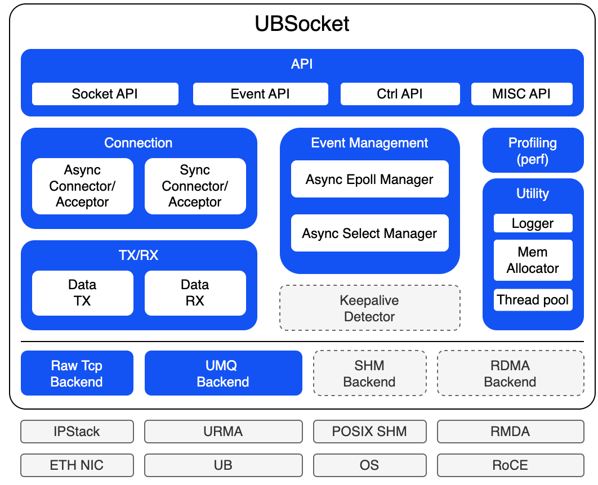

## 🔄Latest News

* UB Support May 30, 2026

## 🎉Introduction

UBSocket is an easy and high performance communication library on top of Unified Bus from Huawei. Key concepts:
* <b>easy to use</b>: socket api compatible
* <b>high performance</b>: bypass kernel, zero copy, fast connection
* <b>large scale</b>: support massive connection 
* <b>well integrated</b>: well integrated with bRPC and so on

## Architecture overview

UBSocket is designed highly extendable to support different hardware, for example: Unified Bus, and RoCE/Posix SHM in the future.

## 🔥Performance

* [Details](./../../doc/ubsocket/performance/perf.md)

## 🚀Quickstart

## 📑How to use

* [Get Started](./../../doc/ubsocket/UBSOCKET-USER-GUIDE.md)
* [API Reference](./../../doc/ubsocket/api/api.md)

## 📦Pre-request hardware and software

- Hardware
    - Host: Kunpeng 950

- Software:
    - OS:
    - URMA:

## 📝 Other information

- [License](./../../LICENSE)
